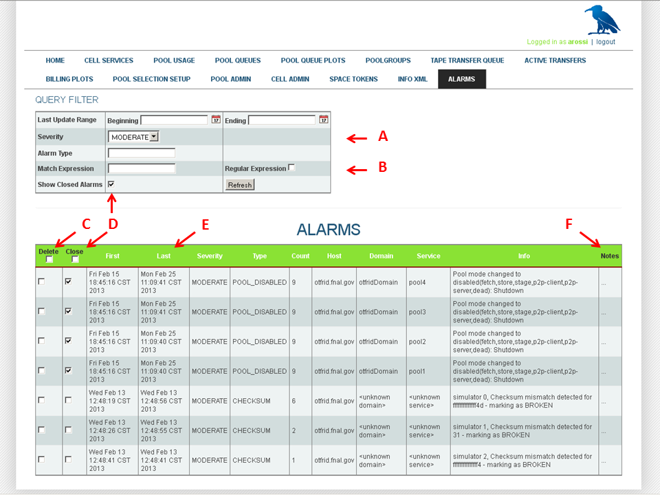

CHAPTER 16. THE ALARMS SERVICE
==============================

Table of Contents
-----------------

 * [The Basic Setup](#the-basic-setup)  

      [Configure where the alarms service is Running](#configure-where-the-alarms-service-is-running)  
      [Types of Alarms](#types-of-alarms)    
      [Alarm Priority](#alarm-priority)  
      [Working with Alarms: Shell Commands](#working-with-alarms-shell-commands)   
      [Working with Alarms: Admin Commands](#working-with-alarms-admin-commands)    
      [Working with Alarms: The Webadmin Alarms Page](#working-with-alarms-the-webadmin-alarms-page)    
        
* [Advanced Service Configuration: Enabling Automatic Cleanup](#advanced-service-configuration-enabling-automatic-cleanup)   
* [Advanced Service Configuration: Enabling Email Alerts](#advanced-service-configuration-enabling-email-alerts)    
* [Advanced Service Configuration: Custom Alarm Definitions](#advanced-service-configuration-custom-alarm-definitions)     
* [Miscellaneous Properties of the alarms Service](#miscellaneous-properties-of-the-alarm-service)     

dCache has an `alarms` service which records errors (*alarms*) requiring more or less urgent intervention. The webadmin servlet running inside the `httpd` service has a special page for querying, displaying and tracking these alarms. There is also an option for sending alarm notifications via email. The alarms data can be stored either in an XML file or in a database. The alarms service is turned off by default.

THE BASIC SETUP  
===============

It is not necessary to run the `alarms` service in a separate domain, though depending on the individual system configuration it may still be advisable not to embed the service in a domain already burdened with higher memory requirements. To handle alarms under a relatively high load (100Hz on the server end) requires only about 2% more of the cpu, but about 75-100 MiB of additional space. In order to capture any alarms from other domains at startup, it is also necessary to arrange for the alarm service to start before the other doors and pools.

While there is nothing strictly preventing the use of multiple `alarms` services, under normal circumstances this should not be necessary. The only constraint on the service set-up has to do with the storage option. Unlike for the RDBMS (relational database) back-end, there is currently no option for remote access of the XML file. Since the alarms storage needs to be written to by the alarms service but also read by the httpd service, it is thus necessary for that file to exist on a shared or mounted partition visible to both. Obviously, no such requirement exists for the RDBMS option.

Add the `alarms` service to a domain in the layout file:

        [alarmsDomain]
        [alarmsDomain/alarms]
        alarms.db.type=rdbms
        ...
        

OR

        [someotherDomain]
        [someotherDomain/alarms]
        alarms.db.type=rdbms
        [someotherDomain/someotherservice]
        ...
        

Note that the storage type setting `alarms.db.type` must be defined either in the layout or **/etc/dcache/dcache.conf** file because its default value is `off`; this can be set to either `xml`, or `rdbms`. In the latter case, the standard set of properties can be used to configure the connection url, db user, and so forth. Before using the `rdbms` option for the first time, be sure to run:

            createdb -U alarms.db.user alarms
        

to create the database; as usual, the actual schema will be initialized automatically when the service is started.

For the XML option, the storage file is usually found in the shared directory for alarms (corresponding to alarms.dir); the usual path is **/var/lib/dcache/store.xml**, but the location can be changed by setting `alarms.db.xml.path`. This will automatically be propagated to `alarms.db.url` and consequently to `httpd.alarms.db.url` if the two domains are on the same host; if they are not (and share this file path via a mount, for instance), be sure to set the httpd property in the layout or **/etc/dcache/dcache.conf** on the httpd host to correspond to the new `alarms.db.url`. 

As a rule of thumb, the choice between XML and RDBMS is dictated by two factors: whether it is feasible to share the XML file between the two services as noted, and how much history is to be preserved. While the XML option is more lightweight and easier to configure, it is limited by performance, experiencing considerable read and write slowdown as the file fills (beyond 1000 entries or so). If you do not need to maintain records of alarms (and either manually delete alarms which have been serviced, or use the built-in cleanup feature – see below), then this option should be sufficient. Otherwise, the extra steps of installing postgreSQL on the appropriate node and creating the alarms database (as above) may be worth the effort.

CONFIGURE WHERE THE ALARMS SERVICE IS RUNNING
-----------------------------------------------

The alarms infrastructure is actually a wrapper around the logging layer and makes use of a simple tcp socket logger to transmit logging events to the server. In each domain, the **/etc/dcache/logback.xml** configuration references the following properties to control remote logging:

            dcache.log.level.remote=off
            dcache.log.server.host=localhost
            dcache.log.server.port=9867
        

As with the `alarms` service database type, remote logging is turned off by default. Under normal circumstances it should be sufficient to set this to `error` in order to receive alarms. All internally generated alarms (see below) are in fact guaranteed to be sent at this logging level. Remote transmission of events at lower logging levels is possible, but caution should be taken inasmuch anything below warn significantly increases network traffic and could risk overloading the server or creating a bottleneck. This service was not designed to provide robust centralized debugging.

If all of your dCache domains run on the same host, then the default (`localhost` value will work. But usually your dCache will not be configured to run on a single node, so each node will need to know the destination of the remote logging events. On all the nodes except where the actual `alarms` service resides, you will thus need to modify the **/etc/dcache/dcache.conf** file or the layout file to set the `dcache.log.server.host` property (and restart dCache if it is already up). The default port should usually not need to be modified; in any case, it needs to correspond to whatever port the service is running on. From inspection of the **/usr/share/dcache/alarms.properties** file, you can see that the alarms-specific properties mirror the logger properties:

         #  ---- Host on which this service is running
         alarms.net.host=${dcache.log.server.host}
         #  ---- TCP port the alarms service listens on
         alarms.net.port=${dcache.log.server.port}
        

The first property should not need any adjustment, but if `alarms.net.port` is modified, be sure to modify the `dcache.log.server.port` property on the other nodes to correspond to it. In general, it is advisable to work directly with the `dcache.log.server` properties everywhere.

Example:
An example of a dCache which consists of a head node, some door nodes and some pool nodes. Assume that the `httpd` service and the `alarms` service are running on the head node. Then you would need to set the property `dcache.log.server.host` on the pool nodes and on the door nodes to the host on which the `alarms` service is running.

                dcache.log.server.host=<head-node>
           

TYPES OF ALARMS
---------------

As stated previously, the dCache alarm system runs on top of the logging system (and more specifically, depends on the `ch.qos.logback` logging library). It promotes normal logging events to alarm status in one of two ways.

`BUILT-IN (MARKED) ALARMS`  
Some alarms are already coded into dCache. These bear the general logging marker `ALARM` and also can carry sub-markers for type and uniqueness identifiers. They also carry information indicating the host, domain and service which emits them. All such alarms are logged at the ERROR event level.

`SERVER-SIDE (OPTIONAL) ALARMS`  
Logging events which arrive at the alarm server, but which do not carry a specific alarm type marker (these may be events at any logging level, not just ERROR), can nevertheless be redefined as a specific type of alarm via a set of filters provided by the administrator. These filters or custom alarm definitions reside in a special XML file usually written to the alarms space. Further explanation as to how to create such filters is given in another section below.

ALARM PRIORITY
--------------

The notion of alarm or alert carries the implication that this particular error or condition requires user attention/intervention; there may be, however, differences in urgency which permit the ordering of such notices in terms of degree of importance. dCache allows the administrator complete control over this prioritization.

The available priority levels are:

-   CRITICAL
-   HIGH
-   MODERATE
-   LOW

Any alarm can be set to whatever priority level is deemed appropriate. This can be done through the admin interface commands (see below). Without any customization, all alarms (of both types) are given a default priority level. This level can be changed via the value of <variable>alarms.priority-mapping.default</variable>, which by default is `critical`.

Filtering based on priority is possible both in the webadmin page (see below), and for alarms sent via email (<variable>alarms.email.threshold</variable>; fuller discussion of how to enable email alarms is given in a later section).

> **NOTE**
>
> There also exists the possibility of filtering out only alarms from the main database into a separate log file. This option is enabled using
>  <variable>alarms.enable.history</variable>
> , and similarly has a priority threshold,
>  <variable>alarms.history.threshold</variable>.
>  This is particularly useful in tandem with the XML storage option; it allows preservation of a condensed record of the alarms even after their full entries have been deleted from the database.

WORKING WITH ALARMS: SHELL COMMANDS
-----------------------------------

Some basic alarm commands are available as part of the dCache shell. The following is an abbreviated description; for fuller information, see the dCache man page.

**alarm send**    
Send an arbitrary alarm message to the alarm server. The remote server address is taken from the local values for <variable>dcache.log.server.host</variable> and <variable>dcache.log.server.port</variable>. If the [-t=TYPE] option is used, it must be a predefined (internal) alarm type.

**alarm list**  
Displays a list of all alarm types currently defined in dCache code (i.e., predefined, internal types). Since these types can be modified with any incremental release, a listing in this manual would be of limited value. It is easy enough to check which ones currently are defined using this command, the predefined ls admin command, or the auto-completing Alarm Type combo box on the webadmin alarms page.

**alarm [add | modify | remove]**  
Activates an interpreter for adding, modifying or removing a filter definition. The interpreter walks you through the steps and choices. The results are written to the definitions file given by the local value for <variable>alarms.custom-definitions.path</variable>.

WORKING WITH ALARMS: ADMIN COMMANDS
-----------------------------------

A similar set of commands is available through the admin interface. To see fuller information for each of these, do `help [command]`.

**definition add [OPTIONS]**     
Add a new custom definition; if a definition of this type already exists, the new definition will overwrite it.

**definition keywords**     
Print the list of attribute names whose values can be used as keyword identifiers for the alarm.

**definition ls [type]**      
Print a single definition or sorted list of definitions.

**definition reload [path]**     
Reinitialize the definitions from the saved changes.

**definition rm type**   
Remove the existing alarm definition.

**definition save [path]**   
Save the current definitions to persistent back-up.

**definition set type name value**    
Set the attribute of an existing alarm definition.

**definition unset type name**    
Unset (remove) the attribute of an existing alarm definition.

**predefined ls**   
Print a list of all internally defined alarms.

**priority get default**   
Get the current default alarm priority value.

**priority ls [type]**  
Print a single priority level or sorted list of priority levels for all known alarms.

**priority reload [path]**   
Reinitialize priority mappings from saved changes.

**priority restore all**   
Set all defined alarms to the current default priority value.

**priority save [path]**    
Save the current priority mappings to persistent back-up.

**priority set type low|moderate|high|critical**  
Set the priority of the alarm type.

**priority set default low|moderate|high|critical**    
Set the default alarm priority value.

**send [OPTIONS] message**    
Send an alarm to the alarm service.

> **NOTE**
>
> Custom definitions and priority mappings are backed by files corresponding to the properties <variable>alarms.custom-definitions.path</variable> and <variable>alarms.priority-mapping.path</variable>, respectively. It is always possible to modify these files directly by hand. These by default are mapped to /var/lib/dcache/alarms.custom-definitions.xml and /var/lib/dcache/alarms-priority.properties. In order for the changes to take effect, either restart the alarms domain, or use the respective reload admin command. It should be understood that when using the admin commands, any modifications are done in memory only and are not flushed automatically to the underlying file, so any permanent changes need to be made via the save command.

> **NOTE**
>
> It is possible to change the file locations by setting the above-mentioned properties in the layout or /etc/dcache/dcache.conf. As can be seen from the admin commands, it is also possible to specify the path as an option on the respective save and reload commands. Note, however, that this is meant mainly for temporary or back-up purposes, as the path defined in the local dcache configuration will remain unaltered after that command completes and the priority map or definitions will be reloaded from there once again whenever the domain is restarted.

> **NOTE**
>
> Any changes made via the priority set default command are in-memory only. To change this default permanently, set the <variable>alarms.priority-mapping.default</variable> property in the layout or /etc/dcache/dcache.conf.

WORKING WITH ALARMS: THE WEBADMIN ALARMS PAGE
---------------------------------------------

The Alarms Web Page is an admin page and thus requires authentication. You must enable HTTPS and set an admin gid (0 by default):

> **NOTE**
>
> For the authenticated mode you need to generate a pk12 hostcert for SSL. This can be done by running the dcache command: import hostcert [--hostcert=FILE] [--hostkey=FILE] [--out=FILE] [--password=PASSWORD] after obtaining a hostcert and hostkey, which are by default placed in **/etc/grid-security.**

        [httpdDomain]
            httpd.enable.authn=true
            httpd.authz.admin-gid=<1234>
        [httpdDomain/httpd]
        

 

1.  The QUERY FILTER form can be used to limit the display of alarms in the table. The underlying query to the database is based on whether the entry has been marked as an alarm (the radio buttons indicating undefined, yes and no, respectively), the time interval in which to search, the
    alarm type
    , and the result range; these are marked by 'D' on the example screenshot above. The date referred to in
    after
    and
    before
    is that of the latest update to that entry, not the timestamp of its original arrival. Each click of the
    Refresh
    button will reload the data from the database based on these parameters. The default behavior is ALL ALARMS ONLY (unspecified type or range). Placing a single date in the Beginning box will give you all entries from that date up to today (inclusive); a single date in the Ending box will give all entries up to that date (inclusive). The other options, marked by 'M', all do in-memory filtering.
2.  The
    Priority
    choice works like a debugging level, such that choosing 
    MODERATE
    will expose all alarms of that priority or above, thus including
    HIGH
    and
    CRITICAL
    , but excluding
    LOW
    . Note that non-alarms are unaffected by this setting.
3.  The
    Match Expression
    filters by appending all fields to a single string and searching for a matching substring. If the
    Regular Expression
    box is checked, the expression to match is compiled as a (Java) regex.
4.  The header of the result table contains two checkboxes which allow you to check or uncheck the respective columns for all displayed items. Checking
    Delete
    and then clicking
    Refresh
    will actually eliminate the entry from persistent store.
5.  Closed
    is a way of marking the alarm as having been dealt with while maintaining a record of it. The
    Show Closed Alarms 
    checkbox allows you to display them (turned off by default).
6.  All column titles appearing in white can be clicked to sort the table by that column. While there is no column indicating alarm priority (as this attribute is external to the alarm schema), alarms are sorted by priority first. Non-alarms follow alarms. If both alarms and non-alarms are displayed, alarms are colored dark red.
7.  Notes
    is an editable field to be used for any special remarks.

When `Refresh` is clicked, any updates to `Closed` and `Notes` are first saved, then any `Deletes` are processed, and finally, the table is repopulated using the current query filter. The entire form is set to auto-refresh every 60 seconds.

ADVANCED SERVICE CONFIGURATION: ENABLING AUTOMATIC CLEANUP
==========================================================

An additional feature of the alarms infrastructure is automatic cleanup of processed alarms. An internal thread runs every so often, and purges all alarms marked as `closed` with a timestamp earlier than the given window. This daemon can be configured using the properties `alarms.enable.cleaner`, `alarms.cleaner.timeout`, `alarms.cleaner.timeout.unit`, `alarms.cleaner.delete-entries-before` and `alarms.cleaner.delete-entries-before.unit`. The cleaner is off by default. This feature is mainly useful when running over an XML store, to mitigate slow-down due to bloat; nevertheless, there is nothing prohibiting its use with RDBMS.

ADVANCED SERVICE CONFIGURATION: ENABLING EMAIL ALERTS
=====================================================

To configure the server to send alarms via email, you need to set a series of alarm properties. No changes are necessary to any **logback.xml** file. The most important properties:

**alarms.enable.email, alarms.email.threshold** 
Off (false) and `critical` by default.

**alarms.email.smtp-host, alarms.email.smtp-port**  
Email server destination. The port defaults to 25.

**SMTP authentication and encryption**  
The SMTP client used by dCache supports authentication via plain user passwords as well as both the STARTTLS and SSL protocols. Note that STARTTLS differs from SSL in that, in STARTTLS, the connection is initially non-encrypted and only after the STARTTLS command is issued by the client (if the server supports it) does the connection switch to SSL. In SSL mode, the connection is encrypted right from the start. Which of these to use is usually determined by the server.

If username and password are left undefined, unauthenticated sends will be attempted, which may not be supported by the server.

The values to use for plain user/password authentication default to undefined. NOTE: while using SSL will guarantee encryption over the wire, there is currently no way of storing an encrypted password. Two possible workarounds: a. Set up an admin account with a plaintext password that is protected by root privileges but which can be shared among adminstrators or those with access to the host containing this file; b. Set up a host-based authentication to the server; the email admin will usually require the client IP, and it will need to be static in that case.

**sender and recipient**  
Only one sender may be listed, but multiple recipients can be indicated by a comma-separated list of email addresses.

See the shared defaults **/usr/share/dcache/alarms.properties** file for additional settings.

ADVANCED SERVICE CONFIGURATION: CUSTOM ALARM DEFINITIONS
========================================================

It should be fairly straightforward to add or modify custom definitions via either the interpreter from the dcache shell, or the admin `definition` commands.

An alarm definition consists of the following:

| Property          | Possible values                                                                                                                                                                                       | Required |
|-------------------|-------------------------------------------------------------------------------------------------------------------------------------------------------------------------------------------------------|----------|
| `type`            | Name of this alarm type (settable only once).                                                                                                                                                         | `YES`    |
| `keyWords`        | Whitespace-delimited concatenation of key field names (see below).                                                                                                                                    | `YES`    |
| `regex`           | A pattern to match the message with.> **Note** > It is advisable to place the regex pattern in double quotes, e.g., "\[=\].\[\\w\]\*"                                                                                                                 | `YES`    |
| `regex-flags`     | A string representation of the (Java) regex flags options, joined by the 'or' pipe symbol: e.g., `CASE_INSENSITIVE | DOTALL`.For fuller explanation, see the Java Tutorial on [Regular Expressions](http://docs.oracle.com/javase/tutorial/essential/regex/). | `NO`     |
| `match-exception` | TRUE = recur over embedded exception messages when applying the regex match (default is FALSE).                                                                                                       | `NO`     |
| `depth`           | Integer GE 0, = depth of exception trace to examine when applying match-exception; undefined means unbounded (default).                                                                               | `NO`     |

For example:

          <alarmType>
          <type>SERVICE_CREATION_FAILURE</type>
          <regex>(.+) from ac_create</regex>
          <keyWords>group1 type host domain service</keyWords>
          </alarmType>
        

The alarm key (the property `keyWords`) is the set of attributes whose values uniquely identify the alarm instance. For example, an alarm defined using `message`, but without including `timestamp` in its key, would suggest that all events with exactly the same message content are to be considered duplicates of the first such alarm. The key field names which can be used to constitute the key include the attributes defined for all alarms, plus the parsing of the message field into regex groups:

-   timestamp
-   domain
-   service
-   host
-   message (= group0)  
-   groupN

These attribute names should be delimited by (an arbitrary number of) whitespace characters. Note that `timestamp` and `message` derive from the logging event, while `host`, `domain` and `service` are properties added to the event's diagnostic context map.

The key field name `groupN`, where `N` is an integer, means that the `Nth` substring (specified by parentheses) will be included. For `N=0`, `group0` is identical to `message`, which means that the whole message string should be included as an identifier.

Alarms that are generated by the code at the origin of the problem may carry with them other arbitrary unique identifier values, but custom definitions are limited to the values associated with these fixed fields.

Miscellaneous Properties of the ALARMS Service
===================================================

There are a number of other settings avaible for customization; check the files **/usr/share/dcache/alarms.properties** and **/usr/share/dcache/httpd.properties** for the complete list with explanations.

 <!-- []: images/Alarms.png 
  [Regular Expressions]: http://docs.oracle.com/javase/tutorial/essential/regex
