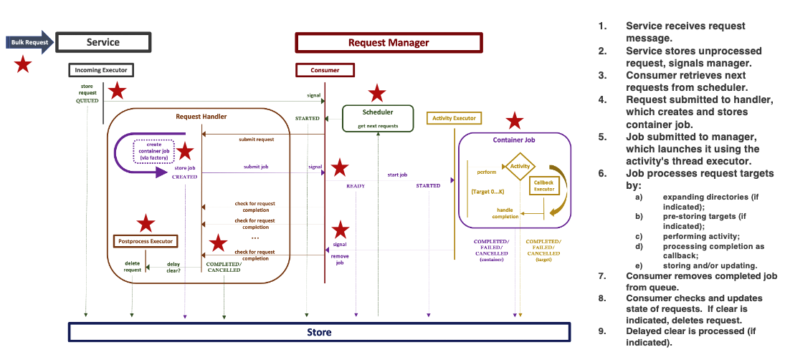
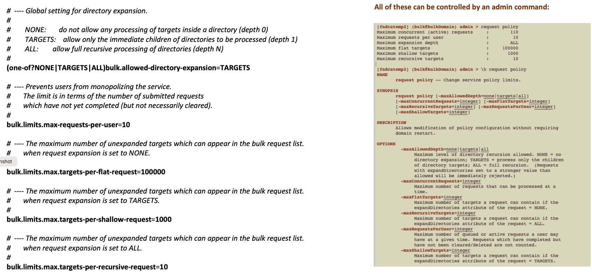

CHAPTER 18. THE BULK SERVICE
===============================

The purpose of the bulk service is to manage mass file system operations involving lists of files
and directories, the latter possibly treated recursively.  In one sense it is meant to incorporate
into dCache proper some of the functionality provided by SRM (such as prestaging of files).

-----
[TOC bullet hierarchy]
-----

## Configuring

The service can run in a shared domain, but it is probably best to isolate it in its own.

```
[bulkDomain]
[bulkDomain/bulk]
```
The bulk service has not yet been rendered replicable, but this should not be
difficult and may be in future versions.

The new version of bulk (version 2, as of dCache 8.2) requires a database consisting of
three tables.  As is customary, before the first startup of the service, be
sure to create the database (e.g., using the postgres command-line tool):

```
createdb -U <user> bulk
```

The rest of the configuration takes place automatically on startup.

While things like thread queue sizes, cache expiration, consumer sweep interval and
such can be adjusted as desired using the service properties, bulk is configured
to run out of the box for most purposes.  See the ``bulk.properties`` file
for further information on settings.

A number of user-facing (policy) settings can also be controlled from the admin
shell without requiring service restart (see below).

## Requests

A bulk request consists of a list of targets (file paths) and an activity that
should be applied to each, along with options for directory expansion or
recursion, pre- and post-processing of the request.

The submission of a request by a user occurs via RESTful interfaces;
currently, there is a general resource, ``bulk-requests``, and two resources
which specifically support the WLCG Tape API, ``stage`` and ``release``.
For the differences, along with a description of the options controlling
the execution of the request, see the User Manual [Chapter 3. Frontend: Bulk Requests].

The bulk service receives these requests from the frontend service via dCache messaging.
The order in which they are processed is determined by a scheduler.  Currently, only
one such scheduler has been implemented,

```
bulk.request-scheduler=org.dcache.services.bulk.manager.scheduler.LeastRecentFirstScheduler
```

which selects the least recent requests to run in order of arrival (first-come first-served).

Only a fixed number of requests can be running at a given time; the default corresponds
to the number of threads made available for processing container jobs,

```
bulk.limits.container-processing-threads=110
```

but can be adjusted upwards or downwards via the admin shell command ``request policy,``
in which case the thread pool will be either over- or under-subscribed; this adjustment
may be desirable under certain conditions (for example, increasing when there are many small
high-latency jobs or decreasing when there are many large low-latency jobs). The number
of requests which can be active or queued at a given time per user is also configurable.

## Activities

An activity consists of some kind of action which can be taken on a file path.  Depending
on the activity, there may be a restriction as to whether it can take a directory target
(these are hard-coded).

Activities are defined via an SPI ("Service Provider Interface") as plugins to
the service.  The following are presently available:

- **DELETE** : file deletion, with or without removal of empty directories.
- **PIN/UNPIN** : by default, the pin uses the request id, but can optionally be given
a different id. The default lifetime is five minutes (the same as for the NFS dot-command).
- **STAGE/RELEASE** : specialized WLCG versions of PIN/UNPIN.
- **UPDATE_QOS** : disk-to-tape and tape-to-disk transitions; communicates with
the [QoS Engine](config-qos-engine.md).
- **LOG_TARGET** : logs metadata for each target at the INFO level.

Each activity is associated with

- a permit count (used in connection with a semaphore for throttling execution);
- two thread queues, one for the execution of the container job,
and the other for the execution of callbacks on activity futures;
- a retry policy (currently the only retry policy is a NOP, i.e., no retry).

The permits are configurable using either the property or the admin shell
command ``request policy``.

Should other retry policies become available, these can be set via a property.

The number and distribution of thread executors is hard-coded for the activities, but their
respective sizes can be adjusted using the properties:

    ```
    bulk.limits.container-processing-threads=110
    bulk.limits.activity-callback-threads=50
    ```

## Container Design

Version 2 of the bulk service has introduced improvements for better scalability and recovery.

All requests are now processed by a single container job which executes the targets serially
while the callbacks on any target futures are executed asynchronously.  A container can
be configured to store initial target information in the database either when the target
is acted upon (on the fly) or in advance (= _prestore_).  The latter incurs some overhead,
particularly for jobs in excess of 10K targets, but may be desirable for tasks
like pinning where the time to completion is long, because it allows any queued targets to be seen
ahead of time.  All of the WLCG operations are hard-coded to prestore, but the general
default is no prestorage.

In order to handle directories consistently, a container will queue them and delay their processing
until all regular file targets have completed.  Directories are always processed
serially depth-first.

The following illustrates the structure of the service and its interactions when processing
a request.



Cancellation is best effort, in the sense that the cessation of the bulk activity is
not guaranteed to stop the activity in other dCache components.  Flushing, for instance,
cannot be easily cancelled.

~~~~~~~~~~~~~~~~~~~~~~~~~~~~~~~~~~~~~~~~~~~~~~~~~~~~~~~~~~~~~~~~~~~~~~~~~~~~~~~~
 NOTE: The user-driven attribute 'delay' for indicating how long to wait
       before clearing a request on success or failure has been deprecated
       and is no longer supported.
~~~~~~~~~~~~~~~~~~~~~~~~~~~~~~~~~~~~~~~~~~~~~~~~~~~~~~~~~~~~~~~~~~~~~~~~~~~~~~~~

## Storage and Recovery

Requests are stored when they are received. When the service fails or goes down,
an attempt will be made to replay incomplete requests upon restart.  This replay will leave
untouched request targets that are already in some terminal state (COMPLETED, FAILED, CANCELLED)
and will retry only those that had not reached completion or had not yet been acted upon.
If the request was doing directory expansion, the directories are walked again and missing
targets are added if any.

## Admin Commands

The bulk service comes with a full set of admin shell commands which allow one
to list the requests and targets, to launch and cancel requests and individual targets,
to list the available activity types and inspect their arguments, and to monitor the
state of the service itself.  The ``request reset`` command removes all request targets
from the database, returns the state to QUEUED and resubmits the request (i.e., this
is a clean-slate retry of the request).

Particularly useful are the following policy properties which can be changed without
requiring service restart using the admin shell command ``request policy``:

