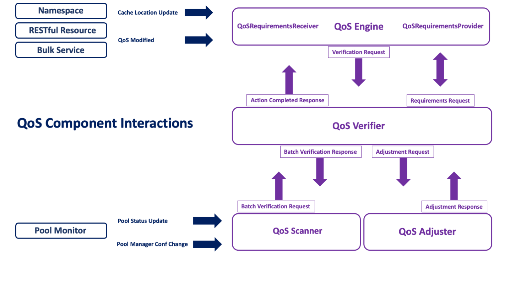
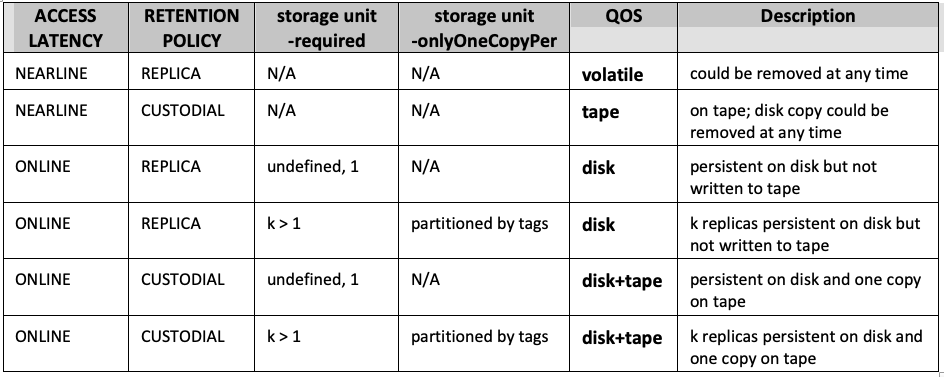
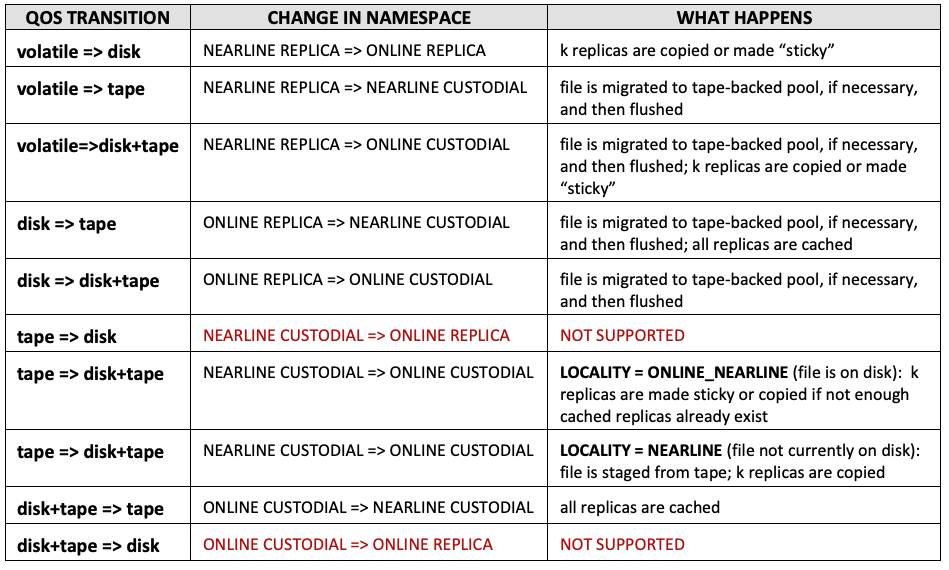

The QoS Service
======================

-----
[TOC bullet hierarchy]
-----

## Introduction to the qos service

Quality of service (QoS) is a broad term with a number of different meanings,
but for our purposes here it refers to whether a file needs to be
on disk, on tape, or both, as well as to how many copies of the file should be
maintained on those media (and, eventually, for how long).

The implementation of the QoS service is a refactoring of Resilience which
incorporates and extends the latter's capabilities.  The first version (current) of QoS
only manages definitions that are still based on directory tags and storage
unit attributes.   The intention of the refactoring, however, is to allow
us to redesign how QoS is specified without having to change in
a significant way the underlying infrastructure which handles it.  Thus
in the (near) future we hope to be able to support such things as multiple
tape locations, slow vs. fast disk (e.g. spinning vs SSD), and time-bound
definitions as to when a file would change its QoS status.  This would
necessarily mean that QoS definitions would become more properly a part of
the file's metadata and not be determined (except perhaps by default) via
global properties such as directory tags or the file's storage unit.

## Configuring the QoS service

The QoS service is actually made up of four different components.

1. the ``QoS Engine``:  This is the "frontend" of the service which receives
   cache location updates (currently directly from the PnfsManager, as
   with Resilience), but also requests to modify a file's status (disk, tape, both),
   either on single files made through the REST frontend, or on file sets through
   the bulk service (also accessible through the REST API). The engine also
   manages the logic, or rules, for determining what a file's QoS is.
1. the ``QoS Verifier``:  This used to be the heart of the Resilience service.
   It is now responsible only for verification––that is, determining the state of
   a file and what needs to be done to make it satisfy its specified QoS.
   The operations are now maintained in a database for reliable survival on restart, and
   the component assures that enough iterations over the file will occur
   to complete all the necessary QoS transformations.
1. the ``QoS Adjuster``:  This is the component that carries out any QoS
   changes necessary for a given file.  Each adjustment represents
   a request made by the verifier to do a single thing: change a replica's sticky bit,
   make a copy, flush the file to an HSM, or stage a file back that is missing
   from disk.
1. the ``QoS Scanner``:  is responsible for observing all the pools in the installation
   and running periodic checks on the files they contain to make sure QoS requirements are
   met; it also responds, as did Resilience, to pool status changes and pool manager configuration
   changes, so as to create missing replicas or cache excess ones, and in general maintain
   the file's QoS, when necessary.



Each of these services can be run separately as cells in a single domain or in independent
domains.  In addition, there is available a singleton/standalone cell configuration
in which all four components are directly plugged into each other.  The latter eliminates the
extra overhead of message passing, but requires more memory.   This flexibility of setup options
should help in overcoming hardware restrictions or in isolating the components which need,
for example, to run over the namespace database (the scanner) or which
require the most heap space (the verifier).

These services are not yet HA (replicable), but we plan to provide that capability soon.

### Database back-up

Resilience ran without an RDBMs backup, using a (lossy) checkpoint file to mitigate long latency
in recovery (via pool scanning) when the service goes down and restarts.  With QoS, we have
decided to back-up the verification operations using a database table.  This not only affords
more reliability on restart, but also allows us to cut down the memory footprint of the
verifier component.

It is therefore necessary to initialize the verifier database before starting dCache (the
example below assumes PostgreSql is installed and the database username is 'dcache'):

```
createdb -U dcache qos
```

No further configuration is necessary, as the table will then be automatically built via
Liquibase on startup.  As usual, the property

```
qos-verifier.db.host=${dcache.db.host}
```

or

```
qos.db.host=${dcache.db.host}
```

should be set to point to the host where the PostgreSql instance is running.

### Activating qos

The service can be run out of the box.  When deployed as separate cells in one or more
domains,


```
[qosDomain]
dcache.java.memory.heap=8192m
[qosDomain/qos-engine]
[qosDomain/qos-verifier]
[qosDomain/qos-adjuster]
[qosDomain/qos-scanner]
```

or

```
[qosVDomain]
dcache.java.memory.heap=8192m
[qosVDomain/qos-verifier]

[qosEDomain]
[qosEDomain/qos-engine]

[qosADomain]
[qosADomain/qos-adjuster]

[qosSDomain]
chimera.db.host=<host-where-chimera-runs>
[qosSDomain/qos-scanner]
```

the default value of ``dcache.service.qos`` (**qos-engine**) pertains and does not
need to be modified. For the singleton service,

```
[qosDomain]
dcache.java.memory.heap=16384m
[qosDomain/qos]
```

set the service property to **qos**:

```
dcache.service.qos=qos
```

With respect to the example scanner domain: the scanner communicates directly with Chimera,
so `chimera.db.host` should be set explicitly if it is not running on the same host
as the database.

### Memory requirements

While it is possible to run QoS in the same domain as other services,
memory requirements for the verification component should be a bit more generous.
While it no longer requires the amount of heap space that resilience does, it still
tries to cache a good proportion of the current operations in memory.

~~~~~~~~~~~~~~~~~~~~~~~~~~~~~~~~~~~~~~~~~~~~~~~~~~~~~~~~~~~~~~~~~~~~~~~~~~~~~~~~
 BEST PRACTICE: We recommend at least 8GB of JVM heap be allocated.
                Be sure to allow enough memory for the entire domain.
~~~~~~~~~~~~~~~~~~~~~~~~~~~~~~~~~~~~~~~~~~~~~~~~~~~~~~~~~~~~~~~~~~~~~~~~~~~~~~~~

Whenever feasible, it is also recommended to give QoS its own domain(s).

## QoS Definitions

The following table summarizes how quality of service is currently implemented.



These are what you might call the file defaults, determined, as they were for Resilience,
by directory tags and storage unit definitions.  The file receives them when it is
written to a particular directory.   See further under the section "QoS and Resilience" on
how to emulate the behavior of the Resilience service in QoS.

### Changing a file's QoS

This is currently limited only to transitions involving ``Access Latency`` and ``Retention Policy``.
The number of copies or partitioning between types of pools is not currently dynamically modifiable
on a file-by-file basis.  Further, QoS currently only supports a single tape/HSM location.

The following table lists the available transitions and should help to clarify
the effect of QoS modification:



The transition ``tape=>disk+tape`` is probably the most useful from the standpoint
of user initiated activity, because it corresponds to "bring on line" or "stage" when
the file is not on disk already.  Note, however, that this transition is permanent,
in the sense that the ``ACCESS LATENCY`` for the file is modified and the replica
is indefinitely set to "sticky".  To change the file back to cached, a second
modification request is required. In the future, this may be done via a time-bound
set of rules given to the engine (not yet implemented).

File QoS modification can be achieved through the RESTful frontend for single files,

[dCache Frontend Service/A Note on the RESTful resource for QoS transitions](config-frontend.md/)

of through the Bulk service for file sets.

[dCache Bulk Service/Job plugins](config-bulk.md)

In addition, the administrator can issue transition requests directly through the admin interface
for the Bulk service using ``request submit``.

### QoS and "resilience"

The QoS service continues to provide disk resident "resilience".  This capability is
now conceived of as a specialized case of QoS handling.  It is still defined
system-wide, but eventually this will be augmented by file-based policies.

The former Resilience service required the following to be in force in order for it
to act upon a given file:

* have an `AccessLatency` of `ONLINE`
* belong to a storage unit where the `required` (copies) attribute is set
* be written to a pool which is a member of at least (but no more than)
  one pool group marked as ``-resilient``

In QoS, these requirements have been loosened.  QoS
no longer restricts itself to looking only at specific pool groups, in the sense
that a storage unit which requires more than one replica will be respected and
handled whether it is linked to a group which has been marked
"resilient" or not.  In the case that the pool where the file is initially written
does not belong to a single resilient group, a pool is selected
from the global set of pools.

It is still possible to mark pool groups as preferential (see below).
While a given pool can belong to any number of pool groups, it must still belong
to only one such preferential group (an exception will be raised when violation of this rule
is discovered). We have kept this concept of preferential pool group because it can
be useful in assuring that copies always land on certain pools, if this is desired.

It further goes without saying that pools continue to be capable of
hosting files with different QoS requirements (disk, tape, both) and that
segregation or partitioning by type is possible but not necessary.

### Setting up "resilience" using the QoS components

This differs little from what was done for the Resilience service, with
the first point now being **optional**:

1.  (Define one or more resilient pool groups).

2.  Define one or more storage units with ``-required`` specified
    (optionally linking them to a preferential group).

3.  Create the namespace directories where these files will reside, with the
    necessary tags (for ``ACCESS LATENCY``, ``RETENTION POLICY`` and storage unit).

Note that if a file is ``ONLINE REPLICA``, this is sufficient
to raise an alarm if its pool goes offline
(i.e., its storage unit need not also specify ``-required=1``).  This is
different from before, where online files without the storage unit attribute
defined would have been ignored by Resilience.

QoS also periodically checks to make sure that ``CUSTODIAL ONLINE`` files whose
permanent disk copy may have been erroneously or accidentally purged are staged
back in (see further below).

#### Defining preferential ("resilient") pool groups

The following definitions in `poolmanager.conf` are now equivalent:

~~~~~~~~~~~~~~~~~~~~~~~~~~~~~~~~~~~~~~~~~~~~~~~~~~~~~~~~~~~~~~~~~~~~~~~~~~~~~~~~
psu create pgroup persistent-group -resilient

psu create pgroup persistent-group -primary
~~~~~~~~~~~~~~~~~~~~~~~~~~~~~~~~~~~~~~~~~~~~~~~~~~~~~~~~~~~~~~~~~~~~~~~~~~~~~~~~

We have kept `-resilient` for backward compatibility, but in the larger QoS context
it makes a bit more sense simply to call such a group "primary".

#### Defining disk requirements via storage unit

The two attributes which pertain to disk-resident replication are unchanged:

1.  `required` defines the number of copies files of this unit should receive
    (default is 1).

2.  `onlyOneCopyPer` takes a comma-delimited list of pool tag names; it
    indicates that copies must be partitioned among pools such that each replica
    has a distinct value for each of the tag names in the list (default is
    undefined).

To create, for instance, a storage unit requiring two copies, each on
a different host, one would do something like this:

~~~~~~~~~~~~~~~~~~~~~~~~~~~~~~~~~~~~~~~~~~~~~~~~~~~~~~~~~~~~~~~~~~~~~~~~~~~~~~~~
psu create unit -store test:persistent@osm

psu set storage unit test:persistent@osm -required=2 -onlyOneCopyPer=hostname
~~~~~~~~~~~~~~~~~~~~~~~~~~~~~~~~~~~~~~~~~~~~~~~~~~~~~~~~~~~~~~~~~~~~~~~~~~~~~~~~

This example assumes that the pool layout has also configured the pools with the
appropriate `hostname` tag and value.

#### Configuration Example

The following demonstrates the setup for a single pool, primary pool group and
storage unit. The usual procedure for linking pools, pool groups and units
continues to apply.

~~~~~~~~~~~~~~~~~~~~~~~~~~~~~~~~~~~~~~~~~~~~~~~~~~~~~~~~~~~~~~~~~~~~~~~~~~~~~~~~
psu create unit -store test:persistent@osm
psu set storage unit test:persistent@osm -required=2 -onlyOneCopyPer=hostname

psu create ugroup persistent-units
psu addto ugroup persistent-units test:persistent@osm

psu create pool persistent-pool1

psu create pgroup persistent-pools -primary
psu addto pgroup persistent-pools persistent-pool1

psu create link persistent-link persistent-units ...
psu addto link persistent-link persistent-pools
~~~~~~~~~~~~~~~~~~~~~~~~~~~~~~~~~~~~~~~~~~~~~~~~~~~~~~~~~~~~~~~~~~~~~~~~~~~~~~~~

#### Setting the directory tags

To continue with the above example, the tags which would be minimally required
in the directories pointing to this storage unit are:

~~~~~~~~~~~~~~~~~~~~~~~~~~~~~~~~~~~~~~~~~~~~~~~~~~~~~~~~~~~~~~~~~~~~~~~~~~~~~~~~
.(tag)(AccessLatency): ONLINE
.(tag)(sGroup): persistent
~~~~~~~~~~~~~~~~~~~~~~~~~~~~~~~~~~~~~~~~~~~~~~~~~~~~~~~~~~~~~~~~~~~~~~~~~~~~~~~~

> **WARNING**
>
> Be careful with large file store configuration settings.
>
> These are in the process of being deprecated, and can interfere with QoS.
>
> In particular,
>
> ```ini
> pool.lfs=volatile
> ```
>
> should not be set on pools where you wish permanent disk copies to reside
> or where files are to be flushed.
>
> If a file which is ```NEARLINE REPLICA``` (i.e., volatile) lands on this
> pool, and is then transitioned at some point to disk (```ONLINE```), the
> ``lfs`` setting is invisible to QoS, which will not know enough to
> migrate the file to another pool; thus the effect of the transition
> will be negated because the system sticky flag is suppressed.

## QoS home

On the host(s) where the QoS services are running, you will see several files
or subdirectories in the `qos.home` directory (`/var/lib/dcache/qos` by default):

**qos-engine**

- backlogged-messages
- engine-statistics-<date-hour>

**qos-verifier**

- backlogged-messages
- verifier-statistics-<date-hour>

**qos-adjuster**

- backlogged-messages
- adjuster-statistics-<date-hour>

**qos-scanner**

- backlogged-messages
- excluded-pools
- scanner-statistics-<date-hour>

Explanations of these files follow.

#### backlogged-messages (all components)

It is possible to enable and disable message handling by the QoS components using the
component's ``ctrl start/shutdown`` command (for the ``verifier, adjuster`` and ``scanner``),
or ``enable/disable`` for the ``engine``. Any messages which happen to arrive during the period
when the component is disabled or shut down will be serialized to a file in this directory,
and then read back in and deleted during enabling/initialization. Disabling message handling
in the ``engine`` with the ``-drop`` option means all incoming messages are discarded.

#### {component}-statistics-{date-hour} (all components)

Through an admin command, one can enable and disable the recording of
statistical data for each of the four components. When enabled, writing to this file
is activated.  This will contain detailed timestamped records and timings
specific to that component (e.g., of messages, operations, or tasks), written out at 1-minute
intervals; this logging rolls over every hour until disabled.

The file can be read from the admin interface by issuing the ``stat`` command
without options.

#### excluded-pools (qos-scanner)

When the command `pool exclude <pools>` is used, the pool operation record is
marked as `EXCLUDED`. This can be observed when the `pool ls` command is issued.
Pools so marked are recorded to this file after each pool monitor state update
(every 30 seconds). This file is read in, again if it exists, at startup, so
that previously excluded pools will continue to be treated as such.

For pool exclusion, see the [section below](config-qos-engine.md/#exclude-a-pool-from-qos-handling)
under typical scenarios.

## Admin Commands

There are a number of ways to interact with the qos service through the
admin door. As usual, the best guide for each command is to consult its help
documentation (`\h <command>`).  Tasks are marked according to the component they
relate to:  ``engine``, ``pool`` (scanner), ``task`` (adjuster) and ``verify``.  The
``async`` commands are part of the scanner component and are used to control
database queries represented by the ``contained`` command that are run asynchronously
because they take a bit of time to complete.

These commands will not be discussed in detail here. We instead present a brief
overview and a few examples of output.

### Available actions

```
qos-adjuster:
    info [-a] [-l]  # get detailed cell information
    task cancel [OPTIONS] [<pnfsids>]  # cancel adjuster tasks
    task ctrl [OPTIONS] [<start>|<shutdown>|<reset>|<run>|<info>]  # control  handling of tasks
    task details # list diagnostic information concerning tasks by pool
    task history [OPTIONS] [errors]  # display a history of the most recent terminated file operations
    task ls [OPTIONS] [<pnfsids>]  # list entries in the adjuster task table
    task stats [OPTIONS]  # print diagnostic statistics history
qos-engine:
    disable [-drop]  # turn off handling
    enable # turn on handling
    engine stats [-enable] [-limit=<integer>] [-order=asc|desc]  # print diagnostic statistics
    info [-a] [-l]  # get detailed cell information
qos-scanner:
    async cmd cancel <ids>  # cancel running scans/queries
    async cmd cleanup [-entry] [-file] <ids>  # remove future entries and/or file
    async cmd ls # print out a list of running scans/queries
    async cmd results [OPTIONS] <filename>  # print to screen asynchronous query/scan results
    contained in <poolexpression>  # count or list pnfsids which have replicas only on the pools in the list
    info [-a] [-l]  # get detailed cell information
    pool cancel [OPTIONS] [regular expression for pools]  # cancel pool operations
    pool details # list diagnostic information concerning scan activity by pool
    pool exclude [OPTIONS] [<pools>]  # exclude pool operations
    pool include [OPTIONS] [<pools>]  # include pool operations
    pool ls [OPTIONS] [<pools>]  # list entries in the pool operation table
    pool reset [OPTIONS]  # control the processing of pool state changes
    pool scan [OPTIONS] <pools>  # launch a scan of one or more pools
    pool stats [-enable] [-limit=<integer>] [-order=asc|desc]  # print diagnostic statistics
    sys cancel [-id=<string>] [-nearline] [-online]  # cancel background scan operations
    sys ls [-history] [-order=ASC|DESC]  # list entries in the system scan operation table
    sys reset [OPTIONS]  # control the periodic check for system scans
    sys scan [-nearline] [-online]  # initiate an ad hoc background scan.
qos-verifier:
    info [-a] [-l]  # get detailed cell information
    pool info [OPTIONS] [<pools>]  # list tags and mode for a pool or pools
    verify <pnfsids>  # launch an operation to verify one or more pnfsids
    verify cancel [OPTIONS] [<pnfsids>]  # cancel verify operations
    verify details # list diagnostic information concerning verification by pool
    verify failed # launch operations to rerun verify for all pnfsids currently appearing in the history errors list
    verify history [OPTIONS] [errors]  # display a history of the most recent terminated operations
    verify ls [OPTIONS] [<pnfsids>]  # list entries in the operation table
    verify reset [OPTIONS]  # control the settings for operation handling
    verify stats [-enable] [-limit=<integer>] [-order=asc|desc]  # print diagnostic statistics
```

### Info output

One of the most useful commands is `info`, for diagnostics, viewed all at once
by doing ``\s qos-* info``):

~~~~~~~~~~~~~~~~~~~~~~~~~~~~~~~~~~~~~~~~~~~~~~~~~~~~~~~~~~~~~~~~~~~~~~~~~~~~~~~~
[fndcatemp2] (local) admin > \s qos-* info
qos-adjuster:
    --- adjuster-task-map (In-memory queues for running, ready and waiting adjustment tasks.) ---
    Running since: Fri Apr 29 13:54:15 CDT 2022
    Uptime 0 days, 0 hours, 0 minutes, 42 seconds

    Last sweep at Fri Apr 29 13:54:52 CDT 2022
    Last sweep took 0 seconds

    maximum running tasks:     200
    maximum number of retries: 1

    ACTION                            TOTAL       FAILED
    CACHE_REPLICA                         0            0
    COPY_REPLICA                          0            0
    FLUSH                                 0            0
    PERSIST_REPLICA                       0            0
    UNSET_PRECIOUS_REPLICA                0            0
    WAIT_FOR_STAGE                        0            0
qos-engine:
    --- file-status-handler (Processes incoming request messages.) ---
    Running since: Fri Apr 29 13:54:15 CDT 2022
    Uptime 0 days, 0 hours, 0 minutes, 42 seconds


    MSG TYPE                       RECEIVED
    ADD_CACHE_LOCATION                    0
    CLEAR_CACHE_LOCATION                  0
    CORRUPT_FILE                          0
    QOS_ACTION_COMPLETED                  1
    QOS_MODIFIED                          0
    QOS_MODIFIED_CANCELED                 0
qos-scanner:
    --- pool-operation-map (Map of pool-specific operations which run location scans in response to state changes.) ---
    down grace period 1 HOURS
    restart grace period 6 HOURS
    maximum idle time before a running operation is canceled  1 HOURS
    maximum concurrent operations 5
    period set to 3 MINUTES

    Running since: Fri Apr 29 13:54:16 CDT 2022
    Uptime 0 days, 0 hours, 0 minutes, 41 seconds

    Last sweep at Fri Apr 29 13:54:16 CDT 2022

    ACTION                       COMPLETED       FAILED
    POOL_STATUS_DOWN                     0            0
    POOL_STATUS_UP                       0            0

    --- system-operation-map (Map of system-wide operations which run scans periodically.) ---
    system online scan window 24 HOURS
    system nearline scan is off
    system nearline scan window 5 DAYS
    max concurrent operations 5
    period set to 3 MINUTES

    Running since: Fri Apr 29 13:54:16 CDT 2022
    Uptime 0 days, 0 hours, 0 minutes, 41 seconds

    Last sweep at Fri Apr 29 13:54:16 CDT 2022

    last online scan start Fri Apr 29 13:54:16 CDT 2022
    last online scan end Fri Apr 29 13:54:16 CDT 2022

        0 days, 0 hours, 0 minutes, 0 seconds

    last nearline scan start Fri Apr 29 13:54:16 CDT 2022
    last nearline scan end Fri Apr 29 13:54:16 CDT 2022

        0 days, 0 hours, 0 minutes, 0 seconds
qos-verifier:
    --- verify-operation-map (Provides an in-memory API for accessing verification operations.) ---
    maximum concurrent operations 200
    maximum number of ready operations in memory 10000
    maximum retries on failure 1

    sweep interval 1 MINUTES

    MESSAGES                              RECEIVED
    ADJUST RESPONSE                              0
    BATCH CANCEL REQUEST                         0
    BATCH VERIFY REQUEST                         0
    CANCEL REQUEST                               0
    LOCATION EXCLUDED                            0
    VERIFY REQUEST                               0

    Last sweep at Fri Apr 29 13:54:22 CDT 2022

    OPS                                  COMPLETED   OPS/SEC       FAILED
    ALL                                          0         0            0
    VOIDED                                       0         0            0


    ACTIVE OPERATIONS BY STATE:
        CANCELED                               1

    ACTIVE OPERATIONS BY MSG_TYPE:
        QOS_MODIFIED                           1
~~~~~~~~~~~~~~~~~~~~~~~~~~~~~~~~~~~~~~~~~~~~~~~~~~~~~~~~~~~~~~~~~~~~~~~~~~~~~~~~

The other useful commands are ``verify ls`` and ``task ls``, ``verify history``
and ``task history``, ``verify details`` and ``task details.``  These can be used
to give an idea of the running state of QoS: what operations are ongoing (``ls``),
the most recent ones to have completed (and any attendant errors, ``history [errors]``),
as well as pool-by-pool summaries (``details``). See the help for each of these commands
for the various options available.

Similar commands, `pool ls` and ``pool details``, exist for checking the current status
of any pool scan operations:

~~~~~~~~~~~~~~~~~~~~~~~~~~~~~~~~~~~~~~~~~~~~~~~~~~~~~~~~~~~~~~~~~~~~~~~~~~~~~~~~
[fndcatemp2] (qos@qosDomain) admin > pool ls
[fndcatemp2] (qos-scanner@qosSDomain) admin > pool ls
dcatest03-1	(completed: 0 / 0 : ?%) – (updated: 2022/04/29 13:54:52)(finished: 2022/04/29 13:54:52)(prev UNINITIALIZED)(curr UNINITIALIZED)(IDLE)
dcatest03-2	(completed: 0 / 0 : ?%) – (updated: 2022/04/29 13:54:52)(finished: 2022/04/29 13:54:52)(prev UNINITIALIZED)(curr UNINITIALIZED)(IDLE)
dcatest03-3	(completed: 0 / 0 : ?%) – (updated: 2022/04/29 13:54:52)(finished: 2022/04/29 13:54:52)(prev UNINITIALIZED)(curr UNINITIALIZED)(IDLE)
dcatest03-4	(completed: 0 / 0 : ?%) – (updated: 2022/04/29 13:54:52)(finished: 2022/04/29 13:54:52)(prev UNINITIALIZED)(curr UNINITIALIZED)(IDLE)
...
~~~~~~~~~~~~~~~~~~~~~~~~~~~~~~~~~~~~~~~~~~~~~~~~~~~~~~~~~~~~~~~~~~~~~~~~~~~~~~~~

and for seeing a summary breakdown of scan activity by pool:

~~~~~~~~~~~~~~~~~~~~~~~~~~~~~~~~~~~~~~~~~~~~~~~~~~~~~~~~~~~~~~~~~~~~~~~~~~~~~~~~
[fndcatemp2] (qos@qosDomain) admin > pool details
NAME                      |        TOTAL       FAILED |           UP         DOWN       FORCED |        FILES          AVGPRD (ms)
dcatest03-1               |            1            0 |            1            0            1 |            0               152077
dcatest03-2               |            1            0 |            1            0            1 |            0               152056
dcatest03-3               |            1            0 |            1            0            1 |            0               152077
dcatest03-4               |            1            0 |            1            0            1 |            0               152033
...
~~~~~~~~~~~~~~~~~~~~~~~~~~~~~~~~~~~~~~~~~~~~~~~~~~~~~~~~~~~~~~~~~~~~~~~~~~~~~~~~

For each operation in the ``ls`` output, the timestamps of the last update
(change in status) and of the last completed scan are indicated, as well as
pool status (`ENABLED` here), and operation state (`IDLE`, `WAITING`, `RUNNING`).
For running scans, the number of file operations completed out of a total (if known)
is reported.

Finally, the `task ctrl` and `verify / pool / sys reset` commands can be used to verify
or reset basic configuration values, or to interrupt operation processing or
force a sweep to run (for the adjuster).

## Tuning

Only a few properties can be reset using the `ctrl` and `reset` commands mentioned above. Please
consult the documentation in the `qos.properties` defaults for a fuller
explanation of the tuning issues which pertain. If adjustments to the preset values
are made, remember to ensure that enough database connections
remain available to service both Chimera operations and pool scan operations,
and that these be properly matched to the number of threads responsible for the
various operations, in order to avoid contention (see again, the explanation in
the default properties file).

## QoS's View of Pool Status

In order to allow for flexibility in configuring door access to pools, the
`disabled` state on a pool is interpreted this way:

-  `\s <pool> pool disable -p2p-client` means no p2p can be written to this pool;
QoS will not use this pool to make copies, though doors can still write
new files there.

-  `\s <pool> pool disable -store` means doors cannot write new copies to the
pool, though it is still available for p2p; hence QoS can still use this
pool to make copies.

-  `\s <pool> pool disable -rdonly` means the pool cannot be written to either
by doors or QoS.

-  `\s <pool> pool disable -strict` indicates not only that the pool is disabled
for write, but also for read; QoS will schedule it for a scan so that the
files it contains can be replicated elsewhere if necessary.

## Automatic Staging of Missing CUSTODIAL ONLINE replicas

Files whose `RETENTION POLICY` is `CUSTODIAL` and whose `ACCESS LATENCY` is `ONLINE`
constitute a special case for the purposes of recovery.  For instance,
if a `REPLICA ONLINE` file with two copies on disk becomes inaccessible because
both pools containing those copies went offline at about the same time (not
permitting QoS enough time to react to make another replica), then an alarm
concerning this file's current inaccessibility is raised.  If this file is
`CUSTODIAL` and has a copy on tertiary storage, however, QoS will first attempt to
restage it before considering it inaccessible.

### Pool scan vs Sys scan

For the scanner component, there are two kinds of scans.  The pool scan runs a query
by location (= pool) and verifies each of the files that the namespace indicates is
resident on that pool.  This is generally useful for disk-resident replicas, but
will not be able to detect missing replicas (say, from faulty migration, where the
old pool is no longer in the pool configuration). Nevertheless, a pool scan
can trigger the restaging of an ``ONLINE CUSTODIAL`` file that has no readable
or available replicas.

The system scan (sys), on the other hand, verifies all files, whatever
cache locations they may or may not have.  These scans are more costly and can run for days,
so they are separate from the pool scans and run in the background.  Given that
the more usual dCache deployments will have NEARLINE >> ONLINE files, the nearline scan
is disabled by default, but can be enabled through the ``reset`` command.  ``NEARLINE``
scans are only useful in catching a qos modification which has changed the status
of a file and, for instance, requires a flush or a caching which has not occurred.
The ``ONLINE`` scan is more useful in that it will detect if such a file is missing a disk
copy, regardless of the current available pools, and will stage it back in if it is also
``CUSTODIAL``.

~~~~~~~~~~~~~~~~~~~~~~~~~~~~~~~~~~~~~~~~~~~~~~~~~~~~~~~~~~~~~~~~~~~~~~~~~~~~~~~~
 SCANNING, QOS vs Resilience

 Formerly (in resilience), individual pool scans were both triggered by pool state changes
 and were run periodically; in QoS, however, they are only triggered by state changes
 (or by an explicit admin command).  The sys scans, on the other hand, run periodically
 in the background, touching each file in the natural order of their primary key in the
 namespace.
~~~~~~~~~~~~~~~~~~~~~~~~~~~~~~~~~~~~~~~~~~~~~~~~~~~~~~~~~~~~~~~~~~~~~~~~~~~~~~~~

----------------------

**_The following sections have been carried forward from previous Resilience documentation.
Most of the same situations and principles continue to apply to QoS inasmuch
as it is still used to maintain system-wide resilience consistency._**

----------------------

## Some typical scenarios part 1: what happens when ...?

### QoS is initialized (service start)

Should the service go offline, nothing special occurs when it is
restarted. That is, it will simply go through the full re-initialization
procedures.

Initialization steps are reported at the logging `INFO` level, and can be
observed from the pinboard:

~~~~~~~~~~~~~~~~~~~~~~~~~~~~~~~~~~~~~~~~~~~~~~~~~~~~~~~~~~~~~~~~~~~~~~~~~~~~~~~~
17 Nov 2020 13:06:13 [qos-0] [] Adjuster task map initialized.
17 Nov 2020 13:06:27 [qos-0] [PoolManager] PoolOpChangeHandler: Received pool monitor update; enabled true, initialized false
17 Nov 2020 13:06:27 [qos-0] [PoolManager] PoolInfoChangeHandler: Received pool monitor update; enabled true, initialized false
17 Nov 2020 13:06:43 [pool-11-thread-1] [] Waiting for pool monitor refresh notification.
17 Nov 2020 13:06:43 [pool-11-thread-1] [] Loading pool operations.
17 Nov 2020 13:06:43 [pool-11-thread-1] [] Getting mapped pools.
17 Nov 2020 13:06:43 [pool-11-thread-1] [] Eliminating old pools from running.
17 Nov 2020 13:06:43 [pool-11-thread-1] [] Eliminating old pools from waiting.
17 Nov 2020 13:06:43 [pool-11-thread-1] [] Eliminating old pools from idle.
17 Nov 2020 13:06:43 [pool-11-thread-1] [] Adding pools.
17 Nov 2020 13:06:43 [pool-11-thread-1] [] loading excluded pools.
17 Nov 2020 13:06:43 [pool-11-thread-1] [] Pool maps reloaded; initializing ...
17 Nov 2020 13:06:43 [pool-11-thread-1] [] Pool maps initialized; delivering backlog.
17 Nov 2020 13:06:43 [Consumer] [] Backlogged messages consumer exiting.
17 Nov 2020 13:06:43 [pool-11-thread-1] [] Starting the periodic pool monitor refresh check.
17 Nov 2020 13:06:43 [pool-19-thread-1] [] Waiting for pool monitor refresh notification.
17 Nov 2020 13:06:43 [pool-19-thread-1] [] Received pool monitor; loading pool information.
17 Nov 2020 13:06:44 [pool-19-thread-1] [] Pool maps initialized.
17 Nov 2020 13:06:44 [pool-19-thread-1] [] Messages are now activated; starting file operation consumer.
17 Nov 2020 13:06:44 [Reloader] [] Done reloading backlogged messages.
17 Nov 2020 13:06:44 [pool-19-thread-1] [] File operation consumer is running; activating admin commands.
17 Nov 2020 13:06:44 [pool-19-thread-1] [] Starting the periodic pool monitor refresh check.
17 Nov 2020 13:06:44 [pool-19-thread-1] [] Admin access enabled; reloading checkpoint file.
17 Nov 2020 13:06:44 [pool-19-thread-1] [] Checkpoint file finished reloading.
~~~~~~~~~~~~~~~~~~~~~~~~~~~~~~~~~~~~~~~~~~~~~~~~~~~~~~~~~~~~~~~~~~~~~~~~~~~~~~~~

PoolMonitor state is initially pulled from PoolManager, and thereafter refreshed
every 30 seconds by a push from PoolManager to its "subscribers" (among which
the verifier and scanner). In the ``qos-verifier``, once the initial monitor
state is received, pool information is also parsed and loaded into a local data
structure (accessed via the `pool info` command). In the ``qos-scanner``, the pool
operations table is built (accessed via the `pool ls` command).
The `excluded-pools` file is also reloaded at this point.

#### What exactly does `UNINITIALIZED` mean for a pool?

In addition to the usual pool status types (`ENABLED`, `READ_ONLY`, `DOWN`),
`UNINITIALIZED` serves to indicate incomplete information on that pool from the
PoolMonitor. The transition from `UNINITIALIZED` to another state occurs when
the ``qos-scanner`` comes on line, whether simultaneously with pool initialization
or not.

>   **The probability of pools going down at initialization is low, but it is
>   possible that the scanner could go down and then restart to find a number of
>   pools down. In this case, the** `DOWN` **pools will be handled as usual (see
>   below). On the other hand, it is preferable not to treat the transition to**
>   `READ_ONLY` **/**`ENABLED` **as a "restart" when coming out of**
>   `UNINITIALIZED`**, since the majority of pools will most of the time
>   initialize to a viable readable status, and handling this transition would
>   unnecessarily provoke an immediate system-wide pool scan.**

During this phase of initialization, message handling is still inactive; hence
any incoming messages are temporarily cached. When the pool info and operation
tables have been populated, the backlogged messages are handled. At the same
time, message handling is also activated. Up until this point, issuing any admin
commands requiring access to qos state will result in a message that the
system is initializing:

~~~~~~~~~~~~~~~~~~~~~~~~~~~~~~~~~~~~~~~~~~~~~~~~~~~~~~~~~~~~~~~~~~~~~~~~~~~~~~~~
[fndcatemp2] (qos@qosDomain) admin > pool ls
Service is not yet initialized; use 'show pinboard' to see progress.
~~~~~~~~~~~~~~~~~~~~~~~~~~~~~~~~~~~~~~~~~~~~~~~~~~~~~~~~~~~~~~~~~~~~~~~~~~~~~~~~

After this point, admin commands become viable and the pool information is
periodically refreshed (every 30 seconds, in response to the PoolMonitor
message). Changes in pool state or pool group and storage unit composition are
recorded and appropriate action, if necessary, is taken.

### A pool goes down or is reported as dead

QoS considers pools viable until they become unreadable. If a pool is
read-only, its files will still be counted as accessible replicas, and will be
used as potential sources for copying (naturally, the pool is excluded as target
for new copies). Once a pool becomes entirely disabled, the scanner will mark it
as `DOWN` and queue it for an eventual scan. The scan will be activated as soon
as the expiration of the grace period for that pool has been detected by the
pool "watchdog" (which wakes up every three minutes by default).

>   **When we speak of "scanning" a pool which is down or inaccessible, this is
>   shorthand for saying that the scanner runs a query against the namespace to
>   find all the** `pnfsids` **at the** `location` **representing that pool.
>   No actual interaction with the pool takes place.**

Once a scan is completed on a dead pool, no more scans will be done on it until
its state changes.

Under most circumstances, no intervention should be required. This is part of
the normal functioning of the service.

### A pool is re-enabled or brought back on line

This is just the counterpart to the previous scenario. When a pool is brought
back on line, the service queues it for eventual scanning, once again activated
as soon as the expiration of the grace period is detected. Note that the grace
periods for pool down and pool restart are independent properties.

>  **If a scan on the pool is currently running when the pool comes back up, it will
be immediately canceled and a new scan rescheduled.**

Note that QoS always does the same thing on a scan, whether triggered by
a change from `UP` to `DOWN` or vice versa: it checks the QoS of each file,
compares it to its requirements, and takes the appropriate action.

### Several pools go off line simultaneously

Each will be treated as above. By default, five scans are allowed to run
simultaneously. If there are more scans than five, they will continue in the
`WAITING` state until a slot becomes available.

Scans can take some time to complete, depending on how big the pool is. If there
is a `WAITING` scan which has not run yet when the periodic window for the scan
expires, it will simply remain queued until it finally runs.

#### Why don't I see a value for the 'total' on the admin `pool ls` output for a `RUNNING` pool operation?

When a pool is scanned, a query is run against Chimera to collect all the
`pnfsids` of files on the given pool. The scanning processes the results from
the query via a cursor, so each file is checked and queued for treatment if necessary,
in order. This looping through the results can very easily take longer than it does
for some of the operations it has created to be run and to complete. But the
total number of files to process is only known at the end of this loop. So it is possible
to see a value for the number of files processed so far before seeing the total.
Obviously, only when the total exists can the % value be computed.

## Some typical scenarios part 2: how do I ...?

During the normal operation a dCache installation, changes to the number of pools,
along with the creation and removal of storage classes or pool groups, will undoubtedly
be necessary. The following describes the steps to take and what response to expect from
the QoS service in each case.

### Add a pool to a group

Let us assume that we have some new disk space available on node `dmsdca24`, and
that we want to use it to host some pools. Of course, the first steps are to
prepare the appropriate partitions for the pools and to create the pool area
(directory) with the necessary setup file for dCache (see "Creating and
configuring pools" in the [Configuring
dCache](https://www.dcache.org/manuals/Book-2.16/Book-fhs.shtml#in-install-configure)
section of the dCache Book). Once we have done that, and have also added the
pool stanza to the layout file
[(ibid)](https://www.dcache.org/manuals/Book-2.16/Book-fhs.shtml#in-install-configure),
we can proceed to add the pool to the `psu` (PoolSelectionUnit):

~~~~~~~~~~~~~~~~~~~~~~~~~~~~~~~~~~~~~~~~~~~~~~~~~~~~~~~~~~~~~~~~~~~~~~~~~~~~~~~~
\sp psu create pool rw-dmsdca24-1 -disabled
~~~~~~~~~~~~~~~~~~~~~~~~~~~~~~~~~~~~~~~~~~~~~~~~~~~~~~~~~~~~~~~~~~~~~~~~~~~~~~~~

We can then start the pool on the host. It should then appear enabled:

~~~~~~~~~~~~~~~~~~~~~~~~~~~~~~~~~~~~~~~~~~~~~~~~~~~~~~~~~~~~~~~~~~~~~~~~~~~~~~~~
\sp psu ls -a  pool rw-dmsdca24-1
rw-dmsdca24-1  (enabled=false;active=15;rdOnly=false;links=0;pgroups=0;hsm=[];mode=enabled)
  linkList   :
  pGroupList :
~~~~~~~~~~~~~~~~~~~~~~~~~~~~~~~~~~~~~~~~~~~~~~~~~~~~~~~~~~~~~~~~~~~~~~~~~~~~~~~~

Let us now say that we want to add it to a pool group.

~~~~~~~~~~~~~~~~~~~~~~~~~~~~~~~~~~~~~~~~~~~~~~~~~~~~~~~~~~~~~~~~~~~~~~~~~~~~~~~~
\sp psu addto pgroup res-group rw-dmsdca24-1

\sp psu ls -a pool rw-dmsdca24-1
rw-dmsdca24-1  (enabled=false;active=19;rdOnly=false;links=0;pgroups=1;hsm=[];mode=enabled)
  linkList   :
  pGroupList :
    res-group(links=1; pools=35; resilient=true)

\sp psu ls -a pgroup res-group
res-group
 resilient = true
 linkList :
   res-link  (pref=10/10/-1/10;;ugroups=3;pools=1)
 poolList :
   dmsdca15-1  (enabled=true;active=14;rdOnly=false;links=0;pgroups=1;hsm=[enstore];mode=enabled)
   dmsdca15-1.1  (enabled=true;active=10;rdOnly=false;links=0;pgroups=1;hsm=[enstore];mode=enabled)
   ...
   dmsdca22-8.1  (enabled=true;active=7;rdOnly=false;links=0;pgroups=1;hsm=[enstore];mode=enabled)
   rw-dmsdca24-1  (enabled=false;active=5;rdOnly=false;links=0;pgroups=1;hsm=[];mode=enabled)
~~~~~~~~~~~~~~~~~~~~~~~~~~~~~~~~~~~~~~~~~~~~~~~~~~~~~~~~~~~~~~~~~~~~~~~~~~~~~~~~

After the next monitor refresh, ``qos-verifier`` and ``qos-scanner`` should both
show this pool as well:

~~~~~~~~~~~~~~~~~~~~~~~~~~~~~~~~~~~~~~~~~~~~~~~~~~~~~~~~~~~~~~~~~~~~~~~~~~~~~~~~
\s qos-verifier pool info rw-dmsdca24-1
key           84
name          rw-dmsdca24-1
tags          {hostname=dmsdca24.fnal.gov, rack=24-1}
mode          enabled
status        ENABLED
last update   Thu Jun 16 09:24:21 CDT 2016

\s qos-scanner pool ls rw-dmsdca24-1
rw-dmsdca24-1   (completed: 0 / 0 : ?%) – (updated: Thu Jun 16 09:25:42 CDT 2016)(scanned: Thu Jun 16 09:25:42 CDT 2016)(prev ENABLED)(curr ENABLED)(IDLE)
~~~~~~~~~~~~~~~~~~~~~~~~~~~~~~~~~~~~~~~~~~~~~~~~~~~~~~~~~~~~~~~~~~~~~~~~~~~~~~~~

When the pool is added, a scan is scheduled for it, provided it is in an
initialized state. In this case, since the pool is empty, the scan completes
quickly.

### Remove a pool from a group

When a pool is removed from a pool group, the pool needs to be scanned because
the loss of the replica on that pool may have an impact on the file QoS.

Here we walk through several steps to show QoS put through its paces.

First, let us remove a pool from a pool group which has been marked ``-primary``.
Because that group is primary, all files from that pool which have replica requirements
will have their other copies on other pools in that group.  What we want to
test here is that removing a pool from this group triggers the necessary QoS
response.

~~~~~~~~~~~~~~~~~~~~~~~~~~~~~~~~~~~~~~~~~~~~~~~~~~~~~~~~~~~~~~~~~~~~~~~~~~~~~~~~
\sp psu removefrom pgroup res-group rw-dmsdca24-2
~~~~~~~~~~~~~~~~~~~~~~~~~~~~~~~~~~~~~~~~~~~~~~~~~~~~~~~~~~~~~~~~~~~~~~~~~~~~~~~~

We observe the pool has been queued for a scan:

~~~~~~~~~~~~~~~~~~~~~~~~~~~~~~~~~~~~~~~~~~~~~~~~~~~~~~~~~~~~~~~~~~~~~~~~~~~~~~~~
\s qos-scanner pool ls rw-
rw-dmsdca24-2   (completed: 0 / 0 : ?%) – (updated: Thu Jun 16 17:17:09 CDT 2016)(scanned: Thu Jun 16 17:14:33 CDT 2016)(prev ENABLED)(curr ENABLED)(WAITING)
rw-dmsdca24-3   (completed: 0 / 0 : ?%) – (updated: Thu Jun 16 17:14:33 CDT 2016)(scanned: Thu Jun 16 17:14:33 CDT 2016)(prev UNINITIALIZED)(curr ENABLED)(IDLE)
rw-dmsdca24-4   (completed: 0 / 0 : ?%) – (updated: Thu Jun 16 17:14:33 CDT 2016)(scanned: Thu Jun 16 17:14:33 CDT 2016)(prev UNINITIALIZED)(curr ENABLED)(IDLE)
~~~~~~~~~~~~~~~~~~~~~~~~~~~~~~~~~~~~~~~~~~~~~~~~~~~~~~~~~~~~~~~~~~~~~~~~~~~~~~~~

When the scan starts, we can see it is doing some work:

~~~~~~~~~~~~~~~~~~~~~~~~~~~~~~~~~~~~~~~~~~~~~~~~~~~~~~~~~~~~~~~~~~~~~~~~~~~~~~~~
\s qos-scanner pool ls rw-dmsdca24-2
rw-dmsdca24-2   (completed: 491 / ? : ?%) – (updated: Thu Jun 16 17:17:19 CDT 2016)(scanned: Thu Jun 16 17:14:33 CDT 2016)(prev ENABLED)(curr ENABLED)(RUNNING)
~~~~~~~~~~~~~~~~~~~~~~~~~~~~~~~~~~~~~~~~~~~~~~~~~~~~~~~~~~~~~~~~~~~~~~~~~~~~~~~~

Because this is a demo pool, there aren't many files, so the scan completes
nearly simultaneously with the actual copying; hence there is not enough of a
time lag to see a "% complete" reported.

Upon termination, there is still a record for this pool in the pool operation table.  The
pool will continue there, in fact, until it is actually removed from the pool
manager configuration.

Now, just to spot check that everything is right with the world, let's examine
the recent operations, pick a `pnfsid`, and find its locations (replicas).

~~~~~~~~~~~~~~~~~~~~~~~~~~~~~~~~~~~~~~~~~~~~~~~~~~~~~~~~~~~~~~~~~~~~~~~~~~~~~~~~
\s qos-verifier verify history
 … [many other files]
2020/11/17 13:40:12 (00008F22B12729CE458596DE47E00411D68C)(COPY_REPLICA DONE)(parent none, retried 0)
  … [many other files]

\sn cacheinfoof 00008F22B12729CE458596DE47E00411D68C
 dmsdca15-1 dmsdca15-1.1 dmsdca16-2.1 rw-dmsdca24-2

\sn storageinfoof 00008F22B12729CE458596DE47E00411D68C
 size=1;new=false;stored=false;sClass=resilient-4.dcache-devel-test;cClass=-;hsm=enstore;accessLatency=ONLINE;retentionPolicy=REPLICA;path=<Unknown>;group=resilient-4;family=dcache-devel-test;bfid=<Unknown>;volume=<unknown>;location=<unknown>;
~~~~~~~~~~~~~~~~~~~~~~~~~~~~~~~~~~~~~~~~~~~~~~~~~~~~~~~~~~~~~~~~~~~~~~~~~~~~~~~~

The storage class/unit for this file (`resilient-4.dcache-devel-test@enstore`)
happens to require three copies; there are indeed three, plus the no-longer
valid location which we just removed from the primary pool group.

~~~~~~~~~~~~~~~~~~~~~~~~~~~~~~~~~~~~~~~~~~~~~~~~~~~~~~~~~~~~~~~~~~~~~~~~~~~~~~~~
WARNING:  If a pool is moved from one primary pool group to another, the
          replica counts for the added files will be seen in the context
          of the new group, leading to the creation of the required number of
          copies on the pools of the new group (without affecting the previous copies).
~~~~~~~~~~~~~~~~~~~~~~~~~~~~~~~~~~~~~~~~~~~~~~~~~~~~~~~~~~~~~~~~~~~~~~~~~~~~~~~~

~~~~~~~~~~~~~~~~~~~~~~~~~~~~~~~~~~~~~~~~~~~~~~~~~~~~~~~~~~~~~~~~~~~~~~~~~~~~~~~~
NOTE:     In the case of removing a pool from a normal pool group, additional
          replicas may or may not be made.  This is because globally replicated
          files (where replicas are placed on pools without observing any particular
          pool group constraint) will still count the replica on the removed pool
          toward their qos requirement.  In this case, it is not until the pool is
          entirely removed from the pool manager configuration that a new replica
          will be made elsewhere.
~~~~~~~~~~~~~~~~~~~~~~~~~~~~~~~~~~~~~~~~~~~~~~~~~~~~~~~~~~~~~~~~~~~~~~~~~~~~~~~~

**A scan is not triggered when a pool is entirely removed from the configuration.**

~~~~~~~~~~~~~~~~~~~~~~~~~~~~~~~~~~~~~~~~~~~~~~~~~~~~~~~~~~~~~~~~~~~~~~~~~~~~~~~~
          It is recommended that a pool be disabled first (see below) before
          removal from the configuration in order to allow QoS to inspect its files
          and act appropriately.
~~~~~~~~~~~~~~~~~~~~~~~~~~~~~~~~~~~~~~~~~~~~~~~~~~~~~~~~~~~~~~~~~~~~~~~~~~~~~~~~

The removal of a pool from the `psu` using `psu remove pool <name>` will also
remove the pool from the pool info listing in the ``qos-verifier``; however,
if the pool keeps connecting (i.e., it has not been stopped), its entry will
continue to appear in the PoolMonitor, and thus also in the internal qos table.

~~~~~~~~~~~~~~~~~~~~~~~~~~~~~~~~~~~~~~~~~~~~~~~~~~~~~~~~~~~~~~~~~~~~~~~~~~~~~~~~
BEST PRACTICE:  When either removing a pool from a pool group or from the entire
                configuration, it is best to disable the pool first in order
                to allow QoS to handle it as `DOWN`; then when the scan completes,
                proceed with the removal.

\s rw-dmsdca24-2 pool disable -strict

...

(after the DOWN scan has completed)

...

\sp psu remove pool rw-dmsdca24-2
~~~~~~~~~~~~~~~~~~~~~~~~~~~~~~~~~~~~~~~~~~~~~~~~~~~~~~~~~~~~~~~~~~~~~~~~~~~~~~~~

As stated above, removal of pools from non-primary groups will not trigger
a qos response until the pool actually becomes inaccessible.

~~~~~~~~~~~~~~~~~~~~~~~~~~~~~~~~~~~~~~~~~~~~~~~~~~~~~~~~~~~~~~~~~~~~~~~~~~~~~~~~
NOTE:   As long as at least one replica of a file continues to reside in a primary
        pool group, action will be taken (if possible) to maintain the proper
        number of replicas for that file inside the pool group (a single but
        currently unreadable copy will raise an alarm, however).

        Three consequences follow from this.

        (1)     If pools are removed serially from a primary group, at some point
                alarms will begin to be generated for files which need more replicas
                than the number of pools left in the group.

        (2a)    If a file has replicas only on pools which have been removed from
                a primary group and which have not been added to another primary
                group, but which still belong to some other group, those replicas
                will count toward the file's requirments, since they are now
                "at large" (there are no longer pool group residency restrictions).

        (2b)    If a file has replicas only on pools which have been removed from
                a primary group and which have not been added to another primary
                group, and which do not belong to any any other group, those
                files will become invisible to QoS.
~~~~~~~~~~~~~~~~~~~~~~~~~~~~~~~~~~~~~~~~~~~~~~~~~~~~~~~~~~~~~~~~~~~~~~~~~~~~~~~~

It follows from these two observations that if you want to empty a primary group,
it is advisable to add all its pools to some other temporary non-primary group
first (if they do not already belong to one), and then remove all the pools
from the group at once.

This avoids two massive alarm situations:  (a) a flood of alarms about replica
requirements not being met as you remove pools one-by-one; (b) a flood of
inaccessible (orphaned) file alarms for ``ONLINE REPLICA`` files if you remove
all the pools at once.

~~~~~~~~~~~~~~~~~~~~~~~~~~~~~~~~~~~~~~~~~~~~~~~~~~~~~~~~~~~~~~~~~~~~~~~~~~~~~~~~
BEST PRACTICE:  In removing all pools from a primary pool group (in preparation
                for removing the group), first make sure that all pools also
                belong to a non-primary group, then remove all the pools from
                the primary group simultaneously.
~~~~~~~~~~~~~~~~~~~~~~~~~~~~~~~~~~~~~~~~~~~~~~~~~~~~~~~~~~~~~~~~~~~~~~~~~~~~~~~~

When removing only selected pools from a primary pool group, the `contained in`
command may come in useful. Running that command over a  set of pools to be
drained and removed will provide a list of pnfsids for which some sort of manual
action/migration will be necessary, since they will be alarmed as 'inaccessible'.

### Add or remove a group

There is nothing special about adding or removing a group. Doing so will register
the group inside qos as well, even though at this point it is empty.
Once pools are added to this group, the behavior will be as indicated above.

>   **As mentioned above (see the warning under "Defining a primary group"),
>   it is not possible to use the admin shell to demote a primary pool group
>   to non-primary status.**

### Exclude a pool from qos handling

~~~~~~~~~~~~~~~~~~~~~~~~~~~~~~~~~~~~~~~~~~~~~~~~~~~~~~~~~~~~~~~~~~~~~~~~~~~~~~~~
NOTE:  With version 9.0, the use of 'exclude' is deprecated for migration.
       See below for the new procedure.
~~~~~~~~~~~~~~~~~~~~~~~~~~~~~~~~~~~~~~~~~~~~~~~~~~~~~~~~~~~~~~~~~~~~~~~~~~~~~~~~

During normal operation, QoS should be expected to handle gracefully situations
where a pool with many files, for one reason or another, goes offline. Such an incident,
even if the "grace period" value were set to 0, in initiating a large scan,
should not bring the system down. Obversely, should the pool come back on line,
any such scan should be (and is) immediately canceled, and the pool rescheduled for
a fresh scan. So under most circumstances, no manual intervention or adjustment
should be required.

Nevertheless, temporary exclusion of one or more pools from being handled by the
scanner may be desirable in a few situations.

The original dCache Replica Manager provided for marking pools `OFFLINE` (a state
distinct from `DOWN` or `disabled`). Such pools were exempted from pool state change
handling, but their files continued to "count" as valid replicas.

This feature was held over into the Resilience service and is kept here as well.

~~~~~~~~~~~~~~~~~~~~~~~~~~~~~~~~~~~~~~~~~~~~~~~~~~~~~~~~~~~~~~~~~~~~~~~~~~~~~~~~
\s qos-scanner pool exclude <regular expression>
\s qos-scanner pool include <regular expression>
~~~~~~~~~~~~~~~~~~~~~~~~~~~~~~~~~~~~~~~~~~~~~~~~~~~~~~~~~~~~~~~~~~~~~~~~~~~~~~~~

#### When **NOT** to use `pool exclude`

The `pool exclude` command interferes with the normal operation of the scanner;
use in the wrong circumstances may easily lead to inconsistent state.

~~~~~~~~~~~~~~~~~~~~~~~~~~~~~~~~~~~~~~~~~~~~~~~~~~~~~~~~~~~~~~~~~~~~~~~~~~~~~~~~
WARNING:  Only use 'pool exclude' for temporary situations where the intention
          is eventually to restore the excluded location(s) to qos management;
          or when the locations on those pools are actually to be deleted
          from the namespace.
~~~~~~~~~~~~~~~~~~~~~~~~~~~~~~~~~~~~~~~~~~~~~~~~~~~~~~~~~~~~~~~~~~~~~~~~~~~~~~~~

If, for instance, one set a pool to `EXCLUDED`, then removed the pool,
the pool would disappear from the pool operation list (`pool
ls`), but QoS would not react to the change in order to compensate for
the missing replicas. One would then have to repair the situation manually,
either by adding the pool back and then removing it correctly, or by manually
migrating the files.

`pool exclude` is useful for doing manual migrations on primary pool groups,
but caution should be taken when applying it.

_Note that once a pool is excluded, it can no longer be scanned, even manually,
until it is explicitly included again._

### Rebalance a pool (group)

Rebalancing should be required less often on pools belonging to a primary pool
group; but if you should decide to rebalance this kind of pool group, be sure
to disable qos on all those pools. One could do this by stopping qos altogether,
but this of course would stop the processing of other groups not involved
in the operation. The alternative is to use the `exclude` command one or more times
with expressions matching the pools you are interested in:

~~~~~~~~~~~~~~~~~~~~~~~~~~~~~~~~~~~~~~~~~~~~~~~~~~~~~~~~~~~~~~~~~~~~~~~~~~~~~~~~
\s qos-scanner pool exclude <exp1>
\s qos-scanner pool exclude <exp2>
...
~~~~~~~~~~~~~~~~~~~~~~~~~~~~~~~~~~~~~~~~~~~~~~~~~~~~~~~~~~~~~~~~~~~~~~~~~~~~~~~~

Note that the exclusion of a pool will survive a restart of the service because
excluded pools are written out to a file (`excluded-pools`; see above) which is
read back in on initialization.

When rebalancing is completed, pools can be set back to active
qos control:

~~~~~~~~~~~~~~~~~~~~~~~~~~~~~~~~~~~~~~~~~~~~~~~~~~~~~~~~~~~~~~~~~~~~~~~~~~~~~~~~
\s qos-scanner pool include .*
~~~~~~~~~~~~~~~~~~~~~~~~~~~~~~~~~~~~~~~~~~~~~~~~~~~~~~~~~~~~~~~~~~~~~~~~~~~~~~~~

(Note that only `EXCLUDED` pools are affected by the `include` command.)
Re-inclusion sets the pools back to `IDLE`, and does not schedule them
automatically for a scan, so if you wish to scan these pools before the periodic
window elapses, a manual scan is required.

~~~~~~~~~~~~~~~~~~~~~~~~~~~~~~~~~~~~~~~~~~~~~~~~~~~~~~~~~~~~~~~~~~~~~~~~~~~~~~~~
BEST PRACTICE:  Disable qos on the potential source and target pools
                by setting them to EXCLUDED before doing a rebalance.
~~~~~~~~~~~~~~~~~~~~~~~~~~~~~~~~~~~~~~~~~~~~~~~~~~~~~~~~~~~~~~~~~~~~~~~~~~~~~~~~

### Migrating files off of a pool (dCache 9.0+)

Instead of the clumsy and less reliable procedure involved in rebalancing above,
QoS can now handle the copying of all persistent replicas to other pools
(whether of a primary/resilient pool group or globally).

To achieve this, do the following:

~~~~~~~~~~~~~~~~~~~~~~~~~~~~~~~~~~~~~~~~~~~~~~~~~~~~~~~~~~~~~~~~~~~~~~~~~~~~~~~~
\s <pool-to-decommission> pool disable -draining
~~~~~~~~~~~~~~~~~~~~~~~~~~~~~~~~~~~~~~~~~~~~~~~~~~~~~~~~~~~~~~~~~~~~~~~~~~~~~~~~

You will then see that pool scheduled for a scan as if it were in the `DOWN`
state.  There will be, however, no issues with using the replicas on that
pool as source for a new copy, because the new pool state `DRAINING` is
the same as `READ_ONLY` (`-rdonly`), but with an extra bit to alert QoS to
treat it as if it were offline.

When the scan has completed, all persistent (but not cached) replicas will
have been replicated on other pools, thus leaving the source pool free to
be taken offline or to be manually purged of its replicas.  One could even
conceivably `rep rm -force` all replicas on it, and set it back to enabled,
with no issues arising for QoS replica management.

### Manually schedule or cancel a pool scan

A scan can be manually scheduled for any pool, including those in the `DOWN` or
`EXCLUDED` states.

~~~~~~~~~~~~~~~~~~~~~~~~~~~~~~~~~~~~~~~~~~~~~~~~~~~~~~~~~~~~~~~~~~~~~~~~~~~~~~~~
\s qos-scanner pool scan dmsdca18-2
Scans have been issued for:
dmsdca18-2
dmsdca18-2.1
~~~~~~~~~~~~~~~~~~~~~~~~~~~~~~~~~~~~~~~~~~~~~~~~~~~~~~~~~~~~~~~~~~~~~~~~~~~~~~~~

Note that if a pool is in the `WAITING` state as a result of a pool status
change from `UP` to `DOWN` or vice versa, calling `pool scan` on it will
override the grace period wait so that it will begin to run the next time the
watchdog wakes up.

~~~~~~~~~~~~~~~~~~~~~~~~~~~~~~~~~~~~~~~~~~~~~~~~~~~~~~~~~~~~~~~~~~~~~~~~~~~~~~~~
NOTE:  One can override the grace period for a waiting scan by calling 'pool scan'.
~~~~~~~~~~~~~~~~~~~~~~~~~~~~~~~~~~~~~~~~~~~~~~~~~~~~~~~~~~~~~~~~~~~~~~~~~~~~~~~~

One could of course also change the global setting for the grace periods using
`pool reset`:

~~~~~~~~~~~~~~~~~~~~~~~~~~~~~~~~~~~~~~~~~~~~~~~~~~~~~~~~~~~~~~~~~~~~~~~~~~~~~~~~
\s qos-scanner pool reset
down grace period 6 HOURS
restart grace period 6 HOURS
maximum concurrent operations 5
scan window set to 24 HOURS
period set to 3 MINUTES

\s qos-scanner pool reset -down=1 -unit=MINUTES
down grace period 1 MINUTES
restart grace period 6 HOURS
maximum concurrent operations 5
scan window set to 24 HOURS
period set to 3 MINUTES

\s qos-scanner pool reset -restart=1 -unit=MINUTES
down grace period 1 MINUTES
restart grace period 1 MINUTES
maximum concurrent operations 5
scan window set to 24 HOURS
period set to 3 MINUTES
~~~~~~~~~~~~~~~~~~~~~~~~~~~~~~~~~~~~~~~~~~~~~~~~~~~~~~~~~~~~~~~~~~~~~~~~~~~~~~~~

Any scan operation, however initiated, can by cancelled manually by issuing the
`pool cancel` command. Verify operations and adjuster tasks can also be cancelled
individually (see below).

### Add or remove a storage unit

Adding a storage unit from scratch would involve creating the unit and
adding it to a unit group.

~~~~~~~~~~~~~~~~~~~~~~~~~~~~~~~~~~~~~~~~~~~~~~~~~~~~~~~~~~~~~~~~~~~~~~~~~~~~~~~~
\sp psu create unit -store resilient-5.dcache-devel-test@enstore
\sp psu set storage unit -required=4 resilient-5.dcache-devel-test@enstore
\sp psu addto ugroup resilient resilient-5.dcache-devel-test@enstore
~~~~~~~~~~~~~~~~~~~~~~~~~~~~~~~~~~~~~~~~~~~~~~~~~~~~~~~~~~~~~~~~~~~~~~~~~~~~~~~~

None of these actions triggers an immediate response from QoS.

If this is a new group, the appropriate tag must be set on any target
directories for the files that belong to it.

Removing a unit also will not trigger an immediate response from QoS,
though once again the unit will be unregistered internally.

### Modify a storage unit

There are two possible modifications to a storage unit with consequences for
QoS. One would be to change the required number of replicas, and the other,
the tag constraints. In the first case, copy or caching operations will be
triggered according to whether there are now not enough or too many replicas.
In the latter, both caching and copies may occur in order to redistribute
the existing files to satisfy the new partitioning by pool tag. In both cases,
all the pools in all the pool groups to which the storage unit is linked will
be scheduled for scans.

>   **In the current implementation, removing the '-required' attribute from
>   a file's storage unit is equivalent to transitioning that file to cached
>   status.  If the file is ONLINE, however, one replica will remain sticky.**
>
>   **This is a setting change which will also affect future files of this
>   storage unit. There is currently no way (but there will be in the future)
>   to change replica counts for individual files.**
>
>   **Use the QoS transition to change existing disk+tape files to tape.**

### Troubleshooting operations

Intervention to rectify qos handling should hopefully be needed infrequently;
yet it is not impossible for tasks not to run to completion (for instance, due to
lost network connections from which QoS could not recover).

There are several palliatives available short of restarting the domain(s) in these cases.

One can try to identify which operations are stuck in the RUNNING state for a
long period:

~~~~~~~~~~~~~~~~~~~~~~~~~~~~~~~~~~~~~~~~~~~~~~~~~~~~~~~~~~~~~~~~~~~~~~~~~~~~~~~~
\s qos-verifier verify ls -lastUpdateBefore=2016/06/17-12:00:00 -state=RUNNING
~~~~~~~~~~~~~~~~~~~~~~~~~~~~~~~~~~~~~~~~~~~~~~~~~~~~~~~~~~~~~~~~~~~~~~~~~~~~~~~~

If no progress is being made, one can cancel these operations (and allow them to
be retried later):

~~~~~~~~~~~~~~~~~~~~~~~~~~~~~~~~~~~~~~~~~~~~~~~~~~~~~~~~~~~~~~~~~~~~~~~~~~~~~~~~
\s qos-verifier verify cancel -lastUpdateBefore=2016/06/17-12:00:00 -state=RUNNING
~~~~~~~~~~~~~~~~~~~~~~~~~~~~~~~~~~~~~~~~~~~~~~~~~~~~~~~~~~~~~~~~~~~~~~~~~~~~~~~~

>   **Note that on verify cancellation, the operation will attempt the next pass.
>   To force immediate cancellation of the entire operation, add `-forceRemoval`
>   to the command.**

It is also possible to cancel the individual adjuster tasks in the same way.
Be aware, however, that this will trigger a retry in the verifier (unless
the verify operation is canceled with the `-forceRemoval` option).  Cancellation
of verify operations also occurs programmatically when a pool scan is canceled,
or when bulk QoS modification requests are canceled in the Bulk service.  In
both of the latter cases, removal of the verify operation is forced.

Should none of the operations be making progress, or if there are `WAITING`
operations but nothing on the `RUNNING` queue, this is symptomatic of a bug, and
should be reported to the dCache team.

Another potentially useful diagnostic procedure is to pause the handling of new
or deleted file locations in the "frontend" (``qos-engine``):

~~~~~~~~~~~~~~~~~~~~~~~~~~~~~~~~~~~~~~~~~~~~~~~~~~~~~~~~~~~~~~~~~~~~~~~~~~~~~~~~
\s qos-engine disable
...
\s qos-engine enable
~~~~~~~~~~~~~~~~~~~~~~~~~~~~~~~~~~~~~~~~~~~~~~~~~~~~~~~~~~~~~~~~~~~~~~~~~~~~~~~~

Without the `-strict` flag, `disable` stops the message handling, serializing
the incoming messages to disk; when re-enabled, the messages are read
back in and deleted. This may help to determine if, for instance, pool scanning
is making any progress by itself.