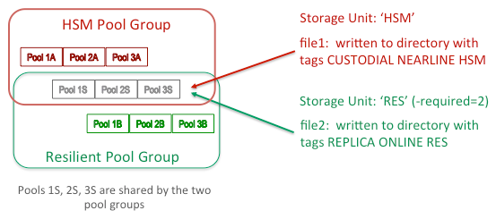

The Resilience Service
======================

-----
[TOC bullet hierarchy]
-----

## Configuring the resilience service

### Activating resilience

The service can be run out of the box. All that is required is to include it in
some domain.

Resilience communicates directly with Chimera, so `chimera.db.host` should be
set explicitly if Resilience is not running on the same host as the database.

```ini
[someDomain/resilience]
chimera.db.host=<host-where-chimera-runs>
```

### Memory requirements

While it is possible to run Resilience in the same domain as other services,
memory requirements for resilience handling are fairly substantial, particularly
for large installations.

~~~~~~~~~~~~~~~~~~~~~~~~~~~~~~~~~~~~~~~~~~~~~~~~~~~~~~~~~~~~~~~~~~~~~~~~~~~~~~~~
 BEST PRACTICE: We recommend at least 8GB of JVM heap be allocated; 16GB is preferable.
                Be sure to allow enough memory for the entire domain.
~~~~~~~~~~~~~~~~~~~~~~~~~~~~~~~~~~~~~~~~~~~~~~~~~~~~~~~~~~~~~~~~~~~~~~~~~~~~~~~~

Whenever feasible, it is recommended to give Resilience its own domain.

### Some definitions

A **resilient file** is one whose `AccessLatency` is `ONLINE` and which belongs
to a **resilient storage unit**.

A **resilient storage unit** is one where the `required` (copies) attribute is
set to a value greater than 1 (the default).

A **resilient storage unit** must be linked to a **resilient pool group** for it
to be acted upon. When linked to a pool group which is not resilient, the
storage unit requirements will be invisible to Resilience.

Resilient replicas (belonging to **resilient storage unit**s) will, for this
reason, only be found on **resilient pools** (belonging to a **resilient pool
group**), though not all files on resilient pools are necessarily resilient (see
below concerning [shared
pools](https://github.com/dCache/dcache/wiki/Resilience#pool-sharing)).

Note that a file's `RetentionPolicy` is not limited to `REPLICA` in order for it
to qualify as resilient; one may have `CUSTODIAL` files which are also given
permanent on-disk copies (the 'Own Cloud' dCache instance running at DESY uses
this configuration to maintain both hard replicas and a tape copy for each
file).

### Setting up resilience

To have a fully functioning resilient installation, you must take the following
steps:

1.  Define one or more resilient pool groups.

2.  Define one or more resilient storage units, and link them to a resilient
    group or groups.

3.  Create the namespace directories where these files will reside, with the
    necessary tags.

#### Defining a resilient pool group

To make a pool group resilient, simply add the '`-resilient`' flag; e.g., in
`poolmanager.conf`:

~~~~~~~~~~~~~~~~~~~~~~~~~~~~~~~~~~~~~~~~~~~~~~~~~~~~~~~~~~~~~~~~~~~~~~~~~~~~~~~~
psu create pgroup resilient-group -resilient
~~~~~~~~~~~~~~~~~~~~~~~~~~~~~~~~~~~~~~~~~~~~~~~~~~~~~~~~~~~~~~~~~~~~~~~~~~~~~~~~

Once a pool group is defined as resilient, it will become "visible" to the
resilience service.

A pool may belong to **only one** resilient group, though it can belong to any
number of non-resilient groups as well. When the resilience service selects a
location for an additional copy, it does so from within the resilient pool group
of the file's source location.

~~~~~~~~~~~~~~~~~~~~~~~~~~~~~~~~~~~~~~~~~~~~~~~~~~~~~~~~~~~~~~~~~~~~~~~~~~~~~~~~
WARNING:  Be careful when redefining a pool group by removing its resilient flag.
          (This is not possible, as a safety precaution, using an admin command;
          it requires manual modification and reloading of the poolmanager
          configuration file.)  Doing so makes all files on all pools in that
          group no longer considered to be resilient;  they will, however, remain
          indefinitely "pinned" or sticky, and thus not susceptible to garbage
          collection.
~~~~~~~~~~~~~~~~~~~~~~~~~~~~~~~~~~~~~~~~~~~~~~~~~~~~~~~~~~~~~~~~~~~~~~~~~~~~~~~~

~~~~~~~~~~~~~~~~~~~~~~~~~~~~~~~~~~~~~~~~~~~~~~~~~~~~~~~~~~~~~~~~~~~~~~~~~~~~~~~~
BEST PRACTICE:  Drain pools in a resilient pool group before removing the
                group's resilience flag.
~~~~~~~~~~~~~~~~~~~~~~~~~~~~~~~~~~~~~~~~~~~~~~~~~~~~~~~~~~~~~~~~~~~~~~~~~~~~~~~~

#### Defining a resilient storage unit

There are two attributes which pertain to resilience.

1.  `required` defines the number of copies files of this unit should receive
    (default is 1).

2.  `onlyOneCopyPer` takes a comma-delimited list of pool tag names; it
    indicates that copies must be partitioned among pools such that each replica
    has a distinct value for each of the tag names in the list (default is
    undefined).

To create, for instance, a resilient storage unit requiring two copies, each on
a different host, one would do something like this:

~~~~~~~~~~~~~~~~~~~~~~~~~~~~~~~~~~~~~~~~~~~~~~~~~~~~~~~~~~~~~~~~~~~~~~~~~~~~~~~~
psu create unit -store test:resilient1@osm
psu set storage unit test:resilient1@osm -required=2 -onlyOneCopyPer=hostname
~~~~~~~~~~~~~~~~~~~~~~~~~~~~~~~~~~~~~~~~~~~~~~~~~~~~~~~~~~~~~~~~~~~~~~~~~~~~~~~~

This example assumes that the pool layout has also configured the pools with the
appropriate `hostname` tag and value.

#### Configuration Example

The following demonstrates the setup for a single resilient pool, pool group and
storage unit. The usual procedure for linking pools, pool groups and units
continues to apply.

~~~~~~~~~~~~~~~~~~~~~~~~~~~~~~~~~~~~~~~~~~~~~~~~~~~~~~~~~~~~~~~~~~~~~~~~~~~~~~~~
psu create unit -store test:resilient1@osm
psu set storage unit test:resilient1@osm -required=2 -onlyOneCopyPer=hostname

psu create ugroup resilient1-units
psu addto ugroup resilient1-units test:resilient1@osm

psu create pool resilient1-pool1

psu create pgroup resilient1-pools -resilient
psu addto pgroup resilient1-pools resilient1-pool1

psu create link resilient1-link resilient1-units ...
psu addto link resilient1-link resilient1-pools
~~~~~~~~~~~~~~~~~~~~~~~~~~~~~~~~~~~~~~~~~~~~~~~~~~~~~~~~~~~~~~~~~~~~~~~~~~~~~~~~

#### Setting the directory tags

To continue with the above example, the tags which would be minimally required
in the directories pointing to this storage unit are:

~~~~~~~~~~~~~~~~~~~~~~~~~~~~~~~~~~~~~~~~~~~~~~~~~~~~~~~~~~~~~~~~~~~~~~~~~~~~~~~~
.(tag)(AccessLatency): ONLINE
.(tag)(sGroup): resilient1
~~~~~~~~~~~~~~~~~~~~~~~~~~~~~~~~~~~~~~~~~~~~~~~~~~~~~~~~~~~~~~~~~~~~~~~~~~~~~~~~

### Pool Sharing

It is possible to share pools between a resilient group and a group backed by an
HSM. The files can be mixed, and the HSM files will not be replicated. This
diagram illustrates a simple example:



Because Resilience checks whether the `AccessLatency` attribute is `ONLINE`, the
`NEARLINE` files belonging to `hsmunit` are ignored. This pertains to pool scans
as well. Thus 1A, 2A and 3A can contain both replicas and cached copies.

### Cached files on resilient pools

As of Golden Release 5.2, the semantics of resilience have changed in the
following ways:

-    the namespace information is not acted upon until a verification
     is run against the pool repositories supposedly containing the replicas
     the database has recorded.

-    full information about whether the replica has the system-owned
     "sticky" flag or is just cached is now gathered by resilience.

-    removal of a given replica is done not by setting the repository state
     to REMOVED, but by removing the "sticky" flag bit.

Several important advantages result from these changes.

-    Pool sharing no longer carries any restrictions in the sense that
     if the pool is resilient, one should not manually p2p a replica of
     a file to it, or that hot replication should be turned off.  Resilience
     will now handle such situations seamlessly.

-    Allowing the sweeper to remove unnecessary or excess copies by changing
     permanent replicas into cached ones is inherently safer.  It also means
     that resilient pools can also be periodically swept for efficiency.

-    A resilient replica which is marked PRECIOUS (the first/new location of a
     CUSTODIAL ONLINE file which is resilient) will not be selected for
     removal in the case of excess copies (this was not guaranteed previously).

There is still one caveat about resilient pools:

> **WARNING**
>
> If a pool is part of a resilient pool group, it should NOT carry the
> large file store configuration
> ```ini
> pool.lfs=volatile
> ```
>
> This is because as a resilient pool group member, this pool could be
> chosen by the Pool Manager as the location of the original (new)
> copy, in which case the system "sticky" flag required for ONLINE
> files will actually be suppressed.  This will cause resilience to
> treat this file as "missing" (since it ignores cached replicas in
> its file count), and to send an alarm before any further replicas
> can be made.

## Resilience home

On the host where the resilience service is running, you will see several files
in the `resilience.home` directory (`/var/lib/dcache/resilience` by default):

-   `pnfs-operation-map`

-   `pnfs-backlogged-messages`

-   `pnfs-operation-statistics`

-   `pnfs-operation-statistics-task-{datetime}`

-   `excluded-pools`

Explanations of these files follow.

### pnfs-operation-map

This is the snapshot of the main operation table. By default, this checkpoint is
written out (in simple text format) every minute. As mentioned above, this
serves as a heuristic for immediately reprocessing incomplete operations in case
of a service crash and restart. It is an approximation of current state, so not
all file operations in progress at that time may have actually been saved, nor
completed ones removed. As previously stated, the periodic pool scan should
eventually detect any missing replicas not captured at restart.

When a new snapshot is taken, the old is first renamed to
`pnfs-operation-map-old`. Similarly, at restart, before being reread, the file
is renamed to `pnfs-operation-map-reload` to distinguish it from the current
snapshot whose processing may overlap with the reloading.

### pnfs-backlogged-messages

It is possible to enable and disable message handling inside Resilience. There
is also a short delay at startup which may also accumulate a backlog. Any
messages which happen to arrive during this period are written out to this file,
which is then read back in and deleted during initialization. The lifetime of
the file, in the latter case, is therefore rather brief, so you will usually not
see one in the directory unless you purposely disable message handling.

### pnfs-operation-statistics and pnfs-operation-statistics-task-{datetime}

Through an admin command, one can enable and disable the recording of
statistical data. When activated, two kinds of files are produced. The first is
an overview of performance with respect to file location messages and
operations. The second contains detailed, task-by-task records and timings for
each terminated file operation, written out at 1-minute intervals; this logging
rolls over every hour until deactivated.

The overview file can be accessed directly in the admin door via `diag history`:

~~~~~~~~~~~~~~~~~~~~~~~~~~~~~~~~~~~~~~~~~~~~~~~~~~~~~~~~~~~~~~~~~~~~~~~~~~~~~~~~
CHECKPOINT                   |          NEWLOC        HZ      CHNG |          FILEOP        HZ      CHNG       FAILED |         CHCKPTD
Tue Jun 07 09:22:21 CDT 2016 |        65592310       512     1.94% |        65595972       516     2.88%           23 |              68
~~~~~~~~~~~~~~~~~~~~~~~~~~~~~~~~~~~~~~~~~~~~~~~~~~~~~~~~~~~~~~~~~~~~~~~~~~~~~~~~

As can be seen, the time of the snapshot is followed by a breakdown based on
arriving (new) locations and triggered file operations; for each, the total
(since the start of the resilience service) is given, along with the rate
sampled over the last checkpoint interval, and the percentage change from the
previous interval. The number of failures and the entry count for the last
snapshot are also reported.

The hourly task files must be read locally. The format used is as follows:

~~~~~~~~~~~~~~~~~~~~~~~~~~~~~~~~~~~~~~~~~~~~~~~~~~~~~~~~~~~~~~~~~~~~~~~~~~~~~~~~
PNFSID | STARTED ENDED | PARENT SOURCE TARGET | VERIFY COPY REMOVE | STATUS
~~~~~~~~~~~~~~~~~~~~~~~~~~~~~~~~~~~~~~~~~~~~~~~~~~~~~~~~~~~~~~~~~~~~~~~~~~~~~~~~

*Parent* refers to a pool which is being scanned; new files have no parent. For
each entry, two timings are reported: *verify* refers to the part of the
operation which determines whether the file needs handling; then either a copy
or remove timing is given.

### excluded-pools

When the command `pool exclude <pools>` is used, the pool operation record is
marked as `EXCLUDED`. This can be observed when the `pool ls` command is issued.
Pools so marked are recorded to this file after each pool monitor state update
(every 30 seconds). This file is read in, again if it exists, at startup, so
that previously excluded pools will continue to be treated as such.

For pool exclusion, see the [section
below](https://github.com/dCache/dcache/wiki/Resilience#exclude-a-pool-from-resilience-handling)
under typical scenarios.

## Admin Commands

There are a number of ways to interact with the resilience service through the
admin door. As usual, the best guide for each command is to consult its help
documentation (`\h <command>`).

These commands will not be discussed in detail here. We instead present a brief
overview and a few examples of output.

### Available actions

1.  `enable`, `disable [strict]`: Enable and disable Resilience message
    handling; enable and disable all of Resilience without having to stop the
    domain.

1.  `async cmd cancel`, `async cmd cleanup`, `async cmd ls`, `async cmd results`:  For management
    of jobs (inaccessible files, contained-in queries) run asynchronously; allows
    for listing, cancelation, and removal of entries, and inspection of the
    contents of the file where results are printed.

1.  `contained in`:  Print to afile the `pnfsids` whose replicas are
    entirely contained by (i.e., only found on) the locations/pools indicated
    by the expression.

1.  `inaccessible`: Print to a file the `pnfsids` for a pool which currently
    have no readable locations.

1.  `file check`: Run a job to adjust replicas for a given file (i.e., make
    required copies or remove unnecessary ones).

1.  `file ctrl`, `pool ctrl`: Reset properties controlling internal behavior
    (such as sweep intervals, grace periods, etc.).

1.  `file ls`: List the current file operations, filtered by attributes or
    state; or just output the count for the given filter.

1.  `file cancel`: Cancel file operations using a filter similar to the list
    filter.

1.  `pool info`: List pool information derived from the pool monitor.

1.  `pool group info`: List the storage units linked to a pool group and confirm
    resilience constraints can be met by the member pools.

1.  `pool ls`: List pool operations, filtered by attributes or state.

1. `pool cancel`: Cancel pool operations using a filter similar to the list
    filter.

1. `pool scan`: Initiate forced scans of one or more pools.

1. `pool include`, `pool exclude`: Set the status of a pool operation to
    exclude or include it in replica counting and resilience handling.

1. `diag`: Display diagnostic information, including number of messages
    received, number of operations completed or failed, and their rates; display
    detailed transfer information by pool and type (copy/remove), with the pool
    as source and target.

1. `diag history [enable]`: Enable or disable the collection of statistics;
    display the contents of the diagnostic history file.

1. `history [errors]`: List the most recent file operations which have
    completed and are now no longer active; do the same for the most recent
    terminally failed operations.

### Example output

One of the most useful commands is `diag`, or diagnostics. This can be called
with or without a regular expression (indicating pool names):

~~~~~~~~~~~~~~~~~~~~~~~~~~~~~~~~~~~~~~~~~~~~~~~~~~~~~~~~~~~~~~~~~~~~~~~~~~~~~~~~
[fndcatemp2] (Resilience@resilienceDomain) admin > diag .*
Running since: Fri Jun 03 14:47:40 CDT 2016
Uptime 3 days, 19 hours, 56 minutes, 36 seconds

Last pnfs sweep at Tue Jun 07 10:44:17 CDT 2016
Last pnfs sweep took 0 seconds
Last checkpoint at Tue Jun 07 10:43:24 CDT 2016
Last checkpoint took 0 seconds
Last checkpoint saved 86 records

MESSAGE                               received  msgs/sec
    CLEAR_CACHE_LOCATION                    19         0
    CORRUPT_FILE                             5         0
    ADD_CACHE_LOCATION                67898905       515
    POOL_STATUS_DOWN                         0         0
    POOL_STATUS_UP                         169         0

OPERATION                            completed   ops/sec       failed
    FILE                              67901908       517           23
    POOL_SCAN_DOWN                           0         0            0
    POOL_SCAN_ACTIVE                       228         0            0

TRANSFERS BY POOL                   from              to          failed         size             removed          failed         size
dmsdca15-1                        959166          962097               0    939.55 KB                 0               0           0
dmsdca15-1.1                      972972          973463               0    950.65 KB                 0               0           0
dmsdca15-2                        967710          970284               1    947.54 KB                 0               0           0
dmsdca15-2.1                      968995          972802               0    950.00 KB                 0               0           0
dmsdca15-3                        956909          963618               1    941.03 KB                 0               0           0
dmsdca15-3.1                      970977          973876               0    951.05 KB                 0               0           0
dmsdca15-4                        959851          959739               0    937.25 KB                 0               0           0
dmsdca15-4.1                      926010          926611               0    904.89 KB                 0               0           0
...
TOTALS                          67901908        67901908              22     64.76 MB                 0               0           0
~~~~~~~~~~~~~~~~~~~~~~~~~~~~~~~~~~~~~~~~~~~~~~~~~~~~~~~~~~~~~~~~~~~~~~~~~~~~~~~~

Along with basic uptime information and operation tracking, the pool expression
displays transfer counts by pool and type (copy, remove).

Also very useful is the file operation list command. This can display the actual
records for the file operations (here given without any filtering):

~~~~~~~~~~~~~~~~~~~~~~~~~~~~~~~~~~~~~~~~~~~~~~~~~~~~~~~~~~~~~~~~~~~~~~~~~~~~~~~~
[fndcatemp2] (Resilience@resilienceDomain) admin > file ls
Tue Jun 07 11:16:12 CDT 2016 (0000C0C4B60020C04B94A8570B0594ACD416 REPLICA)(COPY RUNNING)(parent none, count 1, retried 0)
Tue Jun 07 11:16:12 CDT 2016 (00000447C17631D34ACE98EEDD19A97522F4 REPLICA)(COPY RUNNING)(parent none, count 1, retried 0)
Tue Jun 07 11:16:12 CDT 2016 (00001EE0A9AA9449405890401D5CE5931EB7 REPLICA)(COPY RUNNING)(parent none, count 1, retried 0)
Tue Jun 07 11:16:12 CDT 2016 (00006F319230C7464FEE8BC9BBECFD11636E REPLICA)( RUNNING)(parent none, count 1, retried 0)
…
Tue Jun 07 11:16:12 CDT 2016 (0000C2F0B0C5240F407E964DA748518C106C REPLICA)( RUNNING)(parent none, count 1, retried 0)
Tue Jun 07 11:16:12 CDT 2016 (000092AF5289517D4C029CDFFBF6D92C769B REPLICA)(COPY RUNNING)(parent none, count 1, retried 0)
TOTAL OPERATIONS:       89
~~~~~~~~~~~~~~~~~~~~~~~~~~~~~~~~~~~~~~~~~~~~~~~~~~~~~~~~~~~~~~~~~~~~~~~~~~~~~~~~

You can also use '`$`' as an argument to list the count:

~~~~~~~~~~~~~~~~~~~~~~~~~~~~~~~~~~~~~~~~~~~~~~~~~~~~~~~~~~~~~~~~~~~~~~~~~~~~~~~~
[fndcatemp2] (Resilience@resilienceDomain) admin > file ls $ -state=WAITING
0 matching pnfsids
~~~~~~~~~~~~~~~~~~~~~~~~~~~~~~~~~~~~~~~~~~~~~~~~~~~~~~~~~~~~~~~~~~~~~~~~~~~~~~~~

Appending a '`@`' to the dollar sign will display the counts broken down by
source pool:

~~~~~~~~~~~~~~~~~~~~~~~~~~~~~~~~~~~~~~~~~~~~~~~~~~~~~~~~~~~~~~~~~~~~~~~~~~~~~~~~
[fndcatemp2] (Resilience@resilienceDomain) admin > file ls $@ -state=RUNNING
152 matching pnfsids.

Operation counts per pool:
     dmsdca15-1                             5
     dmsdca21-6.1                           1
     dmsdca21-8.1                           5
     dmsdca17-1.1                           3
     dmsdca18-1.1                           3
     dmsdca22-8.1                           2
     dmsdca22-4.1                          19
     dmsdca22-2.1                          11
     …
~~~~~~~~~~~~~~~~~~~~~~~~~~~~~~~~~~~~~~~~~~~~~~~~~~~~~~~~~~~~~~~~~~~~~~~~~~~~~~~~

A similar command, `pool ls`, exists for checking the current status of any pool
scan operations:

~~~~~~~~~~~~~~~~~~~~~~~~~~~~~~~~~~~~~~~~~~~~~~~~~~~~~~~~~~~~~~~~~~~~~~~~~~~~~~~~
[fndcatemp2] (Resilience@resilienceDomain) admin > pool ls dmsdca17
 dmsdca17-2 (completed: 0 / 0 : ?%) – (updated: Mon Jun 06 14:47:33 CDT 2016)(scanned: Mon Jun 06 14:47:33 CDT 2016)(prev ENABLED)(curr ENABLED)(IDLE)
 dmsdca17-1 (completed: 0 / 0 : ?%) – (updated: Mon Jun 06 15:01:55 CDT 2016)(scanned: Mon Jun 06 15:01:55 CDT 2016)(prev ENABLED)(curr ENABLED)(IDLE)
 dmsdca17-1.1   (completed: 0 / 0 : ?%) – (updated: Mon Jun 06 15:20:32 CDT 2016)(scanned: Mon Jun 06 15:20:32 CDT 2016)(prev ENABLED)(curr ENABLED)(IDLE)
 dmsdca17-2.1   (completed: 0 / 0 : ?%) – (updated: Mon Jun 06 17:53:23 CDT 2016)(scanned: Mon Jun 06 17:53:23 CDT 2016)(prev ENABLED)(curr ENABLED)(IDLE)
~~~~~~~~~~~~~~~~~~~~~~~~~~~~~~~~~~~~~~~~~~~~~~~~~~~~~~~~~~~~~~~~~~~~~~~~~~~~~~~~

For each operation, the timestamps of the last update (change in status) and of
the last completed scan are indicated, as well as pool status (`ENABLED` here),
and operation state (`IDLE`, `WAITING`, `RUNNING`). For running scans, the
number of file operations completed out of a total (if known) is reported.

Finally, the two `ctrl` commands can be used to verify or reset basic
configuration values, or to interrupt operation processing or force a sweep to
run. Here is the info output for each:

~~~~~~~~~~~~~~~~~~~~~~~~~~~~~~~~~~~~~~~~~~~~~~~~~~~~~~~~~~~~~~~~~~~~~~~~~~~~~~~~
[fndcatemp2] (Resilience@resilienceDomain) admin > file ctrl
maximum concurrent operations 200.
maximum retries on failure 2
sweep interval 1 MINUTES
checkpoint interval 1 MINUTES
checkpoint file path /var/lib/dcache/resilience/pnfs-operation-map
Last pnfs sweep at Tue Jun 07 11:38:28 CDT 2016
Last pnfs sweep took 0 seconds
Last checkpoint at Tue Jun 07 11:38:26 CDT 2016
Last checkpoint took 0 seconds
Last checkpoint saved 87 records

[fndcatemp2] (Resilience@resilienceDomain) admin > pool ctrl
down grace period 1 HOURS
restart grace period 6 HOURS
maximum concurrent operations 5
scan window set to 24 HOURS
period set to 3 MINUTE
~~~~~~~~~~~~~~~~~~~~~~~~~~~~~~~~~~~~~~~~~~~~~~~~~~~~~~~~~~~~~~~~~~~~~~~~~~~~~~~~

## Tuning

Only a few properties can be reset using the `ctrl` commands shown above. Please
consult the documentation in the `resilience.properties` defaults for a fuller
explanation of the tuning issues which pertain to resilience. If adjustments to
the preset values are made, remember to ensure that enough database connections
remain available to service both Chimera operations and Resilience operations,
and that these be properly matched to the number of threads responsible for the
various operations, in order to avoid contention (see again, the explanation in
the default properties file).

## Resilience's View of Pool Status

In order to allow for flexibility in configuring door access to pools, the
`disabled` state on a pool is interpreted this way:

-  `\s <pool> pool disable -p2p-client` means no p2p can be written to this pool;
Resilience will not use this pool to make copies, though doors can still write
new files there.

-  `\s <pool> pool disable -store` means doors cannot write new copies to the
pool, though it is still available for p2p; hence Resilience can still use this
pool to make copies.

-  `\s <pool> pool disable -rdonly` means the pool cannot be written to either
by doors or Resilience.

-  `\s <pool> pool disable -strict` indicates not only that the pool is disabled
for write, but also for read; is the pool is resilient, Resilience will schedule
it for a scan so that the resilient files it contains can be replicated elsewhere.

## Automatic Staging of Missing CUSTODIAL Replicas

Files whose `retention policy` is `CUSTODIAL` and whose `access latency` is `ONLINE`
will be handled by Resilience when their replicas are found in a resilient
pool group and their `required` property is defined.

Such files constitute a special case for the purposes of recovery.  For instance,
if a normal resilient file with 2 copies on disk becomes inaccessible because
both pools containing those two copies went offline at about the same time (not
permitting Resilience time to react to make another replica), then an alarm
concerning this file's current inaccessibility is raised.  If this file is also
`CUSTODIAL` and has a copy on tertiary storage, resilience will first attempt to
restage it before considering it inaccessible.

There is no special configuration setup to enable this.  Resilience has been
tested for restaging of this sort even with a setup where there are special
staging pools from which the staged-in replica is then to be p2p'd to a resilient
pool group, and works normally in this case (i.e., provided the proper link
selection preferences are set).

## Handling of QoS Transitions for Resilient Files

As of dCache 6.1, resilience also handles changes in ACCESS LATENCY for
files that are in resilient pool groups and belong to a storage unit
which has a non-null '-required' attribute.  This means, for instance, that
a change from ONLINE CUSTODIAL to NEARLINE CUSTODIAL will remove the
permanent pin on all disk copies.  Changes from NEARLINE CUSTODIAL to
ONLINE CUSTODIAL will also be handled in the usual manner by resilience,
because the service now subscribes to attribute change messages broadcast
by the PnfsManager.

## Some typical scenarios part 1: what happens when ...?

### Resilience is initialized (service start)

Should the resilience service go offline, nothing special occurs when it is
restarted. That is, it will simply go through the full re-initialization
procedures.

Initialization steps are reported at the logging `INFO` level, and can be
observed from the pinboard:

~~~~~~~~~~~~~~~~~~~~~~~~~~~~~~~~~~~~~~~~~~~~~~~~~~~~~~~~~~~~~~~~~~~~~~~~~~~~~~~~
[fndcatemp2] (Resilience@resilienceDomain) admin > show pinboard
11:50:50 AM [pool-9-thread-1] [] Waiting for pool monitor refresh notification.
11:50:50 AM [pool-9-thread-1] [] Received pool monitor; loading pool information.
11:50:50 AM [pool-9-thread-1] [] Loading pool operations.
11:50:50 AM [pool-9-thread-1] [] Pool maps reloaded; initializing ...
11:50:50 AM [pool-9-thread-1] [] Pool maps initialized; delivering backlog.
11:50:50 AM [Consumer] [] Backlogged messages consumer exiting.
11:50:50 AM [pool-9-thread-1] [] Messages are now activated; starting pnfs consumer.
11:50:50 AM [pool-9-thread-1] [] Pnfs consumer is running; activating admin commands.
11:50:50 AM [Reloader] [] Done reloading backlogged messages.
11:50:50 AM [pool-9-thread-1] [] Starting the periodic pool monitor refresh check.
11:50:50 AM [pool-9-thread-1] [] Updating initialized pools.
11:50:50 AM [pool-9-thread-1] [] Admin access enabled; reloading checkpoint file.
11:50:50 AM [pool-9-thread-1] [] Checkpoint file finished reloading.
~~~~~~~~~~~~~~~~~~~~~~~~~~~~~~~~~~~~~~~~~~~~~~~~~~~~~~~~~~~~~~~~~~~~~~~~~~~~~~~~

PoolMonitor state is initially pulled from PoolManager, and thereafter refreshed
every 30 seconds by a push from PoolManager to its "subscribers" (of which
Resilience is one). Once the initial monitor state is received, pool information
is parsed and loaded into a local data structure (accessed via the `pool info`
command). The pool operations table is then built (accessed via the `pool ls`
command). The `excluded-pools` file is also reloaded at this point.

#### What exactly does `UNINITIALIZED` mean for a pool?

In addition to the usual pool status types (`ENABLED`, `READ_ONLY`, `DOWN`),
`UNINITIALIZED` serves to indicate incomplete information on that pool from the
PoolMonitor. The transition from `UNINITIALIZED` to another state occurs when
the resilience service comes on line, whether simultaneously with pool
initialization or not.

>   **The probability of pools going down at initialization is low, but it is
>   possible that Resilience could go down and then restart to find a number of
>   pools down. In this case, the** `DOWN` **pools will be handled as usual (see
>   below). On the other hand, it is preferable not to treat the transition to**
>   `READ_ONLY`**/**`ENABLED` **as a "restart" when coming out of**
>   `UNINITIALIZED`**, since the majority of pools will most of the time
>   initialize to a viable readable status, and handling this transition would
>   unnecessarily provoke an immediate system-wide scan.**

During this phase of initialization, message handling is still inactive; hence
any incoming messages are temporarily cached. When the pool info and operation
tables have been populated, the backlogged messages are handled. At the same
time, message handling is also activated. Up until this point, issuing any admin
commands requiring access to Resilience state will result in a message that the
system is initializing:

~~~~~~~~~~~~~~~~~~~~~~~~~~~~~~~~~~~~~~~~~~~~~~~~~~~~~~~~~~~~~~~~~~~~~~~~~~~~~~~~
[fndcatemp2] (Resilience@resilienceDomain) admin > diag
Resilience is not yet initialized; use 'show pinboard' to see progress, or 'enable' to re-initialize if previously disabled.
~~~~~~~~~~~~~~~~~~~~~~~~~~~~~~~~~~~~~~~~~~~~~~~~~~~~~~~~~~~~~~~~~~~~~~~~~~~~~~~~

After this point, admin commands become viable and the pool information is
periodically refreshed (every 30 seconds, in response to the PoolMonitor
message). Changes in pool state or pool group and storage unit composition are
recorded and appropriate action, if necessary, is taken.

The final step in initialization is to reload any operations from the checkpoint
file.

>   **This can be a lengthy procedure if the file is large, but should pose no
>   particular issues, since the system treats the reloaded operations as just
>   another set of cache location updates and handles them accordingly.**

### A pool goes down or is reported as dead

Resilience considers pools viable until they become unreadable. If a pool is
read-only, its files will still be counted as accessible replicas, and will be
used as potential sources for copying (naturally, the pool is excluded as target
for new copies). Once a pool becomes entirely disabled, Resilience will mark it
as `DOWN` and queue it for an eventual scan. The scan will be activated as soon
as the expiration of the grace period for that pool has been detected by the
pool "watchdog" (which wakes up every three minutes by default).

>   **When we speak of "scanning" a pool which is down or inaccessible, this is
>   shorthand for saying that Resilience runs a query against the namespace to
>   find all the** `pnfsids` **which have** `AccessLatency` **=** `ONLINE` **and
>   a** `location` **(copy) on that pool. No actual interaction with the pool
>   takes place.**

Once a scan is completed on a dead pool, no more scans will be done on it until
its state changes.

Under most circumstances, no intervention should be required. This is part of
the normal functioning of the service.

### A pool is re-enabled or brought back on line

This is just the counterpart to the previous scenario. When a pool is brought
back on line, Resilience queues it for eventual scanning, once again activated
as soon as the expiration of the grace period is detected. Note that the grace
periods for pool down and pool restart are independent properties.

If a scan on the pool is currently running when the pool comes back up, it will
be immediately canceled and a new scan rescheduled.

Note that Resilience always does the same thing on a scan, whether triggered by
a change from `UP` to `DOWN` or vice versa: it checks the countable replicas of
a file, compares them to the required number, and takes the appropriate action
(either copy or remove).

### Several pools go off line simultaneously

Each will be treated as above. By default, five scans are allowed to run
simultaneously. If there are more scans than five, they will continue in the
`WAITING` state until a slot becomes available.

Scans can take some time to complete, depending on how big the pool is. If there
is a `WAITING` scan which has not run yet when the periodic window for the scan
expires, it will simply remain queued until it finally runs.

#### Why don't I see a value for the 'total' on the admin `pool ls` output for a `RUNNING` pool operation?

When a pool is scanned, a query is run against Chimera to collect all the
`pnfsids` associated with `ONLINE` files on the given pool. The scanning
processes the results from the query via a cursor, so each file is checked and
queued for treatment if necessary, in order. This looping through the results
can very easily take longer than it does for some of the operations it has
created to be run and to complete. But the total number of files to process is
only known at the end of this loop. So it is possible to see a value for the
number of files processed so far before seeing the total. Obviously, only when
the total exists can the % value be computed.

## Some typical scenarios part 2: how do I ...?

During the normal operation of a resilient installation of dCache, changes to
the number of pools, along with the creation and removal of storage classes or
pool groups, will undoubtedly be necessary. The following describes the steps to
take and what response to expect from the resilience service in each case.

### Add a pool to a resilient group

Let us assume that we have some new disk space available on node `dmsdca24`, and
that we want to use it to host some pools. Of course, the first steps are to
prepare the appropriate partitions for the pools and to create the pool area
(directory) with the necessary setup file for dCache (see "Creating and
configuring pools" in the [Configuring
dCache](https://www.dcache.org/manuals/Book-2.16/Book-fhs.shtml#in-install-configure)
section of the dCache Book). Once we have done that, and have also added the
pool stanza to the layout file
[(ibid)](https://www.dcache.org/manuals/Book-2.16/Book-fhs.shtml#in-install-configure),
we can proceed to add the pool to the `psu` (PoolSelectionUnit):

~~~~~~~~~~~~~~~~~~~~~~~~~~~~~~~~~~~~~~~~~~~~~~~~~~~~~~~~~~~~~~~~~~~~~~~~~~~~~~~~
[fndcatemp2] (PoolManager@dCacheDomain) admin > \c PoolManager
psu create pool rw-dmsdca24-1 -disabled
~~~~~~~~~~~~~~~~~~~~~~~~~~~~~~~~~~~~~~~~~~~~~~~~~~~~~~~~~~~~~~~~~~~~~~~~~~~~~~~~

We can then start the pool on the host. It should then appear enabled:

~~~~~~~~~~~~~~~~~~~~~~~~~~~~~~~~~~~~~~~~~~~~~~~~~~~~~~~~~~~~~~~~~~~~~~~~~~~~~~~~
[fndcatemp2] (PoolManager@dCacheDomain) admin > psu ls -a  pool rw-dmsdca24-1
rw-dmsdca24-1  (enabled=false;active=15;rdOnly=false;links=0;pgroups=0;hsm=[];mode=enabled)
  linkList   :
  pGroupList :
~~~~~~~~~~~~~~~~~~~~~~~~~~~~~~~~~~~~~~~~~~~~~~~~~~~~~~~~~~~~~~~~~~~~~~~~~~~~~~~~

Let us now say that we want to make this a resilient pool by adding it to a
resilient pool group.

~~~~~~~~~~~~~~~~~~~~~~~~~~~~~~~~~~~~~~~~~~~~~~~~~~~~~~~~~~~~~~~~~~~~~~~~~~~~~~~~
[fndcatemp2] (PoolManager@dCacheDomain) admin > psu addto pgroup res-group rw-dmsdca24-1

[fndcatemp2] (Resilience@resilienceDomain) admin > \sp psu ls -a pool rw-dmsdca24-1
rw-dmsdca24-1  (enabled=false;active=19;rdOnly=false;links=0;pgroups=1;hsm=[];mode=enabled)
  linkList   :
  pGroupList :
    res-group(links=1; pools=35; resilient=true)

[fndcatemp2] (PoolManager@dCacheDomain) admin > psu ls -a pgroup res-group
res-group
 resilient = true
 linkList :
   res-link  (pref=10/10/-1/10;;ugroups=3;pools=1)
 poolList :
   dmsdca15-1  (enabled=true;active=14;rdOnly=false;links=0;pgroups=1;hsm=[enstore];mode=enabled)
   dmsdca15-1.1  (enabled=true;active=10;rdOnly=false;links=0;pgroups=1;hsm=[enstore];mode=enabled)
   ...
   dmsdca22-8.1  (enabled=true;active=7;rdOnly=false;links=0;pgroups=1;hsm=[enstore];mode=enabled)
   rw-dmsdca24-1  (enabled=false;active=5;rdOnly=false;links=0;pgroups=1;hsm=[];mode=enabled)
~~~~~~~~~~~~~~~~~~~~~~~~~~~~~~~~~~~~~~~~~~~~~~~~~~~~~~~~~~~~~~~~~~~~~~~~~~~~~~~~

After the next monitor refresh, Resilience should show this pool as well:

~~~~~~~~~~~~~~~~~~~~~~~~~~~~~~~~~~~~~~~~~~~~~~~~~~~~~~~~~~~~~~~~~~~~~~~~~~~~~~~~
[fndcatemp2] (Resilience@resilienceDomain) admin > pool info rw-dmsdca24-1
key           84
name          rw-dmsdca24-1
tags          {hostname=dmsdca24.fnal.gov, rack=24-1}
mode          enabled
status        ENABLED
last update   Thu Jun 16 09:24:21 CDT 2016

[fndcatemp2] (Resilience@resilienceDomain) admin > pool ls rw-dmsdca24-1
rw-dmsdca24-1   (completed: 0 / 0 : ?%) – (updated: Thu Jun 16 09:25:42 CDT 2016)(scanned: Thu Jun 16 09:25:42 CDT 2016)(prev ENABLED)(curr ENABLED)(IDLE)
~~~~~~~~~~~~~~~~~~~~~~~~~~~~~~~~~~~~~~~~~~~~~~~~~~~~~~~~~~~~~~~~~~~~~~~~~~~~~~~~

When the pool is added, a scan is scheduled for it, provided it is in an
initialized state. In this case, since the pool is empty, the scan completes
quickly.

### Remove a pool from a resilient group

When a pool is removed from a resilient group, the pool needs to be scanned,
because the `ONLINE` files it contains constitute replicas, and as such, the
respective counts for each will be diminished by 1.

Here we walk through several steps to show Resilience put through its paces.

First, let us remove a pool from a resilient pool group.

~~~~~~~~~~~~~~~~~~~~~~~~~~~~~~~~~~~~~~~~~~~~~~~~~~~~~~~~~~~~~~~~~~~~~~~~~~~~~~~~
[fndcatemp2] (PoolManager@dCacheDomain) admin > psu removefrom pgroup res-group rw-dmsdca24-2
~~~~~~~~~~~~~~~~~~~~~~~~~~~~~~~~~~~~~~~~~~~~~~~~~~~~~~~~~~~~~~~~~~~~~~~~~~~~~~~~

We observe the pool has been queued for a scan:

~~~~~~~~~~~~~~~~~~~~~~~~~~~~~~~~~~~~~~~~~~~~~~~~~~~~~~~~~~~~~~~~~~~~~~~~~~~~~~~~
[fndcatemp2] (Resilience@resilienceDomain) admin > pool ls rw-
rw-dmsdca24-2   (completed: 0 / 0 : ?%) – (updated: Thu Jun 16 17:17:09 CDT 2016)(scanned: Thu Jun 16 17:14:33 CDT 2016)(prev ENABLED)(curr ENABLED)(WAITING)
rw-dmsdca24-3   (completed: 0 / 0 : ?%) – (updated: Thu Jun 16 17:14:33 CDT 2016)(scanned: Thu Jun 16 17:14:33 CDT 2016)(prev UNINITIALIZED)(curr ENABLED)(IDLE)
rw-dmsdca24-4   (completed: 0 / 0 : ?%) – (updated: Thu Jun 16 17:14:33 CDT 2016)(scanned: Thu Jun 16 17:14:33 CDT 2016)(prev UNINITIALIZED)(curr ENABLED)(IDLE)
~~~~~~~~~~~~~~~~~~~~~~~~~~~~~~~~~~~~~~~~~~~~~~~~~~~~~~~~~~~~~~~~~~~~~~~~~~~~~~~~

Because we are impatient and don't want to wait 3 minutes, let's wake up the
sleeping watchdog:

~~~~~~~~~~~~~~~~~~~~~~~~~~~~~~~~~~~~~~~~~~~~~~~~~~~~~~~~~~~~~~~~~~~~~~~~~~~~~~~~
[fndcatemp2] (Resilience@resilienceDomain) admin > pool ctrl run
Forced watchdog scan.

[fndcatemp2] (Resilience@resilienceDomain) admin > pool ls rw-dmsdca24-2
rw-dmsdca24-2   (completed: 0 / 0 : ?%) – (updated: Thu Jun 16 17:17:19 CDT 2016)(scanned: Thu Jun 16 17:14:33 CDT 2016)(prev ENABLED)(curr ENABLED)(RUNNING)
~~~~~~~~~~~~~~~~~~~~~~~~~~~~~~~~~~~~~~~~~~~~~~~~~~~~~~~~~~~~~~~~~~~~~~~~~~~~~~~~

Shortly thereafter, we can see it is doing some work:

~~~~~~~~~~~~~~~~~~~~~~~~~~~~~~~~~~~~~~~~~~~~~~~~~~~~~~~~~~~~~~~~~~~~~~~~~~~~~~~~
[fndcatemp2] (Resilience@resilienceDomain) admin > pool ls rw-dmsdca24-2
rw-dmsdca24-2   (completed: 491 / ? : ?%) – (updated: Thu Jun 16 17:17:19 CDT 2016)(scanned: Thu Jun 16 17:14:33 CDT 2016)(prev ENABLED)(curr ENABLED)(RUNNING)
~~~~~~~~~~~~~~~~~~~~~~~~~~~~~~~~~~~~~~~~~~~~~~~~~~~~~~~~~~~~~~~~~~~~~~~~~~~~~~~~

Because this is a demo pool, there aren't many files, so the scan completes
nearly simultaneously with the actual copying; hence there is not enough of a
time lag to see a "% complete" reported.

Upon termination, this pool is no longer resilient; as such, there should no
longer be a record for it in the pool operation table; and indeed, only the
other two "rw-" pools still appear:

~~~~~~~~~~~~~~~~~~~~~~~~~~~~~~~~~~~~~~~~~~~~~~~~~~~~~~~~~~~~~~~~~~~~~~~~~~~~~~~~
[fndcatemp2] (Resilience@resilienceDomain) admin > pool ls rw-
rw-dmsdca24-3   (completed: 0 / 0 : ?%) – (updated: Thu Jun 16 17:14:33 CDT 2016)(scanned: Thu Jun 16 17:14:33 CDT 2016)(prev UNINITIALIZED)(curr ENABLED)(IDLE)
rw-dmsdca24-4   (completed: 0 / 0 : ?%) – (updated: Thu Jun 16 17:14:33 CDT 2016)(scanned: Thu Jun 16 17:14:33 CDT 2016)(prev UNINITIALIZED)(curr ENABLED)(IDLE)
~~~~~~~~~~~~~~~~~~~~~~~~~~~~~~~~~~~~~~~~~~~~~~~~~~~~~~~~~~~~~~~~~~~~~~~~~~~~~~~~

Now, just to spot check that everything is right with the world, let's examine
the recent operations, pick a `pnfsid`, and find its locations (replicas).

~~~~~~~~~~~~~~~~~~~~~~~~~~~~~~~~~~~~~~~~~~~~~~~~~~~~~~~~~~~~~~~~~~~~~~~~~~~~~~~~
 [fndcatemp2] (Resilience@resilienceDomain) admin > history
 … [many other files]
 Thu Jun 16 17:17:23 CDT 2016 (00008F22B12729CE458596DE47E00411D68C REPLICA)(COPY DONE)(parent 20, retried 0)
 … [many other files]

 [fndcatemp2] (Resilience@resilienceDomain) admin > \sn cacheinfoof 00008F22B12729CE458596DE47E00411D68C
 dmsdca15-1 dmsdca15-1.1 dmsdca16-2.1 rw-dmsdca24-2

 [fndcatemp2] (Resilience@resilienceDomain) admin > \sn storageinfoof 00008F22B12729CE458596DE47E00411D68C
 size=1;new=false;stored=false;sClass=resilient-4.dcache-devel-test;cClass=-;hsm=enstore;accessLatency=ONLINE;retentionPolicy=REPLICA;path=<Unknown>;group=resilient-4;family=dcache-devel-test;bfid=<Unknown>;volume=<unknown>;location=<unknown>;
~~~~~~~~~~~~~~~~~~~~~~~~~~~~~~~~~~~~~~~~~~~~~~~~~~~~~~~~~~~~~~~~~~~~~~~~~~~~~~~~

The storage class/unit for this file (`resilient-4.dcache-devel-test@enstore`)
happens to require three copies; there are indeed three, plus the no-longer
valid location which we just removed from resilience handling.

~~~~~~~~~~~~~~~~~~~~~~~~~~~~~~~~~~~~~~~~~~~~~~~~~~~~~~~~~~~~~~~~~~~~~~~~~~~~~~~~
NOTE:     removing a pool from a resilient pool group will not automatically
          delete the files it contains from the pool, nor will it remove
          the system-owned sticky bits for these files (such behavior
          would be unsafe).

WARNING:  if a pool is moved from one resilient pool group to another, the
          replica counts for the added files will be seen in the context
          of the new group, leading to the creation of the required number of
          copies on the pools of the new group (without affecting the previous copies).
~~~~~~~~~~~~~~~~~~~~~~~~~~~~~~~~~~~~~~~~~~~~~~~~~~~~~~~~~~~~~~~~~~~~~~~~~~~~~~~~

The removal of a pool from the `psu` using `psu remove pool <name>` will also
remove the pool from the pool info listing in Resilience; however, if the pool
keeps connecting (i.e., it has not been stopped), its entry will continue to
appear in the PoolMonitor, and thus also in the internal resilience table.

~~~~~~~~~~~~~~~~~~~~~~~~~~~~~~~~~~~~~~~~~~~~~~~~~~~~~~~~~~~~~~~~~~~~~~~~~~~~~~~~
WARNING:  do NOT remove the pool from the psu using 'psu remove pool <name>'
          until the scan of the pool has completed. Otherwise, its reference
          will no longer be visible to Resilience, and the scan will partially
          or completely fail.
~~~~~~~~~~~~~~~~~~~~~~~~~~~~~~~~~~~~~~~~~~~~~~~~~~~~~~~~~~~~~~~~~~~~~~~~~~~~~~~~

One could also disable the pool, let Resilience handle it as a `DOWN` pool, and
then when the scan completes, remove it from the pool group. The removal in this
case should not trigger an additional scan, since the pool is `DOWN` and has
already been processed. Thus this sequence would also work:

~~~~~~~~~~~~~~~~~~~~~~~~~~~~~~~~~~~~~~~~~~~~~~~~~~~~~~~~~~~~~~~~~~~~~~~~~~~~~~~~
[fndcatemp2] (Resilience@resilienceDomain) admin > \s rw-dmsdca24-2 pool disable -strict
...
(after the DOWN scan has completed)
...
[fndcatemp2] (PoolManager@dCacheDomain) admin > psu removefrom pgroup res-group rw-dmsdca24-2
~~~~~~~~~~~~~~~~~~~~~~~~~~~~~~~~~~~~~~~~~~~~~~~~~~~~~~~~~~~~~~~~~~~~~~~~~~~~~~~~

>   **As long as at least one replica of a file continues to reside in a
>   resilient pool group, action will be taken by Resilience (if possible) to
>   maintain the proper number of replicas for that file inside the pool group
>   (a single but currently unreadable copy will raise an alarm, however). Once
>   all pools containing replicas of a given file have been removed from the
>   pool group, however, Resilience becomes agnostic concerning the number of
>   copies of that file (the file becomes "invisible" to Resilience).**

>   **Because of the likelihood of "orphaned" files (files all of whose replicas
>   are inaccessible) when removing or draining pools concurrently, it is
>   recommended that resilient pools be decommissioned/removed serially while
>   resilience is running.  If concurrent draining is necessary, then the
>   `contained in` command may come in useful.  Running that command over
>   the set of pools to be drained and removed will provide a list of
>   pnfsids for which some sort of manual action/migration will be necessary,
>   since they will be alarmed as 'inaccessible' by resilience.**

### Add or remove a resilient group

There is nothing special about adding or removing a resilient group. Doing so
will register the group inside Resilience as well:

~~~~~~~~~~~~~~~~~~~~~~~~~~~~~~~~~~~~~~~~~~~~~~~~~~~~~~~~~~~~~~~~~~~~~~~~~~~~~~~~
[fndcatemp2] (Resilience@resilienceDomain) admin > \sp psu create pgroup r-test-group -resilient

[fndcatemp2] (Resilience@resilienceDomain) admin > pool group info r-test-group
Name         : r-test-group
Key          : 12
~~~~~~~~~~~~~~~~~~~~~~~~~~~~~~~~~~~~~~~~~~~~~~~~~~~~~~~~~~~~~~~~~~~~~~~~~~~~~~~~

even though at this point it is empty. Once pools are added to this group, the
behavior will be as indicated above. To remove the group, remove all the pools
first, let their scans complete, and then remove the group. (See below for how
to override the grace periods for pool status changes in order to force the scan
to run.)

>   **As mentioned above (see the warning under "Defining a resilient group"),
>   it is not possible to use the admin shell to demote a resilient pool group
>   to non-resilient status.**

### Exclude a pool from resilience handling

During normal operation, the resilience service should be expected to handle
gracefully situations where a pool with many files, for one reason or another,
goes offline. Such an incident, even if the "grace period" value were set to 0,
in initiating a large scan, should not bring the system down. Obversely, should
the pool come back on line, any such scan should be (and is) immediately
canceled, and the pool rescheduled for a scan to remove unnecessary copies. So
under most circumstances, no manual intervention or adjustment in this regard
should be required.

Nevertheless, temporary exclusion of one or more pools from being handled by the
resilience service may be desirable in a few situations.

The old Replica Manager provided for marking pools `OFFLINE` (a state distinct
from `DOWN` or `disabled`). Such pools were exempted from pool state change
handling, but their files continued to "count" as valid replicas.

This feature has been held over in the new resilience service.

~~~~~~~~~~~~~~~~~~~~~~~~~~~~~~~~~~~~~~~~~~~~~~~~~~~~~~~~~~~~~~~~~~~~~~~~~~~~~~~~
\s Resilience pool exclude <regular expression>
\s Resilience pool include <regular expression>
~~~~~~~~~~~~~~~~~~~~~~~~~~~~~~~~~~~~~~~~~~~~~~~~~~~~~~~~~~~~~~~~~~~~~~~~~~~~~~~~

#### When **NOT** to use `pool exclude`

The `pool exclude` command interferes with the normal operation of Resilience;
use in the wrong circumstances may easily lead to inconsistent state.

~~~~~~~~~~~~~~~~~~~~~~~~~~~~~~~~~~~~~~~~~~~~~~~~~~~~~~~~~~~~~~~~~~~~~~~~~~~~~~~~
WARNING:  Only use 'pool exclude' for temporary situations where the intention
          is eventually to restore the excluded location(s) to resilience management;
          or when the locations on those pools are actually being migrated or
          deleted from the namespace.
~~~~~~~~~~~~~~~~~~~~~~~~~~~~~~~~~~~~~~~~~~~~~~~~~~~~~~~~~~~~~~~~~~~~~~~~~~~~~~~~

If, for instance, one set a pool to `EXCLUDED`, then removed the pool from a
resilient group, the pool would disappear from the pool operation list (`pool
ls`), but its replicas would still be counted by Resilience. One would then have
to repair the situation manually, either by adding the pool back into the
resilient group and then removing it correctly, or by manually deleting or
migrating the files.

`pool exclude` is useful for doing manual migrations on resilient pool groups,
but caution should be taken when applying it.

_Note that once a pool is excluded, it can no longer be scanned, even manually,
until it is explicitly included again._

### Rebalance or migrate a resilient pool (group)

Rebalancing should be required less often on resilient pools; but if you should
decide to rebalance a resilient pool group, or need to migrate files from one
pool group to another, be sure to disable resilience on all those pools. One
could do this by stopping resilience altogether,

~~~~~~~~~~~~~~~~~~~~~~~~~~~~~~~~~~~~~~~~~~~~~~~~~~~~~~~~~~~~~~~~~~~~~~~~~~~~~~~~
\s Resilience disable strict
~~~~~~~~~~~~~~~~~~~~~~~~~~~~~~~~~~~~~~~~~~~~~~~~~~~~~~~~~~~~~~~~~~~~~~~~~~~~~~~~

but this of course would stop the processing of other resilient groups not
involved in the operation. The alternative is to use the `exclude` command one
or more times with expressions matching the pools you are interested in:

~~~~~~~~~~~~~~~~~~~~~~~~~~~~~~~~~~~~~~~~~~~~~~~~~~~~~~~~~~~~~~~~~~~~~~~~~~~~~~~~
\s Resilience pool exclude <exp1>
\s Resilience pool exclude <exp2>
...
~~~~~~~~~~~~~~~~~~~~~~~~~~~~~~~~~~~~~~~~~~~~~~~~~~~~~~~~~~~~~~~~~~~~~~~~~~~~~~~~

Note that the exclusion of a pool inside Resilience will survive a restart of
the service because excluded pools are written out to a file (`excluded-pools`;
see above) which is read back in on initialization.

When rebalancing or migration is completed, pools can be set back to active
resilience control:

~~~~~~~~~~~~~~~~~~~~~~~~~~~~~~~~~~~~~~~~~~~~~~~~~~~~~~~~~~~~~~~~~~~~~~~~~~~~~~~~
\s Resilience pool include .*
~~~~~~~~~~~~~~~~~~~~~~~~~~~~~~~~~~~~~~~~~~~~~~~~~~~~~~~~~~~~~~~~~~~~~~~~~~~~~~~~

(Note that only `EXCLUDED` pools are affected by the `include` command.)
Re-inclusion sets the pools back to `IDLE`, and does not schedule them
automatically for a scan, so if you wish to scan these pools before the periodic
window elapses, a manual scan is required.

~~~~~~~~~~~~~~~~~~~~~~~~~~~~~~~~~~~~~~~~~~~~~~~~~~~~~~~~~~~~~~~~~~~~~~~~~~~~~~~~
BEST PRACTICE:  Disable resilience on the potential source and target pools
                by setting them to EXCLUDED before doing a rebalance
                or migration.

                An alternative to this would be to remove all the pools
                from the pool group(s) in question, and then add them back
                afterwards.
~~~~~~~~~~~~~~~~~~~~~~~~~~~~~~~~~~~~~~~~~~~~~~~~~~~~~~~~~~~~~~~~~~~~~~~~~~~~~~~~

### Manually schedule or cancel a pool scan

A scan can be manually scheduled for any resilient pool, including those in the
`DOWN` or `EXCLUDED` states.

~~~~~~~~~~~~~~~~~~~~~~~~~~~~~~~~~~~~~~~~~~~~~~~~~~~~~~~~~~~~~~~~~~~~~~~~~~~~~~~~
[fndcatemp2] (Resilience@resilienceDomain) admin > pool scan dmsdca18-2
Scans have been issued for:
dmsdca18-2
dmsdca18-2.1
~~~~~~~~~~~~~~~~~~~~~~~~~~~~~~~~~~~~~~~~~~~~~~~~~~~~~~~~~~~~~~~~~~~~~~~~~~~~~~~~

Note that if a pool is in the `WAITING` state as a result of a pool status
change from `UP` to `DOWN` or vice versa, calling `pool scan` on it will
override the grace period wait so that it will begin to run the next time the
watchdog wakes up.

~~~~~~~~~~~~~~~~~~~~~~~~~~~~~~~~~~~~~~~~~~~~~~~~~~~~~~~~~~~~~~~~~~~~~~~~~~~~~~~~
NOTE:  One can override the grace period for a waiting scan by calling 'pool scan'.
~~~~~~~~~~~~~~~~~~~~~~~~~~~~~~~~~~~~~~~~~~~~~~~~~~~~~~~~~~~~~~~~~~~~~~~~~~~~~~~~

One could of course also change the global setting for the grace periods using
`pool ctrl`:

~~~~~~~~~~~~~~~~~~~~~~~~~~~~~~~~~~~~~~~~~~~~~~~~~~~~~~~~~~~~~~~~~~~~~~~~~~~~~~~~
[fndcatemp2] (Resilience@resilienceDomain) admin > pool ctrl
down grace period 6 HOURS
restart grace period 6 HOURS
maximum concurrent operations 5
scan window set to 24 HOURS
period set to 3 MINUTES

[fndcatemp2] (Resilience@resilienceDomain) admin > pool ctrl reset -down=1 -unit=MINUTES
down grace period 1 MINUTES
restart grace period 6 HOURS
maximum concurrent operations 5
scan window set to 24 HOURS
period set to 3 MINUTES

[fndcatemp2] (Resilience@resilienceDomain) admin > pool ctrl reset -restart=1 -unit=MINUTES
down grace period 1 MINUTES
restart grace period 1 MINUTES
maximum concurrent operations 5
scan window set to 24 HOURS
period set to 3 MINUTES
~~~~~~~~~~~~~~~~~~~~~~~~~~~~~~~~~~~~~~~~~~~~~~~~~~~~~~~~~~~~~~~~~~~~~~~~~~~~~~~~

Any scan operation, however initiated, can by cancelled manually by issuing the
`pool cancel` command. This has a number of options, but perhaps the most
important is `-includeChildren`; this indicates that, aside from resetting to
idle the pool operation in question (and cancelling the underlying database
query if it is still running), all of the incomplete child (i.e., file)
operations scheduled thus far will also be immediately cancelled and removed
from the file operation table. File operations can also be cancelled
individually (see below).

### Add or remove a resilient storage unit

Adding a resilient storage unit from scratch would involve creating the unit and
adding it to a unit group.

~~~~~~~~~~~~~~~~~~~~~~~~~~~~~~~~~~~~~~~~~~~~~~~~~~~~~~~~~~~~~~~~~~~~~~~~~~~~~~~~
\sp psu create unit -store resilient-5.dcache-devel-test@enstore
\sp psu set storage unit -required=4 resilient-5.dcache-devel-test@enstore
\sp psu addto ugroup resilient resilient-5.dcache-devel-test@enstore
~~~~~~~~~~~~~~~~~~~~~~~~~~~~~~~~~~~~~~~~~~~~~~~~~~~~~~~~~~~~~~~~~~~~~~~~~~~~~~~~

None of these actions triggers an immediate response from Resilience, though the
unit does show up as registered:

~~~~~~~~~~~~~~~~~~~~~~~~~~~~~~~~~~~~~~~~~~~~~~~~~~~~~~~~~~~~~~~~~~~~~~~~~~~~~~~~
[fndcatemp2] (Resilience@resilienceDomain) admin > pool group info -showUnits res-group
Name         : res-group
Key          : 9
    resilient-0.dcache-devel-test@enstore
    resilient-4.dcache-devel-test@enstore
    resilient-1.dcache-devel-test@enstore
    resilient-5.dcache-devel-test@enstore
    resilient-3.dcache-devel-test@enstore
    resilient-2.dcache-devel-test@enstore

[fndcatemp2] (Resilience@resilienceDomain) admin > pool group info -showUnits rss-group
Name         : rss-group
Key          : 11
    resilient-0.dcache-devel-test@enstore
    resilient-4.dcache-devel-test@enstore
    resilient-1.dcache-devel-test@enstore
    resilient-5.dcache-devel-test@enstore
    resilient-3.dcache-devel-test@enstore
    resilient-2.dcache-devel-test@enstore
~~~~~~~~~~~~~~~~~~~~~~~~~~~~~~~~~~~~~~~~~~~~~~~~~~~~~~~~~~~~~~~~~~~~~~~~~~~~~~~~

If this is a new group, the appropriate tag must be set on any target
directories for the files that belong to it.

Removing a unit also will not trigger an immediate response from Resilience,
though once again the unit will be unregistered internally.

### Modify a resilient storage unit

There are two possible modifications to a resilient storage unit. One would be
to change the required number of replicas, and the other, the tag constraints.
In the first case, copy or remove operations will be triggered according to
whether there are now not enough or too many replicas. In the latter, both
removes and copies may occur in order to redistribute the existing files to
satisfy the new partitioning by pool tag. In both cases, all the pools in all
the pool groups to which the storage unit is linked will be scheduled for scans.

### Troubleshooting file operations

Intervention to rectify resilience handling should hopefully be needed
infrequently; yet it is not impossible for copy or remove jobs not to run to
completion (for instance, due to lost network connections from which Resilience
could not recover).

There are several palliatives available short of restarting the Resilience
domain in these cases.

One can try to identify which operations are stuck in the RUNNING state for a
long period:

~~~~~~~~~~~~~~~~~~~~~~~~~~~~~~~~~~~~~~~~~~~~~~~~~~~~~~~~~~~~~~~~~~~~~~~~~~~~~~~~
file ls -lastUpdateBefore=2016/06/17-12:00:00 -state=RUNNING
~~~~~~~~~~~~~~~~~~~~~~~~~~~~~~~~~~~~~~~~~~~~~~~~~~~~~~~~~~~~~~~~~~~~~~~~~~~~~~~~

If no progress is being made, one can cancel these operations (and allow them to
be retried later):

~~~~~~~~~~~~~~~~~~~~~~~~~~~~~~~~~~~~~~~~~~~~~~~~~~~~~~~~~~~~~~~~~~~~~~~~~~~~~~~~
file cancel -lastUpdateBefore=2016/06/17-12:00:00 -state=RUNNING
~~~~~~~~~~~~~~~~~~~~~~~~~~~~~~~~~~~~~~~~~~~~~~~~~~~~~~~~~~~~~~~~~~~~~~~~~~~~~~~~

>   **Note that with file cancellation, if the operation count is more than 1
>   (meaning it is scheduled to make or remove more than once), the operation
>   will attempt the next pass. To force immediate cancellation of the entire
>   operation for such cases, add** `-forceRemoval` **to the command.**

Should none of the file operations be making progress, or if there are `WAITING`
operations but nothing on the `RUNNING` queue, this is symptomatic of a bug, and
should be reported to the dCache team. One could try to restart the consumer in
this case:

~~~~~~~~~~~~~~~~~~~~~~~~~~~~~~~~~~~~~~~~~~~~~~~~~~~~~~~~~~~~~~~~~~~~~~~~~~~~~~~~
file ctrl shutdown
file ctrl start
~~~~~~~~~~~~~~~~~~~~~~~~~~~~~~~~~~~~~~~~~~~~~~~~~~~~~~~~~~~~~~~~~~~~~~~~~~~~~~~~

but the bug may present itself again.

The above `ctrl` command is nevertheless useful for attempting recovery without
stopping all of Resilience; one can similarly start and stop the pool operation
consumer using `pool ctrl`. The resilience service as a whole can also be
stopped and restarted (should you be running other services in the same domain)
using `disable -strict` and `enable`.

Another potentially useful diagnostic procedure is to pause the handling of new
or deleted file locations:

~~~~~~~~~~~~~~~~~~~~~~~~~~~~~~~~~~~~~~~~~~~~~~~~~~~~~~~~~~~~~~~~~~~~~~~~~~~~~~~~
disable
...
enable
~~~~~~~~~~~~~~~~~~~~~~~~~~~~~~~~~~~~~~~~~~~~~~~~~~~~~~~~~~~~~~~~~~~~~~~~~~~~~~~~

Without the `-strict` flag, `disable` stops the message handling, passing off
the incoming messages to a file cache; when re-enabled, the messages are read
back in. This may help to determine if, for instance, pool scanning is making
any progress by itself.