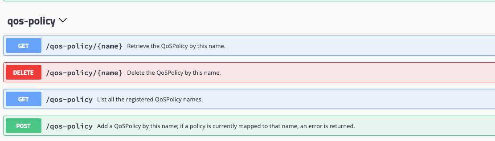
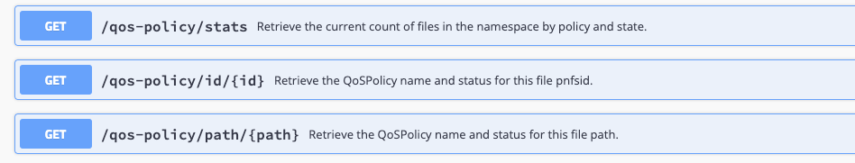

QoS Policies
=================================

With dCache 9.2, file QoS can be managed automatically by the `QoS Engine` using a policy.
The following details the structure of a policy, how to manage policies and how to
associate a policy with a file.

-----
[TOC bullet hierarchy]
-----

## QoS Policy Definition

QoS policies determine how files should be stored on various storage media over time.

QoS policies are of predefined types.  Only users with administrative privileges
can add or remove policy definitions.

A policy is defined by a JSON object consisting of an identifying name and array of states,
each with a duration value (ISO 8601) and an array of media directives.  The policy name is
arbitrary; meaningful names could indicate something about the storage policy itself.
For instance, one might choose “public-resilient” to denote files only on disk and which
have 20 replicas apiece (as at FNAL). However, these names should be unique within the local
dCache installation.

A file may be associated with a QoS policy. Files having a defined policy are verified
by the dCache QoS system and appropriate action taken to guarantee that the file's presence
on the various media conform with that policy.  Files without a policy will be treated
in the usual manner.

The policy definitions serve as templates from which an individual file's transitions are derived.
The template becomes a set of QoS transitions to be applied in succession by transforming state
duration into a timestamp denoting the expiration of that state for that file.

The basic structure for the JSON file is as follows:

- *name* - String identifier. Required.
- *states* - Ordered list (array) of states. Required.

Each state consists of:

- *duration* - How long the state should last. Optional. No duration means the same as INF.
  Expressed using ISO 8601 duration notation.
- *media* - Ordered list (array) of storage element descriptions. At least one is required.

Each storage element description consists of:

- *storageMedium* - currently one of (DISK, HSM). Required.
- *numberOfCopies* - currently supported for DISK only.
- *type* - String. Could describe a disk type or the hsm system name, for example. Optional, currently
  unused.
- *instance* - String URI for the system instance (HSM only).
- *partitionKeys* - list (array) of values used to distribute copies across pools (DISK only).
  Analogous to the storage unit attribute `onlyOneCopyPer` (pool tags) used for resilient files.
  Optional.

A simple example:

```
{
  "name": "TEST",
  "states": [
    {
      "duration": "P10D",
      "media": [
        {
          "storageMedium": "DISK",
          "numberOfCopies": 2
        }
      ]
    },
    {
      "duration": "P1M",
      "media": [
        {
          "storageMedium": "DISK",
          "numberOfCopies": 1
        },
        {
          "storageMedium": "HSM",
          "numberOfCopies": 1
        }
      ]
    },
    {
      "media": [
        {
          "storageMedium": "HSM",
          "numberOfCopies": 1
        }
      ]
    }
  ]
}
```

Here we have a policy with three states.  When the file with this policy is initially
written, it is given two disk replicas.   After ten days, the file is flushed to tape
and one of the replicas is cached.  One month after that, the single replica is
also cached and the file is only guaranteed to be on tape.

There is theoretically no limit to the transitions making up the states array.
Currently, only two types of storage media are recognized, `DISK` and `HSM`, and
only one `HSM` copy at a time is supported (this may change in the future).

No duration need be given on the final state entry; the QoS Engine will stop tracking this file
after all transitions have completed.  The QoS Scanner component, however, will still periodically
check that `ONLINE` files indeed have their necessary number of replicas, and, if the file
is `NEARLINE CUSTODIAL` and has a QoS policy, that it has been flushed (these are two separate
scans that can be scheduled with different periods in the QoS Scanner).

## Managing Policies

As stated above, only admins are given permission to define policies.  These may be set, queried
and deleted. Once a policy is uploaded, however, it cannot be modified.  One would instead have to
create a new policy definition and upload it, then delete the old one when one is sure files are no
longer associated with it.

The Frontend provides a RESTful resource for policy management.  The SWAGGER page contains
more details.  These are found under `qos-policy`:



Policies are stored in the namespace (Chimera), but are also cached by the QoS Engine.  There
are admin shell commands in the namespace available for listing and viewing policies:

```
admin > \sn help qos policies
NAME
       qos policies -- List qos policy names

SYNOPSIS
       qos policies

DESCRIPTION
       Show list of policy names


admin > \sn help show qos policy
NAME
       show qos policy -- Print qos policy

SYNOPSIS
       show qos policy policy

DESCRIPTION
       Display qos policy

ARGUMENTS
       policy
              The policy name.
```

## Applying Policies to Files

Files can be given a policy at the time of initial write via a directory tag.

```
[arossi@fndcatemp1 persistent]$ echo "TEST" > ".(tag)(QosPolicy)"
[arossi@fndcatemp1 persistent]$ grep "" $(cat ".(tags)()")
.(tag)(AccessLatency):ONLINE
.(tag)(file_family):dcache-devel-test
.(tag)(file_family_width):10
.(tag)(QosPolicy):TEST
.(tag)(RetentionPolicy):REPLICA
.(tag)(storage_group):persistent

```

When the `QosPolicy` tag is set, it overrides the `AccessLatency` and `RetentionPolicy`
attributes for the purposes of QoS verification.  When written, the file will be placed
in the first state of the policy by the QoS Verifier, and the QoS Engine will record
the expiration based on the duration indicated.  The QoS Engine periodically checks the expiration
timestamps of the files it has registered, and promotes them to the next state
accordingly.

Should one wish at some point to change the QoS policy for one or more files,
this can be achieved via the RESTful bulk resource `/api/v1/bulk-requests`.

For example,

```
{"activity":"UPDATE_QOS",
 "arguments": {"qosPolicy":"TEST"},
 "target":["/pnfs/fs/usr/example-user/my_scratch_dir"],
 "expandDirectories":"TARGETS"}
```

represents the JSON parameter to the POST call on `bulk-requests` which will give
all the files in `my_scratch_dir` the `TEST` policy.

If `TEST` has more than one state, and you only wish to apply the transitions
from a certain index in the state list forward, you can also specify the `qosState`
attribute.  For instance, in the `TEST` example above, the second state
(at index 1) flushes the file immediately and keeps only one disk copy.

Thus:

```
{"activity":"UPDATE_QOS",
 "arguments": {"qosPolicy":"TEST", "qosState":1},
 "target":["/pnfs/fs/usr/example-user/my_scratch_dir"],
 "expandDirectories":"TARGETS"}
```

would skip the first state (two disk copies only) and immediately store the file on tape,
also making its disk copy persistent (sticky).  Then after 30 days, that replica
would be cached.

The older arguments for the Bulk `UPDATE_QOS` activity type are still valid;
that is, one can still choose to do a one-time transition using

`"targetQos":"tape|disk+tape|disk"`

as before.  In this case, there is no policy assigned; the file is simply transitioned
to that QoS state.  One can also transition between policy and this kind of
simple QoS operation without restriction.  For instance, say you wanted to
disassociate a file from its current policy, making it merely `NEARLINE CUSTODIAL`.
You could do a bulk request using `"targetQos":"tape"`; this would cache all disk
copies, and eliminate the file from QoS tracking by the QoS Engine.

~~~~~~~~~~~~~~~~~~~~~~~~~~~~~~~~~~~~~~~~~~~~~~~~~~~~~~~~~~~~~~~~~~~~~~~~~~~~~~~~
 NOTE:  Policies cannot be assigned to single files using the /api/v1/namespace
resource (but one can still issue disk, tape and disk+tape transitions this
way).  There is nothing, however, preventing one from changing a single file
by using the /api/v1/bulk-requests resource; just make the "target":[] array
contain a single file path.
~~~~~~~~~~~~~~~~~~~~~~~~~~~~~~~~~~~~~~~~~~~~~~~~~~~~~~~~~~~~~~~~~~~~~~~~~~~~~~~~

> Users need special authorization in order to transition files.  This is
> achieved via roles defined in the multimap plugin configuration file.  There are three
> roles available:  admin, qos-user and qos-group.  The first grants privileges
> on all files; the second, on files whose owner matches the user's uid; the
> last, on files whose group matches the user's primary gid.  Example:
>
> dn:"/DC=org/DC=cilogon/C=US/O=Fermi National Accelerator Laboratory/OU=People/CN=Henry Higgins/CN=UID:higgs" username:higgs  uid:8342  gid:4211,true roles:qos-user,qos-group
>
> This will give Prof. Higgins privileges on files he owns or which have his primary gid
> as group.

A file's policy and its current transition state are stored in the basic attributes
table of the namespace (Chimera).  Inspection of file QoS policies is available both
through the REST interface and the admin shell.

The `/api/v1/namespace/<path>` resource will return the file's policy attributes if given
the `optional=true` parameter.  As can be seen from the SWAGGER pages, the `/qos-policy`
resource also supports retrieval of file policy information:



These correspond to the namespace admin shell commands:

```
\sn help file policy
NAME
       file policy -- shows qos policy info

SYNOPSIS
       file policy <pathorid>

DESCRIPTION
       Reports policy name and state for the file, if defined.

ARGUMENTS
       <pathorid>
              <pnfsid>|<path>.


\sn help file policy stats
NAME
       file policy stats -- shows summary of qos policy info

SYNOPSIS
       file policy stats

DESCRIPTION
       Gives a list of policy names, states and respective file counts.
```

Additionally, the QoS Engine has a spot-check command to see if it is tracking
a given file:

```
\s qos-engine help qos
NAME
       qos -- print qos info for a file if it is being tracked

SYNOPSIS
       qos <pnfsid>

ARGUMENTS
       <pnfsid>
              The unique identifier of the file within dCache.
```
