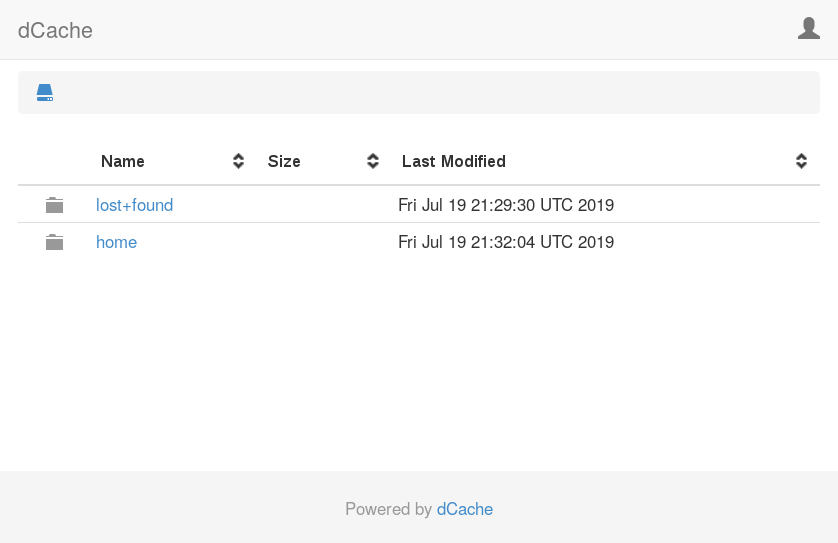
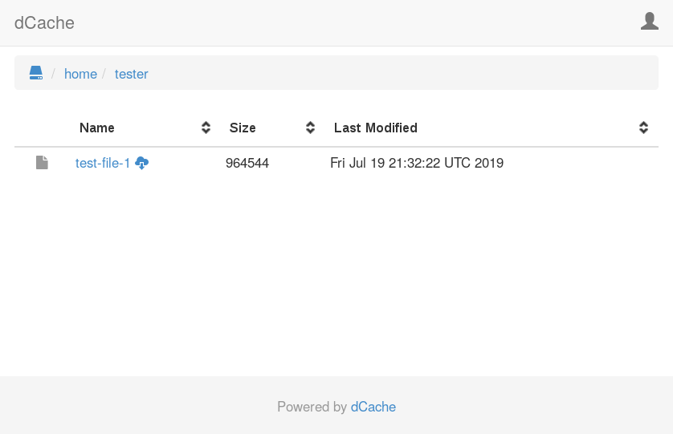
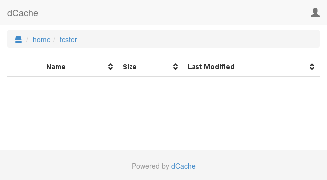
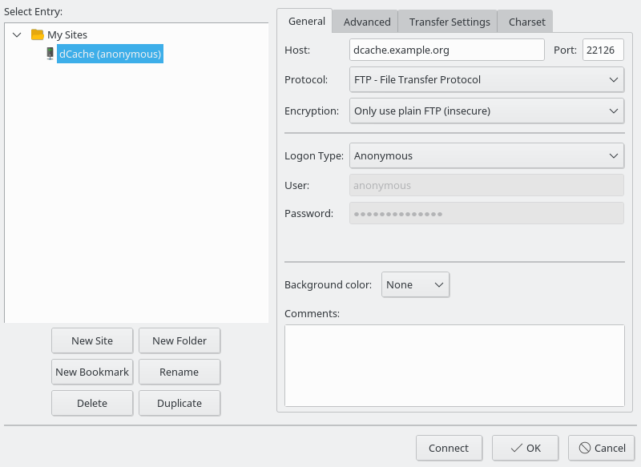
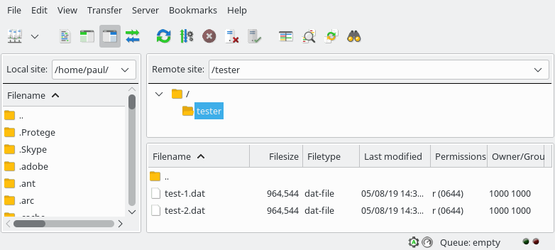

Chapter 2. Installing dCache
============================

If you have never run dCache before then this chapter will get you
started as quickly as possible, with some useful features available
for you to explore.

In fact, this chapter does much more than give you a bare-bones dCache
deployment.  It contains a number of steps, each building from the
previous steps, that with give you a multi-node dCache cluster that
supports multiple network protocols and multiple authentication
schemes.  The result will be both scalable and fault-tolerant, using
dCache's highly available options.

By doing this step-by-step, you have the opportunity to learn more
about how dCache works and explore some of the details of dCache
configuration and administration without being overwhelmed.  As far as
possible, you can simply copy the commands and end up with a working
dCache.  We've included some example commands that perform some basic
tests, so you can have some confidence that everything is OK so far,
before moving on to the next step.

Please note that, although this chapter will provide you with a
working dCache instance, you should not blindly use this chapter as a
recipe for a production instance.  There are many ways to configure
dCache.  The optimal choice depends on which hardware you wish to use
and how dCache's users will interact with the system.  So, we cannot
give a simple, single recipe that will provide the optimal solution in
all cases.

## Prerequisites

As this chapter encompasses an expanding deployment, there is a
minimum requirement to complete the first step, and an expanded list
of requirements to finish all the steps and reach the end of this
chapter.

To make this chapter as precise and accurate as possible, we decided
to focus on a single version of a Linux distribution: CentOS v7.
dCache will work fine with other distributions (for example, Debian
and Ubuntu), but the instructions and responses may be slightly
different.

The minimum requirement is a single computer running the latest
CentOS-7 Linux distribution, with the following packages installed:

  * java-1.8.0-openjdk-devel
  * httpd-tools

This chapter also describes how to get a server-side certificate from
the Let's Encrypt service.  Obtaining a Let's Encrypt certificate
requires that there is external access to port 80 on the machine.  If
you skip this step (or obtain a server certificate by some other
means) then you will not require this external access.

## Step 1: building a basic dCache deployment

In this first step, we will deploy dCache in a minimal configuration,
just sufficient to allow data to be written and read back using the
HTTP/WebDAV protocol.

### Installing dCache

All dCache packages are available directly from our website's
[dCache releases](https://www.dcache.org/downloads/1.9/) page, under
the Downloads section.

```console-root
rpm -ivh https://www.dcache.org/downloads/1.9/repo/##SERIES##/dcache-##VERSION##-1.noarch.rpm
|Retrieving https://www.dcache.org/downloads/1.9/repo/##SERIES##/dcache-##VERSION##-1.noarch.rpm
|Preparing...                          ################################# [100%]
|Updating / installing...
|   1:dcache-##VERSION##-1                   ################################# [100%]
```

### Installing prerequisite packages

First, install OpenJDK and httpd-tools packages.

```console-root
yum install java-1.8.0-openjdk-devel httpd-tools
```

### Installing PostgreSQL

In general, the database may be deployed on the same node as dCache or
on some dedicated machine with db-specific hardware.  The decision
involves trade-offs beyond the scope of this chapter; however, to keep
this chapter simple, we are assuming the database will run on the same
machine as the dCache services that use it.

Please remember that, wherever you choose to deploy the database, it
must be tuned for optimal performance for the available hardware.
Without doing this, you will see poor performance as PostgreSQL
typically experiences very poor performance with its default
configuration.  Tuning a PostgreSQL server is outside the scope of
this chapter.


First we install PostgreSQL's "Building Project" yum repository:

```console-root
rpm -Uvh https://download.postgresql.org/pub/repos/yum/reporpms/EL-7-x86_64/pgdg-redhat-repo-latest.noarch.rpm
|Retrieving https://download.postgresql.org/pub/repos/yum/reporpms/EL-7-x86_64/pgdg-redhat-repo-latest.noarch.rpm
|warning: /var/tmp/rpm-tmp.bsZtDm: Header V4 DSA/SHA1 Signature, key ID 442df0f8: NOKEY
|Preparing...                          ################################# [100%]
|Updating / installing...
|   1:pgdg-redhat-repo-42.0-4          ################################# [100%]
```

Then, install the server package for PostgreSQL.  In this example, we
are installing PostgreSQL v10.  In general, we recommend using the
latest version and upgrading your PostgreSQL version as new versions
become available.

```console-root
yum install postgresql10-server
|Loaded plugins: fastestmirror
|Loading mirror speeds from cached hostfile
| * base: ftp.rrzn.uni-hannover.de
| * extras: ftp.rrzn.uni-hannover.de
| * updates: ftp.rrzn.uni-hannover.de
|Resolving Dependencies
|--> Running transaction check
|---> Package postgresql10-server.x86_64 0:10.9-1PGDG.rhel7 will be installed
|--> Processing Dependency: postgresql10-libs(x86-64) = 10.9-1PGDG.rhel7 for package: postgresql10-server-10.9-1PGDG.rhel7.x86_64
|--> Processing Dependency: postgresql10(x86-64) = 10.9-1PGDG.rhel7 for package: postgresql10-server-10.9-1PGDG.rhel7.x86_64
|--> Processing Dependency: libpq.so.5()(64bit) for package: postgresql10-server-10.9-1PGDG.rhel7.x86_64
|--> Processing Dependency: libicuuc.so.50()(64bit) for package: postgresql10-server-10.9-1PGDG.rhel7.x86_64
|--> Processing Dependency: libicui18n.so.50()(64bit) for package: postgresql10-server-10.9-1PGDG.rhel7.x86_64
|--> Running transaction check
|---> Package libicu.x86_64 0:50.1.2-17.el7 will be installed
|---> Package postgresql10.x86_64 0:10.9-1PGDG.rhel7 will be installed
|---> Package postgresql10-libs.x86_64 0:10.9-1PGDG.rhel7 will be installed
|--> Finished Dependency Resolution
|
|Dependencies Resolved
|
|============================================================================================
| Package                      Arch           Version                  Repository       Size
|============================================================================================
|Installing:
| postgresql10-server          x86_64         10.9-1PGDG.rhel7         pgdg10           4.5 M
|Installing for dependencies:
| libicu                       x86_64         50.1.2-17.el7            base             6.9 M
| postgresql10                 x86_64         10.9-1PGDG.rhel7         pgdg10           1.6 M
| postgresql10-libs            x86_64         10.9-1PGDG.rhel7         pgdg10           355 k
|
|Transaction Summary
|============================================================================================
|Install  1 Package (+3 Dependent packages)
|
|Total download size: 13 M
|Installed size: 52 M
|Is this ok [y/d/N]: y
|Downloading packages:
|warning: /var/cache/yum/x86_64/7/base/packages/libicu-50.1.2-17.el7.x86_64.rpm: Header V3 RSA/SHA256 Signature, key ID f4a80eb5: NOKEYB  --:--:-- ETA
|Public key for libicu-50.1.2-17.el7.x86_64.rpm is not installed
|(1/4): libicu-50.1.2-17.el7.x86_64.rpm                               | 6.9 MB  00:00:00
|warning: /var/cache/yum/x86_64/7/pgdg10/packages/postgresql10-libs-10.9-1PGDG.rhel7.x86_64.rpm: Header V4 DSA/SHA1 Signature, key ID 442df0f8: NOKEYA
|Public key for postgresql10-libs-10.9-1PGDG.rhel7.x86_64.rpm is not installed
|(2/4): postgresql10-libs-10.9-1PGDG.rhel7.x86_64.rpm                 | 355 kB  00:00:01
|(3/4): postgresql10-10.9-1PGDG.rhel7.x86_64.rpm                      | 1.6 MB  00:00:01
|(4/4): postgresql10-server-10.9-1PGDG.rhel7.x86_64.rpm               | 4.5 MB  00:00:00
|--------------------------------------------------------------------------------------------
|Total                                                       7.8 MB/s |  13 MB  00:00:01
|Retrieving key from file:///etc/pki/rpm-gpg/RPM-GPG-KEY-PGDG
|Importing GPG key 0x442DF0F8:
| Userid     : "PostgreSQL RPM Building Project <pgsqlrpms-hackers@pgfoundry.org>"
| Fingerprint: 68c9 e2b9 1a37 d136 fe74 d176 1f16 d2e1 442d f0f8
| Package    : pgdg-redhat-repo-42.0-4.noarch (installed)
| From       : /etc/pki/rpm-gpg/RPM-GPG-KEY-PGDG
|Is this ok [y/N]: y
|Retrieving key from file:///etc/pki/rpm-gpg/RPM-GPG-KEY-CentOS-7
|Importing GPG key 0xF4A80EB5:
| Userid     : "CentOS-7 Key (CentOS 7 Official Signing Key) <security@centos.org>"
| Fingerprint: 6341 ab27 53d7 8a78 a7c2 7bb1 24c6 a8a7 f4a8 0eb5
| Package    : centos-release-7-5.1804.4.el7.centos.x86_64 (installed)
| From       : /etc/pki/rpm-gpg/RPM-GPG-KEY-CentOS-7
|Is this ok [y/N]: y
|Running transaction check
|Running transaction test
|Transaction test succeeded
|Running transaction
|  Installing : libicu-50.1.2-17.el7.x86_64                                               1/4
|  Installing : postgresql10-libs-10.9-1PGDG.rhel7.x86_64                                 2/4
|  Installing : postgresql10-10.9-1PGDG.rhel7.x86_64                                      3/4
|  Installing : postgresql10-server-10.9-1PGDG.rhel7.x86_64                               4/4
|  Verifying  : postgresql10-10.9-1PGDG.rhel7.x86_64                                      1/4
|  Verifying  : postgresql10-server-10.9-1PGDG.rhel7.x86_64                               2/4
|  Verifying  : postgresql10-libs-10.9-1PGDG.rhel7.x86_64                                 3/4
|  Verifying  : libicu-50.1.2-17.el7.x86_64                                               4/4
|
|Installed:
|  postgresql10-server.x86_64 0:10.9-1PGDG.rhel7
|
|Dependency Installed:
|  libicu.x86_64 0:50.1.2-17.el7             postgresql10.x86_64 0:10.9-1PGDG.rhel7
|  postgresql10-libs.x86_64 0:10.9-1PGDG.rhel7
|
|Complete!
```

With the database packages installed, we can initialise the database
the service.  Note that we do *not* start the database at this point,
as we will make some tweaks to the configuration.

```console-root
/usr/pgsql-10/bin/postgresql-10-setup initdb
|Initializing database ... OK
```

Perhaps the simplest configuration is to allow password-less access to
the database.  This install chapter assumes this to be the case.

> **NOTE**
>
> Please note it is also possible to run dCache with all PostgreSQL
> accounts requiring passwords. See [the section called “Configuring
> Access to
> PostgreSQL”](cookbook-postgres.md#configuring-access-to-postgresql)
> for more advice on the configuration of PostgreSQL.

To allow local users to access PostgreSQL without requiring a
password, make sure the following three lines are the only uncommented
lines in the file `/var/lib/pgsql/10/data/pg_hba.conf`

```
local   all             all                                     trust
host    all             all             127.0.0.1/32            trust
host    all             all             ::1/128                 trust
```

Once this is done, we can configure the system to automatically start
PostgreSQL on startup, and then manually start the database:

```console-root
systemctl enable postgresql-10
|Created symlink from /etc/systemd/system/multi-user.target.wants/postgresql-10.service to /usr/lib/systemd/system/postgresql-10.service.
systemctl start postgresql-10
```

We can request the current status of PostgreSQL just to verify quickly
that it is working.

```console-root
systemctl status postgresql-10
|● postgresql-10.service - PostgreSQL 10 database server
|   Loaded: loaded (/usr/lib/systemd/system/postgresql-10.service; enabled; vendor preset: disabled)
|   Active: active (running) since Fri 2019-07-19 14:38:31 UTC; 1s ago
|     Docs: https://www.postgresql.org/docs/10/static/
|  Process: 17395 ExecStartPre=/usr/pgsql-10/bin/postgresql-10-check-db-dir ${PGDATA} (code=exited, status=0/SUCCESS)
| Main PID: 17400 (postmaster)
|   CGroup: /system.slice/postgresql-10.service
|           ├─17400 /usr/pgsql-10/bin/postmaster -D /var/lib/pgsql/10/data/
|           ├─17402 postgres: logger process
|           ├─17404 postgres: checkpointer process
|           ├─17405 postgres: writer process
|           ├─17406 postgres: wal writer process
|           ├─17407 postgres: autovacuum launcher process
|           ├─17408 postgres: stats collector process
|           └─17409 postgres: bgworker: logical replication launcher
|
|Jul 19 14:38:31 dcache.example.org systemd[1]: Starting PostgreSQL 10 database server...
|Jul 19 14:38:31 dcache.example.org postmaster[17400]: 2019-07-19 14:38:31.415 UTC [17400] LOG:  listening on IPv6 address "::1", port 5432
|Jul 19 14:38:31 dcache.example.org postmaster[17400]: 2019-07-19 14:38:31.415 UTC [17400] LOG:  listening on IPv4 address "127.0.0...t 5432
|Jul 19 14:38:31 dcache.example.org postmaster[17400]: 2019-07-19 14:38:31.427 UTC [17400] LOG:  listening on Unix socket "/var/run....5432"
|Jul 19 14:38:31 dcache.example.org postmaster[17400]: 2019-07-19 14:38:31.450 UTC [17400] LOG:  listening on Unix socket "/tmp/.s.....5432"
|Jul 19 14:38:31 dcache.example.org postmaster[17400]: 2019-07-19 14:38:31.477 UTC [17400] LOG:  redirecting log output to logging ...rocess
|Jul 19 14:38:31 dcache.example.org postmaster[17400]: 2019-07-19 14:38:31.477 UTC [17400] HINT:  Future log output will appear in ..."log".
|Jul 19 14:38:31 dcache.example.org systemd[1]: Started PostgreSQL 10 database server.
|Hint: Some lines were ellipsized, use -l to show in full.
```

### Creating PostgreSQL users and databases

dCache will manage the database schema, creating and updating the
database tables, indexes etc as necessary.  However, dCache does not
create the databases.  That is a manual process, typically done only
once.

Since this is a new PostgreSQL deployment, we must first create the
database users.  For this setup, we will create a single database
user: `dcache`.

```console-root
createuser -U postgres --no-superuser --no-createrole --createdb --no-password dcache
```

Now we can create the databases, using the correct database user to
ensure correct database ownership.  At this stage, we need only one
database: chimera.  This database holds dCache's namespace.

```console-root
createdb -U dcache chimera
```

### Creating a minimal dCache configuration

The main configuration for dCache is the layout file.  By default, the
layout file is located in the `/etc/dcache/layouts` directory, with a
filename formed by concatenating this machine's hostname with `.conf`.
For example, if the machine is called `dcache.example.org` then the
default layout file path is
`/etc/dcache/layouts/dcache.example.org.conf`.

It is normally a good idea to follow this naming scheme, as it allows
different hosts within the dCache cluster to share the same
configuration directory.

However, to make it easier to copy-and-paste examples from this
document, we will update dCache so that the layout file is
`/etc/dcache/layouts/mylayout.conf`, irrespective of the machine's
hostname.  To do this, update the file `/etc/dcache/dcache.conf`,
appending the following line:

```ini
dcache.layout = mylayout
```

Now, create the file `/etc/dcache/layouts/mylayout.conf` with the
following contents:

```ini
dcache.enable.space-reservation = false

[dCacheDomain]
 dcache.broker.scheme = none
[dCacheDomain/zookeeper]
[dCacheDomain/admin]
[dCacheDomain/pnfsmanager]
 pnfsmanager.default-retention-policy = REPLICA
 pnfsmanager.default-access-latency = ONLINE

[dCacheDomain/cleaner]
[dCacheDomain/poolmanager]
[dCacheDomain/billing]
[dCacheDomain/gplazma]
[dCacheDomain/webdav]
 webdav.authn.basic = true
```

This tells dCache to run a single domain (Java Virtual Machine
process) called `dCacheDomain`.  Within that single process, dCache
will start the `pnfsmanager`, `cleaner`, `poolmanager`, `billing`,
`gplazma` and `webdav` services.

As the line `dcache.enable.space-reservation = false` appears before
the first domain declaration (`[dCacheDomain]`), it applies to
everything in this file.

As the line `dcache.broker.scheme = none` appears after the
dCacheDomain domain declaration, but before the first service
(`[dCacheDomain/zookeeper]`) it applies to the domain and all
services.

As the line `pnfsmanager.default-retention-policy = REPLICA` appears
after a service declaration, it applies only to that service.

What are these configuration lines doing?

`dcache.enable.space-reservation = false` tells dCache that space
reservation is not supported on this dCache cluster: when uploading
data, dCache shouldn't first allocate sufficient capacity for that
file.

`dcache.broker.scheme = none` tells the domain that it is running
stand-alone, and should not attempt to contact other domains.

`pnfsmanager.default-retention-policy = REPLICA` and
`pnfsmanager.default-access-latency = ONLINE` tell dCache that files
written without any explicit instructions should stay on disk and not
be written to any tertiary storage.

`webdav.authn.basic = true` tells the WebDAV endpoint to allow HTTP
BASIC authentication over an unencrypted connection.  This is
insecure, so disabled by default.

We can verify this by asking dCache which services should be running
in the different domains on this host.  Currently there is a single
domain (`dCacheDomain`) which will host all eight configured services:

```console-root
dcache services
|DOMAIN       SERVICE     CELL          PROXIED REPLICABLE
|dCacheDomain zookeeper   zookeeper     -       No
|dCacheDomain pnfsmanager PnfsManager   -       Yes
|dCacheDomain cleaner     cleaner       -       No
|dCacheDomain poolmanager PoolManager   -       Yes
|dCacheDomain billing     billing       -       Yes
|dCacheDomain gplazma     gPlazma       -       Yes
|dCacheDomain webdav      WebDAV-dcache No      No
```

The output includes a line for each service running on this machine.
The columns have the following meaning:

<dl>
<dt><strong>DOMAIN</strong></dt>
<dd>
  The domain that hosts this service.  This value is taken from the
  service declaration line in the layout file like
  <tt>[DOMAIN/SERVICE]</tt>.
</dd>

<dt><strong>SERVICE</strong></dt>
<dd>
  The type of service.  This value is taken from the the service
  declaration line in the layout file, like <tt>[DOMAIN/SERVICE]</tt>.
</dd>

<dt><strong>CELL</strong></dt>
<dd>
  The name for this service instance.  Each service has a default cell
  name, but cell names must be unique within the domain.  So, if a
  domain hosts multiple services of the same type then the cell name
  must be configured.
</dd>

<dt><strong>PROXIED</strong></dt>

<dd>
  Whether the service accepts file data itself, instead of redirecting
  the client to transfer the data directly with a pool.
</dd>

<dt><strong>REPLICABLE</strong></dt>

<dd>
  Whether the service may have multiple instances in a high-available
  (HA) deployment with load balanced over those instances.
</dd>
</dl>


A common operation is to ask what is the current status of all
domains running on this machine:

```console-root
dcache status
|DOMAIN       STATUS  PID USER   LOG
|dCacheDomain stopped     dcache /var/log/dcache/dCacheDomain.log
```

In the output there is a line for each domain configured to run on
this machine, with the columns have the following meanings:

<dl>
<dt><strong>DOMAIN</strong></dt>
<dd>
  The name of the domain being described.
</dd>

<dt><strong>STATUS</strong></dt>
<dd>
  The high-level status of this domain.  The value is one of
  <tt>stopped</tt>, <tt>running</tt> and <tt>restarting</tt>.  The
  <tt>running</tt> status also describes for how long the domain has
  been running.  If <tt>restarting</tt> then the domain has died and
  dCache is waiting a short period before automatically restarting it.
</dd>

<dt><strong>PID</strong></dt>
<dd>
  The process ID for this domain's JVM process.
</dd>

<dt><strong>USER</strong></dt>
<dd>
  The (Linux) user under which the JVM will run.  If dCache is started
  by the root user then the <tt>dcache</tt> script will switch user
  before starting the Java Virtual Machine process.
</dd>

<dt><strong>LOG</strong></dt>

<dd>
  The principle log file for this domain.
</dd>
</dl>

Note that the `USER` column shows `dcache`.  It's generally accepted
that services should run as some non-root account, to limit the damage
from a compromised service.  By default, dCache uses the `dcache`
user, and the RPM package ensures this user exists.

We can also query information about how dCache will use the database
or servers:

```console-root
dcache database ls
|DOMAIN       CELL        DATABASE HOST      USER   MIN- MAX-CONNS MANAGEABLE AUTO
|dCacheDomain PnfsManager chimera  localhost dcache      30        Yes        Yes
|dCacheDomain cleaner     chimera  localhost dcache      10        No         No
|TOTAL                                              0    40
```

The output shows a line for each service that accesses a database.
The columns have the following meaning:

<dl>
<dt><strong>DOMAIN</strong></dt>
<dd>
  The domain being described.
</dd>

<dt><strong>CELL</strong></dt>
<dd>
  The name for this service instance.
</dd>

<dt><strong>DATABASE</strong></dt>
<dd>
  The name of the database.
</dd>

<dt><strong>HOST</strong></dt>
<dd>
  The host that runs the database.
</dd>

<dt><strong>MIN- &amp; MAX-CONNS</strong></dt>

<dd>
  The minimum and maximum number of concurrent database connections
  dedicated for this cell.  If MIN is empty then there is no lower
  limit: when idle for an extended period, the cell will close all
  database connections.
</dd>

<dt><strong>MANAGEABLE</strong></dt>

<dd>
  The `MANAGEABLE` column shows whether the service can (in principle)
  manage this database.  This value is not configurable.
</dd>

<dt><strong>AUTO</strong></dt>

<dd>
  The `AUTO` option describes how dCache should react if it detects
  the database requires a schema update.  If set to `Yes` then dCache
  will automatically apply any outstanding schema changes on start-up.
  If set to `No` and there are outstanding schema changes then dCache
  will list them and immediately shutdown.  This behaviour is
  configurable, although it depends on the MANAGEABLE field.
</dd>
</dl>

In our case, `dCacheDomain` has two services that require access to a
database: `PnfsManager` and `cleaner`.  Both services access the
`chimera` database on the local machine (`localhost`) authenticating
as database-user `dcache`.

By default, the `PnfsManager` service will manage the `chimera`
database, updating the schema as needed.  The `cleaner` service will
simply fail to start if the database schema is not up-to-date.
Therefore, it is important that `PnfsManager` is started before
`cleaner` (`PnfsManager` appears first in the layout file) or to use
manual database updates.

We will run the database operations manually, to exercise the manual
database update process.  Starting dCache without manually updating
the database will trigger services (like `PnfsManager`) to apply any
pending database maintenance when starting up.

To manually update the database schema, run the command `dcache
database update`.  When run the first time, this command generates
copious output.  In this example below, almost all of that output is
omitted.

```console-root
dcache database update
|PnfsManager@dCacheDomain:
|INFO  - Successfully acquired change log lock
|INFO  - Creating database history table with name: public.databasechangelog
|INFO  - Reading from public.databasechangelog
|INFO  - org/dcache/chimera/changelog/changelog-master.xml: org/dcache/chimera/changelog/changeset-1.8.0.xml::1::tigran: Table t_dirs created
|[...]
|INFO  - org/dcache/chimera/changelog/changelog-master.xml: org/dcache/chimera/changelog/changeset-5.2.xml::27::tigran: Stored procedure created
|INFO  - org/dcache/chimera/changelog/changelog-master.xml: org/dcache/chimera/changelog/changeset-5.2.xml::27::tigran: ChangeSet org/dcache/chimera/changelog/changeset-5.2.xml::27::tigran ran successfully in 8ms
|INFO  - Successfully released change log lock
|Liquibase Update Successful
```

### Configuring dCache users

The `gplazma` service is responsible for user authentication,
following a scheme inspired by PAM.  If you don't know PAM, this
process may seem rather daunting, later chapters will go into
authentication in considerable depth.

The dCache RPM comes with a default gPlazma configuration file
`/etc/dcache/gplazma.conf`; however, that configuration is intended
for users with X.509 credentials.  X.509 credentials require a
certificate authority; which require considerable effort to set up.

Therefore, in this initial configuration, we adopt something simpler:
username + password authentication.  So, delete the current
`/etc/dcache/gplazma.conf` file and create a new one with the
following contents:

```ini
auth     sufficient  htpasswd
map      sufficient  multimap
account  requisite   banfile
session  requisite   authzdb
```

The first column is the phases of the authentication process.  Each
login attempt follows four phases: auth, map, account and session.
*auth* verifies user's identity. *map* converts this identity to some
dCache user. *account* checks if the user is allowed to use dCache
right now. Finally, *session* adds some additional information.

This configuration tells gPlazma to use the `htpasswd` plugin to check
any passwords, the `multimap` plugin to convert usernames into uid and
gid values, the `banfile` plugin to check if the user is allowed to
use dCache, and finally use the `authzdb` plugin to add various
session information.

The `sufficient` and `requisite` labels describe how to handle errors.
For more details on this, see the gplazma chapter.

This ability to split login steps between different plugins may make
the process seem complicated; however, it is also very powerful and
allows dCache to work with many different authentication schemes.

For the next step, we need to create the configuration for these four
plugins.  We will create two users: a regular user ("tester") and an
admin user ("admin").

The `htpasswd` plugin uses the Apache HTTPD server's file format to
record username and passwords.  This file may be maintained by the
`htpasswd` command.

Let us create a new password file (`/etc/dcache/htpasswd`) and add
these two users ("tester" and "admin") with passwords `TooManySecrets`
and `dickerelch` respectively:

```console-root
touch /etc/dcache/htpasswd
htpasswd -bm /etc/dcache/htpasswd tester TooManySecrets
|Adding password for user tester
htpasswd -bm /etc/dcache/htpasswd admin dickerelch
|Adding password for user admin
```

Next, we need to tell dCache which uid and gids these users should be
assigned.  To do this, create the file `/etc/dcache/multi-mapfile`
with the following content:

```
username:tester uid:1000 gid:1000,true
username:admin uid:0 gid:0,true
```

Finally, we need to provide some session data for this user, which is
stored in the `authzdb` plugin configuration. For backwards
compatibility, this plugin's default configuration location is the
file `/etc/grid-security/storage-authzdb`, where `/etc/grid-security`
is a directory that you may need to create:

```console-root
mkdir -p /etc/grid-security
```

After ensuring the directory exists, create the file `storage-authzdb`
file with the following content.  Note that the first line of the file
must be `version 2.1`.

```
version 2.1

authorize tester read-write 1000 1000 /home/tester /
authorize admin read-write 0 0 / /
```

The `authorize` line describes how both users are allowed full access
to dCache.  User tester has a home directory of `/home/tester`,
whereas user admin has the root directory as a home directory.
Finally, both users have the system root as their personal root
directory.

The uid and gid values must be included in this file, but are ignored
by the `authzdb` plugin: the actual values do not matter.

Finally, we can create the tester user's home directory, using the
chimera shell.  This shell provides direct access to the dCache
namespace by talking directly with the Chimera database, bypassing
dCache.

```console-root
chimera
|Jul 19, 2019 4:29:17 PM com.hazelcast.config.XmlConfigLocator
|INFO: Loading 'hazelcast.xml' from classpath.
|WARN  - [131.169.240.59]:5701 [dcache-namespace] [3.11.1] No join method is enabled! Starting standalone.
|Type 'help' for help on commands.
|Type 'exit' or Ctrl+D to exit.
|chimera:/# mkdir /home
|chimera:/# mkdir /home/tester
|chimera:/# chown 1000:1000 /home/tester
|chimera:/# ls /home
|total 3
|drwxr-xr-x 3    0    0 512 Jul 19 16:29 .
|drwxrwxrwx 4    0    0 512 Jul 19 16:29 ..
|drwxr-xr-x 2 1000 1000 512 Jul 19 16:29 tester
|chimera:/# exit
```

### Configuring storage

The pool service is responsible for storing the contents of files.
Therefore, in order to accept any data, a dCache cluster must have at
least one pool.  The file's data is actually stored as files on the
local filesystem, using a specified prefix, which is usually a mounted
filesystem.

The `dcache` script provides an easy way to create the pool directory
structure and add the pool service to a domain.  In the following
example, we will create a pool using storage located at
`/srv/dcache/pool-1` and add this pool to the `dCacheDomain` domain.

```console-root
mkdir -p /srv/dcache
dcache pool create /srv/dcache/pool-1 pool1 dCacheDomain
|Created a pool in /srv/dcache/pool-1. The pool was added to dCacheDomain
|in file:/etc/dcache/layouts/mylayout.conf.
```

The `/etc/dcache/layouts/mylayout.conf` file should be updated to have
an additional `pool` service:

```ini
dcache.enable.space-reservation = false

[dCacheDomain]
 dcache.broker.scheme = none
[dCacheDomain/zookeeper]
[dCacheDomain/admin]
[dCacheDomain/pnfsmanager]
 pnfsmanager.default-retention-policy = REPLICA
 pnfsmanager.default-access-latency = ONLINE

[dCacheDomain/cleaner]
[dCacheDomain/poolmanager]
[dCacheDomain/billing]
[dCacheDomain/gplazma]
[dCacheDomain/webdav]
 webdav.authn.basic = true

[dCacheDomain/pool]
pool.name=pool1
pool.path=/srv/dcache/pool-1
pool.wait-for-files=${pool.path}/data
```

This new pool is called `pool1` and will store all data and metadata
within the `/srv/dcache/pool-1` path.

The `pool.wait-for-files` configuration tells dCache to pause during
start-up if the `data` directory is missing.  This is a safety feature
to prevent dCache accepting data if `/srv/dcache/pool-1` is some
mounted filesystem and (by mistake) that device is not mounted.

By default, a pool will detect the free capacity on the partition and
assume that capacity is available to store dCache files.  It is
possible to configure pools so they are limited.

> **MIND THE GAP!**
>
> A pool will try to keep the free capacity above some minimum value,
> rejecting transfers once the free capacity drops to this minimum
> value.  This minimum free size is called the gap.  The purpose is to
> try to allow transfers to succeed, if the protocol does not allow
> the client to specify the file's size.
>
> The default gap is 4 GiB.  For production systems, this is fine, as
> such pools are much larger; however, test instances may include
> smaller pools.  If the pool size is comparable to (or smaller than)
> 4 GiB then you must decrease the pool's gap.
>
> Perhaps the easiest way to do this is with the admin interface (see
> below), issuing the `set gap` pool command (e.g., `\s <pool> set gap
> 1G`).  Remember to save the configuration to ensure it survives
> across dCache restarts (e.g., `\s <pool> save`).


### Starting dCache

Finally, dCache can be started now.

```console-root
dcache start
|Starting dCacheDomain done
```

You can observe dCache current status using the `dcache status`
command:

```console-root
dcache status
|DOMAIN       STATUS                   PID   USER   LOG
|dCacheDomain running (for 18 seconds) 18953 dcache /var/log/dcache/dCacheDomain.log
```

The domain log file (`/var/log/dcache/dCacheDomain.log`) also contains
some details, logged as dCache starts:

```
2019-07-19 16:46:06 Launching /bin/java -server -Xmx512m -XX:MaxDirectMemorySize=512m -Dsun.net.inetaddr.ttl=1800 -Dorg.globus.tcp.port.range=20000,25000 -Dorg.dcache.dcap.port=0 -Dorg.dcache.ftp.log-aborted-transfers=true -Dorg.dcache.net.tcp.portrange=33115:33145 -Djava.security.krb5.realm= -Djava.security.krb5.kdc= -Djavax.security.auth.useSubjectCredsOnly=false -Djava.security.auth.login.config=/etc/dcache/jgss.conf -Dcontent.types.user.table=/etc/dcache/content-types.properties -Dzookeeper.sasl.client=false -Dcurator-dont-log-connection-problems=true -XX:+HeapDumpOnOutOfMemoryError -XX:HeapDumpPath=/var/log/dcache/dCacheDomain-oom.hprof -XX:+UseCompressedOops -javaagent:/usr/share/dcache/classes/aspectjweaver-1.9.2.jar -Djava.awt.headless=true -DwantLog4jSetup=n -Ddcache.home=/usr/share/dcache -Ddcache.paths.defaults=/usr/share/dcache/defaults org.dcache.boot.BootLoader start dCacheDomain
19 Jul 2019 16:46:14 (PnfsManager) [] [131.169.240.59]:5701 [dcache-namespace] [3.11.1] No join method is enabled! Starting standalone.
19 Jul 2019 16:49:09 (WebDAV-dcache) [admin NIC auto-discovery] Adding [dcache.example.org/[fe80::f816:3eff:fe3e:36a5], dcache.example.org/131.169.240.59]
19 Jul 2019 16:49:11 (pool1) [] Pool mode changed to disabled(fetch,store,stage,p2p-client,p2p-server): Awaiting initialization
19 Jul 2019 16:49:11 (PoolManager) [pool1 PoolManagerPoolUp] Pool pool1 changed from mode disabled() to disabled(fetch,store,stage,p2p-client,p2p-server).
19 Jul 2019 16:49:11 (pool1) [] Pool mode changed to disabled(store,stage,p2p-client,loading): Loading...
19 Jul 2019 16:49:11 (PoolManager) [pool1 PoolManagerPoolUp] Pool pool1 changed from mode disabled(fetch,store,stage,p2p-client,p2p-server)  to disabled(store,stage,p2p-client,loading).
19 Jul 2019 16:49:11 (pool1) [] Reading inventory from InotifyMonitoring[org.dcache.pool.repository.checksums.ChecksumReplicaStore@497b49cf].
19 Jul 2019 16:49:11 (pool1) [] Pool mode changed to enabled
19 Jul 2019 16:49:11 (PoolManager) [pool1 PoolManagerPoolUp] Pool pool1 changed from mode disabled(store,stage,p2p-client,loading)  to enabled.
```

### Transferring data

The `dcache ports` command allows you to discover on which network
ports the services are listening.  This is useful to verify your
configuration and to configure firewalls appropriately.

```console-root
dcache ports
|DOMAIN       CELL          SERVICE   PROTO PORT
|dCacheDomain zookeeper     zookeeper TCP   2181
|dCacheDomain WebDAV-dcache webdav    TCP   2880
|dCacheDomain pool1         pool      TCP   20000-25000
|dCacheDomain pool1         pool      TCP   33115-33145
```

The WebDAV door is listening on port 2880 (the default).  We can
upload a file into dCache using that protocol, with the `curl` client.

```console-root
curl -u tester:TooManySecrets -L -T /bin/bash http://localhost:2880/home/tester/test-file-1
|964544 bytes uploaded
```

The file may also be downloaded:

```console-root
curl -u tester:TooManySecrets -L -o /tmp/test-file-1 http://localhost:2880/home/tester/test-file-1
|  % Total    % Received % Xferd  Average Speed   Time    Time     Time  Current
|                                 Dload  Upload   Total   Spent    Left  Speed
|  0     0    0     0    0     0      0      0 --:--:-- --:--:-- --:--:--     0
|100  941k  100  941k    0     0  10.1M      0 --:--:-- --:--:-- --:--:-- 10.1M
```

The WebDAV door also includes a limited web interface that allows
users to explore the namespace and download specific files.  To see
this interface, point your favourate web browser at the WebDAV
endpoint (`http://dcache.example.org:2880/` in this example).  After
entering the username and password (`tester` and `TooManySecrets`
respectively), so will see the following page.



Navigating to the directory `/home/tester` by selecting the `home`
directory and the `tester` directory.  You will see the expected
`test-file-1` file.




### The admin interface

Built into dCache is a very powerful mechanism to allow admins to
inspect details of a running dCache instance and modify many aspects
of its behaviour on-the-fly, without restarting any component and
without interrupting the service delivered to users.

This interface is known as the *admin interface*.  The admin service
provides access to this admin interface by providing an ssh protocol
endpoint.  You can connect to this interface and will be presented
with a shell environment within which you can investigate problems and
adjust dCache behaviour.

Given how useful the admin interface is, we will take a short detour
to explore the basics.

We can authenticate to the admin interface using the `admin` user:

```console-root
ssh -p 22224 admin@localhost
|Password authentication
|Password:
|dCache (5.2.2)
|Type "\?" for help.
```

The prompt `[dcache] (local) admin >` indicates that the shell is
waiting for a command.  The name in square brackets (`dcache`) is the
machine to which you are connected.  The name in parenthesis (`local`)
is the fully-qualitified cell name (written `CELL@DOMAIN`), when
connected or `local` when the shell is not yet connected to a cell.
The name after the parenthesis (`admin`) is the username of the
authenticated user.

Here is some instructions to try, as a quick introduction and to
verify the interface is working as expected.

First lets quickly look at the backslash commands.  These are
meta-commands that operate on the shell itself, rather than on
individual cells within dCache.  The `\?` command shows the list of
available meta-commands.

```
[dcache] (local) admin > \?
\? [command]...  # display help for shell commands
\c cell[@domain] [user]  # connect to cell
\exception [trace]  # controls display of stack traces
\h [command]...  # display help for cell commands
\l [cell[@domain]|pool/poolgroup]...  # list cells
\q # quit
\s [OPTIONS] (cell[@domain]|pool/poolgroup)[,(cell[@domain]|pool/poolgroup)]... command...  # send command
\sl [options] pnfsid|path command...  # send to locations
\sn [options] command...  # send pnfsmanager command
\sp [options] command...  # send poolmanager command
\timeout [seconds]  # sets the command timeout
```

Detailed help is available for a specific meta-command:

```
[dcache] (local) admin > \? \l
NAME
       \l -- list cells

SYNOPSIS
       \l [cell[@domain]|pool/poolgroup]...

DESCRIPTION
       Lists all matching cells. The argument is interpreted as a glob.
       If no domain suffix is provided, only well known cells are
       listed. Otherwise all matching cells in all matching domains are
       listed.

ARGUMENTS
       cell[@domain]|pool/poolgroup
              A glob pattern. An empty CELL, DOMAIN, POOL or POOLGROUP
              string matches any name. Defaults to *.
```

Let's run the `\l` command, to list the running cells.  Note that the
name of the WebDAV cell depends on the machine's name, so the output
may look slightly different.

```
[dcache] (local) admin > \l
acm
billing
cleaner
gPlazma
PnfsManager
pool1
PoolManager
WebDAV-dcache
zookeeper
```

The '\c' meta-command connects the shell to a specific cell, so
subsequent commands are sent there for evaluation.  We will first
connect to the WebDAV cell.

```
[dcache] (local) admin > \c WebDAV-dcache
```

You should see the prompt change when the command is successful.  The
name in parenthesis (`local` above) is the full name of the cell:
`WebDAV-dcache@dCacheDomain`.

Now, lets try two commands that all cells implement: 'help' and
'info'.

The 'help' command provides a list of commands this cell understands:

```
[dcache] (WebDAV-dcache@dCacheDomain) admin > help
bean dep # show bean dependencies
bean ls # list running beans
bean messages [<bean>]  # show message types handled by beans
bean properties <bean>  # show properties of a bean
bean property <property>  # show property of a bean
dump pinboard <file>  # write pinboard to file
get children [-binary]
get door info [-binary]
help [-format=PLAIN|ANSI] [<command>]...  # display help pages
info [-a] [-l]  # get detailed cell information
infox <bean>  # show status information about bean
lb disable [-read] [-write]  # suspend publishing capabilities
lb enable [-read] [-write]  # resume publishing capabilities
lb set tags [<tags>]...  # set published tags
lb set threshold <load>  # set threshold load for OOB updates
lb set update <seconds>  # set login broker update frequency
log ls [-a] [<appender>] [<logger>]
log reset [-a] <appender> [<logger>]
log set <appender> [<logger>] OFF|ERROR|WARN|INFO|DEBUG|TRACE|ALL
login clear cache  # clear cached result of login and identity mapping oprations
login dump cache  # dump cached result of login and identity mapping oprations
monitoring disable # disable message monitoring
monitoring enable # gather message handling statistics
monitoring info # display message monitoring information
reload template # refresh HTML template from file
show pinboard [<lines>]  # display the most recent pinboard messages
xgetcellinfo # get this cell information
```

As with the `\?` meta-command help, the cell `help` command may be
used to discover detailed information about a specific cell command.
Here is the help information for the `info` command:

```
[dcache] (WebDAV-dcache@dCacheDomain) admin > help info
NAME
       info -- get detailed cell information

SYNOPSIS
       info [-a] [-l]

DESCRIPTION
       Shows detailed information about this cell. The returned
       information can contain the performance statistics, past and
       current activities of the cell. This usually depends on the type
       of cell.

OPTIONS
         -a
              Display content of unanswered message requests.
         -l
              Display unanswered message requests.
```

Let's run the info command, to see typical output for a WebDAV door:

```
[dcache] (WebDAV-dcache@dCacheDomain) admin > info
--- cache-login-strategy (Processes mapping requests) ---
gPlazma login cache: CacheStats{hitCount=0, missCount=1, loadSuccessCount=1, loadExceptionCount=0, totalLoadTime=8287060, evictionCount=0}
gPlazma map cache: CacheStats{hitCount=0, missCount=0, loadSuccessCount=0, loadExceptionCount=0, totalLoadTime=0, evictionCount=0}
gPlazma reverse map cache: CacheStats{hitCount=0, missCount=0, loadSuccessCount=0, loadExceptionCount=0, totalLoadTime=0, evictionCount=0}

--- lb (Registers the door with a LoginBroker) ---
    LoginBroker      : LoginBrokerTopic@local
    Protocol Family  : http
    Protocol Version : 1.1
    Port             : 2880
    Addresses        : [dcache.example.org/fe80:0:0:0:f816:3eff:fe3e:36a5, dcache.example.org/131.169.240.59]
    Tags             : [cdmi, dcache-view, glue, srm, storage-descriptor]
    Root             : /
    Read paths       : [/]
    Write paths      : [/]
    Update Time      : 5 SECONDS
    Update Threshold : 10 %
    Last event       : UPDATE_SENT

--- path-mapper (Mapping between request paths and dCache paths with OwnCloud Sync client-specific path trimming.) ---
Root path : /

--- pool-monitor (Maintains runtime information about all pools) ---
last refreshed = 2019-07-24 22:26:20.108 (23 seconds ago)
refresh count = 83
active refresh target = [>PoolManager@local]

--- resource-factory (Exposes dCache resources to Milton WebDAV library) ---
Allowed paths: /
IO queue     :
```

As a final demonstrator, let's discover the internal identifier
(called a PNFS-ID) of the uploaded file, which pool is hosting this
file and the current status of that replica.

We will use the `\s` meta-command to direct the command to specific
cells, rather than targeting the current cell.  The `\sn` command
targets dCache's namespace and is simply a short-hand for the `\s
PnfsManager` command.

```
[dcache] (WebDAV-dcache@dCacheDomain) admin > \sn pnfsidof /home/tester/test-file-1
0000F3BF2D92435E4D9A9EFA1470F1214A0D

[dcache] (WebDAV-dcache@dCacheDomain) admin > \sn cacheinfoof /home/tester/test-file-1
 pool1

[dcache] (WebDAV-dcache@dCacheDomain) admin > \s pool1 rep ls 0000F3BF2D92435E4D9A9EFA1470F1214A0D
0000F3BF2D92435E4D9A9EFA1470F1214A0D <C-------X--L(0)[0]> 964544 si={<Unknown>:<Unknown>}
```

The output from the `rep ls` command is described in the online help:

```
[dcache] (WebDAV-dcache@dCacheDomain) admin > \s pool1 help rep ls
NAME
       rep ls -- list replicas

SYNOPSIS
       rep ls [-binary] [-l=[s|p|l|u|nc|e...]] [-s=[k|m|g|t]]
       [-storage=<glob>] [-sum] [<pnfsids>]...

DESCRIPTION
       List the replicas in this pool.

       Each line has the following format:

          PNFSID <STATE> <SIZE> <STORAGE CLASS>

       STATE is a sequence of fields:
          field 1 is "C"
             if entry is cached and "-" otherwise.
          field 2 is "P"
             if entry is precious and "-" otherwise.
          field 3 is "C"
             if entry is being transferred "from client" and "-"
             otherwise.
          field 4 is "S"
             if entry is being transferred "from store" and "-"
             otherwise.
          field 5 is unused.
          field 6 is unused.
          field 7 is "R"
             if entry is removed but still open and "-" otherwise.
          field 8 is "D"
             if entry is removed and "-" otherwise.
          field 9 is "X"
             if entry is sticky and "-" otherwise.
          field 10 is "E"
             if entry is in error state and "-" otherwise.
          field 11 is unused.
          field 12 is "L(0)(n)"
             where is the link count.

ARGUMENTS
       <pnfsids>
              Limit to these replicas.

OPTIONS
         -binary
              Return statistics in binary format instead.
         -l=[s|p|l|u|nc|e...]
              Limit to replicas with these flags:
                 s  : sticky
                 p  : precious
                 l  : locked
                 u  : in use
                 nc : not cached
                 e  : error
         -s=[k|m|g|t]
              Output per storage class statistics instead. Optionally
              use KiB, MiB, GiB, or TiB.
         -storage=<glob>
              Limit to replicas with matching storage class.
         -sum
              Include totals for all storage classes when used with -s
              or -binary.
```

A complete copy of the file's data is stored as a file within the
pool's `data` directory, using the PNFS-ID as the filename:

```console-root
ls -l /srv/dcache/pool-1/data
|-rw-r--r--. 1 dcache dcache 964544 Jul 19 21:26 0000F3BF2D92435E4D9A9EFA1470F1214A0D
```

Note that you should never need to access the files stored on the pool
directly: dCache will mediate all network access.

### Deleting files

We will use the WebDAV door to delete the uploaded file, again using
curl as the client:

```console-root
curl -u tester:TooManySecrets -X DELETE http://localhost:2880/home/tester/test-file-1
```

Subsequent attempts to download this file will fail:

```
curl -sD- -u tester:TooManySecrets -o/dev/null http://localhost:2880/home/tester/test-file-1
|HTTP/1.1 404 Not Found
|Date: Wed, 31 Jul 2019 22:15:21 GMT
|Server: dCache/5.2.2
|Content-Type: text/html
|Transfer-Encoding: chunked
```

A directory listing using the WebDAV interface also shows the file is
no longer present:



One feature of dCache is that the data stored in dCache is not deleted
as part of the above command, but is done in a lazy fashion.  The
purpose is to avoid that users who delete large numbers of files keep
pools busy, preventing attempts to read other data stored on those
pools.  Instead, the data of deleted files is removed by the cleaner
service so as it doesn't stress pools.

Therefore, if you are quick enough, you can still see the delete
file's data stored as a file with the PNFS-ID of the file
(`0000F3BF2D92435E4D9A9EFA1470F1214A0D` in our example).

You can use the `rundelete` admin command to force cleaner to
garbage-collect any deleted file's data; e.g.,

```console-root
ssh -p 22224 admin@localhost '\s cleaner rundelete'
|Password authentication
|Password:
```

### Billing logging

One of the most important log files in dCache is billing.  This is the
output from the billing service and, by default, is written as files
in the directory based on the year and month; e.g.,
`/var/lib/dcache/billing/2019/07`.

The file's contain considerable information about each time a file is
uploaded into dCache, written to tape, read back from tape, internally
(within dCache) copied, read back by a client, and deleted.  This
often proves very useful in understanding why a file is no longer
present, or checking when a file was written to tape.

Whenever a file is transferred between a client and dCache, two
records a written: one from the door and one from the pool.  Also,
when a file is deleted, the door writes a billing record when the file
is deleted in the namespace, and the pool writes a record when the
file's data is removed.

You should see these records when viewing the billing file like
`/var/lib/dcache/billing/2019/07/billing-2019.07.31`, adjusting for
the current day.

Here is an example from the billing file:

```
## door-request-info-message $date$ [$cellType$:$cellName$:$type$] ["$owner$":$uid$:$gid$:$clientChain$] [$pnfsid$,$filesize$] [$path$] $if(storage)$$storage.storageClass$@$storage.hsm$$else$<Unknown>$endif$ $transactionTime$ $queuingTime$ {$rc$:"$message$"}
## mover-info-message $date$ [$cellType$:$cellName.cell$:$type$] [$pnfsid$,$filesize$] [$path$] $if(storage)$$storage.storageClass$@$storage.hsm$$else$<Unknown>$endif$ $transferred$ $connectionTime$ $created$ {$protocol$} [$initiator$] {$rc$:"$message$"}
## warning-pnfs-file-info-message $date$ [$cellType$:$cellName$:$type$] {$rc$:"$message$"}
## remove-file-info-message $date$ [$cellType$:$cellName$:$type$] [$pnfsid$,$filesize$] [$path$] $if(storage)$$storage.storageClass$@$storage.hsm$$else$<Unknown>$endif$ {$rc$:"$message$"}
## pool-hit-info-message $date$ [$cellType$:$cellName.cell$:$type$] [$pnfsid$,$filesize$] [$path$] $if(storage)$$storage.storageClass$@$storage.hsm$$else$<Unknown>$endif$ $cached$ {$protocol$} {$rc$:"$message$"}
## storage-info-message $date$ [$cellType$:$cellName$:$type$] [$pnfsid$,$filesize$] [$path$] $if(storage)$$storage.storageClass$@$storage.hsm$$else$<Unknown>$endif$ $transferTime$ $queuingTime$ {$rc$:"$message$"}
08.05 07:47:49 [pool:pool1:transfer] [0000FA09235CA0974697AB93F00FFEA61620,964544] [/home/tester/test-file-1] <Unknown>:<Unknown>@osm 964544 323 true {Http-1.1:0:0:0:0:0:0:0:1:0:WebDAV-dcache:dCacheDomain:/home/tester/test-file-1} [door:WebDAV-dcache@dCacheDomain:AAWPWeyoBWg:1564991268926000] {0:""}
08.05 07:47:49 [door:WebDAV-dcache@dCacheDomain:request] ["tester":1000:1000:0:0:0:0:0:0:0:1] [0000FA09235CA0974697AB93F00FFEA61620,964544] [/home/tester/test-file-1] <Unknown>:<Unknown>@osm 681 0 {0:""}
08.05 07:47:55 [pool:pool1:transfer] [0000FA09235CA0974697AB93F00FFEA61620,964544] [/home/tester/test-file-1] <Unknown>:<Unknown>@osm 964544 74 false {Http-1.1:0:0:0:0:0:0:0:1:0:WebDAV-dcache:dCacheDomain:/home/tester/test-file-1} [door:WebDAV-dcache@dCacheDomain:AAWPWe0LXwA:1564991275384000] {0:""}
08.05 07:47:55 [door:WebDAV-dcache@dCacheDomain:request] ["tester":1000:1000:0:0:0:0:0:0:0:1] [0000FA09235CA0974697AB93F00FFEA61620,964544] [/home/tester/test-file-1] <Unknown>:<Unknown>@osm 205 0 {0:""}
08.05 07:48:19 [door:WebDAV-dcache@dCacheDomain:remove] ["tester":1000:1000:unknown] [0000FA09235CA0974697AB93F00FFEA61620,964544] [/home/tester/test-file-1] <Unknown> 0 0 {0:""}
08.05 07:48:38 [pool:pool1@dCacheDomain:remove] [0000FA09235CA0974697AB93F00FFEA61620,964544] [Unknown] <Unknown>:<Unknown>@osm {0:"cleaner@dCacheDomain [PoolRemoveFiles]"}
```

Lines that start with a hash (`#`) symbol are comments; the
double-hash comments at the beginning of the file are added
automatically and record the structure of the file.

The first two non-comment lines record `test-file-1` being uploaded.
Of these two, the first line records information from the pool while
the second records information from the WebDAV door.

```
08.05 07:47:49 [pool:pool1:transfer] [0000FA09235CA0974697AB93F00FFEA61620,964544] [/home/tester/test-file-1] <Unknown>:<Unknown>@osm 964544 323 true {Http-1.1:0:0:0:0:0:0:0:1:0:WebDAV-dcache:dCacheDomain:/home/tester/test-file-1} [door:WebDAV-dcache@dCacheDomain:AAWPWeyoBWg:1564991268926000] {0:""}
08.05 07:47:49 [door:WebDAV-dcache@dCacheDomain:request] ["tester":1000:1000:0:0:0:0:0:0:0:1] [0000FA09235CA0974697AB93F00FFEA61620,964544] [/home/tester/test-file-1] <Unknown>:<Unknown>@osm 681 0 {0:""}
```

The next two lines record the download of `test-file-1`: one line
shows information from the pool and the other information from the
WebDAV door.

```
08.05 07:47:55 [pool:pool1:transfer] [0000FA09235CA0974697AB93F00FFEA61620,964544] [/home/tester/test-file-1] <Unknown>:<Unknown>@osm 964544 74 false {Http-1.1:0:0:0:0:0:0:0:1:0:WebDAV-dcache:dCacheDomain:/home/tester/test-file-1} [door:WebDAV-dcache@dCacheDomain:AAWPWe0LXwA:1564991275384000] {0:""}
08.05 07:47:55 [door:WebDAV-dcache@dCacheDomain:request] ["tester":1000:1000:0:0:0:0:0:0:0:1] [0000FA09235CA0974697AB93F00FFEA61620,964544] [/home/tester/test-file-1] <Unknown>:<Unknown>@osm 205 0 {0:""}
```

The final two lines show the file being deleted.  The first line shows
when the file was deleted by the client.  The second line records the
file's data being deleted by the pool.

```
08.05 07:48:19 [door:WebDAV-dcache@dCacheDomain:remove] ["tester":1000:1000:unknown] [0000FA09235CA0974697AB93F00FFEA61620,964544] [/home/tester/test-file-1] <Unknown> 0 0 {0:""}
08.05 07:48:38 [pool:pool1@dCacheDomain:remove] [0000FA09235CA0974697AB93F00FFEA61620,964544] [Unknown] <Unknown>:<Unknown>@osm {0:"cleaner@dCacheDomain [PoolRemoveFiles]"}
```

### Access log file

The final log file to review here is the access log file.  This
provides you with a wealth of information when diagnosing problems
with specific clients.  The access log file is a file in the same
directory as the domain log file, but with the `.log` end replaced
with `.access`.  In our case, the file is
`/var/log/dcache/dCacheDomain.access`.

Each line in this file describes a low-level protocol request make by
a client along with the corresponding response from dCache.  Some
protocols (such as FTP, xrootd and NFS) may involve many such
interactions even if the client is simply transferring the contents of
a file.  A HTTP/WebDAV client, by comparsion, typically makes a single
request to transfer data.

```
level=INFO ts=2019-08-05T07:47:49.337+0000 event=org.dcache.webdav.request request.method=PUT request.url=http://localhost:2880/home/tester/test-file-1 response.code=307 location=http://[0:0:0:0:0:0:0:1]:23981/home/tester/test-file-1?dcache-http-uuid=c3ebcc92-9232-4739-a7b4-f6a4ca1d9b0c socket.remote=[::1]:39720 user-agent=curl/7.29.0 user.mapped=1000:1000 transaction=door:WebDAV-dcache@dCacheDomain:AAWPWeyoBWg:1564991268926000
level=INFO ts=2019-08-05T07:47:55.526+0000 event=org.dcache.webdav.request request.method=GET request.url=http://localhost:2880/home/tester/test-file-1 response.code=302 location=http://[0:0:0:0:0:0:0:1]:22575/home/tester/test-file-1?dcache-http-uuid=475d380a-4b8a-4a62-9247-8df5c9817988 socket.remote=[::1]:39724 user-agent=curl/7.29.0 user.mapped=1000:1000 transaction=door:WebDAV-dcache@dCacheDomain:AAWPWe0LXwA:1564991275384000
level=INFO ts=2019-08-05T07:48:19.020+0000 event=org.dcache.webdav.request request.method=DELETE request.url=http://localhost:2880/home/tester/test-file-1 response.code=204 socket.remote=[::1]:39728 user-agent=curl/7.29.0 user.mapped=1000:1000
level=WARN ts=2019-08-05T07:48:23.762+0000 event=org.dcache.webdav.request request.method=GET request.url=http://localhost:2880/home/tester/test-file-1 response.code=404 response.reason="Not Found" socket.remote=[::1]:39730 user-agent=curl/7.29.0 user.mapped=1000:1000
```

These lines show:

   * the successful upload (`PUT` request) for the file `test-file-1`,
   * the successful download (`GET` request) of this file,
   * the successful deletion (`DELETE` request),
   * an unsuccessful attempt to download the deleted file.

Note that, by default, dCache will log-rotate and delete the access
log files on a fairly agressive schedule.  This is because the access
log file contains low-level protocol information and it would quickly
become very large.

## Step 2. Splitting services into domains

In this step, we will split the services into multiple domains.  A
domain is a JVM process that is cooperating with others to build the
complete dCache instance.

### Motivation

Although our dCache instance is working, the deployment of services
are not particularly convenient.

First, a single domain does not scale.  As you have more people using
dCache, you will require more CPU, memory or storage capacity.
Eventually, you will reach the limit of what a single machine can
provide and would like to expand dCache to use a cluster of machines.

Second, many operational interventions (such as adding or removing
services, or modifying some configuration) require restarting the
domain.  If everything is running in a single domain then restarting
dCache will result in failed transfers and unhappy users.

In this step, we will split the services into three domains.

There is nothing special about having three domains.  At one extreme,
dCache will work correctly if everything runs in a single domain.  On
the other extreme, you can configure dCache to run each service in a
separate domain.  Although the latter deployment is the most flexible,
there is some overhead in having many domains, so the optimal approach
is usually somewhere in between these two extremes.

### dCache messages

Services communicate with each other by sending messages.  This is
true for both our single-domain dCache instance and one spanning many
thousands of machines.  The difference is that, when a dCache instance
spans multiple domains, there needs to be some mechanism for sending
messages between services located in different domains.

This is done by establishing tunnels between domains.  A tunnel is a
TCP connection over which all messages from one domain to the other
are sent.

To reduce the number of TCP connections, domains may be configured to
be core domains or satellite domains.  Core domains have tunnels to
all other core domains.  Satellite domains have tunnels to all core
domains.

The simplest deployment has a single core domain and all other domains
as satellite domains.  This is a spoke deployment, where messages from
a service in any satellite domain is sent directly to the core domain,
but messages between services in different satellite domains are
relayed through the core domain.

### Updating the layout file

We will create three domains: poolsDomain, centralDomain, and
doorsDomain.  The centralDomain will be a core domain and the other two
will be satellite domains.

This may sound quite complicated, but is actually involves doing just
three things: renaming `dCacheDomain` to either `centralDomain`,
`doorsDomain` or `poolsDomain`, adding the missing domain definitions,
and adding a single configuration line to say the centralDomain is a
core domain.

First, stop dCache

```console-root
dcache stop
|Stopping dCacheDomain 0 1 2 3 4 5 6 done
```

Next, update the layout file.  The following shows the final version,
after applying all the updates.

```ini
dcache.enable.space-reservation = false

[centralDomain]
 dcache.broker.scheme = core
[centralDomain/zookeeper]
[centralDomain/admin]
[centralDomain/pnfsmanager]
 pnfsmanager.default-retention-policy = REPLICA
 pnfsmanager.default-access-latency = ONLINE

[centralDomain/cleaner]
[centralDomain/poolmanager]
[centralDomain/billing]
[centralDomain/gplazma]

[doorsDomain]
[doorsDomain/webdav]
 webdav.authn.basic = true

[poolsDomain]
[poolsDomain/pool]
pool.name=pool1
pool.path=/srv/dcache/pool-1
pool.wait-for-files=${pool.path}/data
```

Third, verify new configuration by checking the status of the
different domains:

```console-root
dcache status
|DOMAIN        STATUS  PID USER   LOG
|centralDomain stopped     dcache /var/log/dcache/centralDomain.log
|doorsDomain   stopped     dcache /var/log/dcache/doorsDomain.log
|poolsDomain   stopped     dcache /var/log/dcache/poolsDomain.log
```

You can also check in which domains the different services are
deployed:

```console-root
dcache services
|DOMAIN        SERVICE     CELL          PROXIED REPLICABLE
|centralDomain zookeeper   zookeeper     -       No
|centralDomain pnfsmanager PnfsManager   -       Yes
|centralDomain cleaner     cleaner       -       No
|centralDomain poolmanager PoolManager   -       Yes
|centralDomain admin       admin         -       No
|centralDomain billing     billing       -       Yes
|centralDomain gplazma     gPlazma       -       Yes
|doorsDomain   webdav      WebDAV-dcache No      No
|poolsDomain   pool        pool1         -       No
```

Start dCache:

```console-root
dcache start
|Starting centralDomain done
|Starting doorsDomain done
|Starting poolsDomain done
```

Verify the status of these three domains:

```console-root
dcache status
|DOMAIN        STATUS                  PID   USER   LOG
|centralDomain running (for 2 minutes) 11831 dcache /var/log/dcache/centralDomain.log
|doorsDomain   running (for 2 minutes) 11883 dcache /var/log/dcache/doorsDomain.log
|poolsDomain   running (for 2 minutes) 11938 dcache /var/log/dcache/poolsDomain.log
```

Once dCache is running, you can try uploading and downloading files to
verify that dCache is working as expected.


## Step 3. Adding X.509 host credentials

One problem common to all services on the Internet is how a client is
sure it is talking with the correct server, and not an impostor.  A
commonly used solution is for the server to use an X.509 certificate
to identify itself, with the certificate issued by a certificate
authority that the client trusts.

dCache supports several protocols that can use X.509 certificate
authentication, including the HTTP/WebDAV.  In this step, we will
update our WebDAV door to use an X.509 certificate.

### Obtaining an X.509 certificate

One issue is how to obtain an X.509 certificate from a certificate
authority that the client trust.  There are several approaches:

  * obtain a certificate from a commercial CA,

  * generate a self-sign certificate and run the client with insecure
    settings,

  * establish a new certificate authority, which will issue the
    certificate and update the client to trust your CA,

  * obtain a certificate from an IGTF affiliated CA,

  * obtain a free certificate from Let's Encrypt.

The decision on which option to adopt is often not completely open:
different sites are under different constraints.  Therefore, in this
section, we will discuss using a commercial provider, using Let's
Encrypt, and obtaining a certificate from IGTF CA, as these are the
most likely solutions.

#### Handling PKCS12 format

Many CAs will use your web-browser when interacting with their
service, which results in your web-browser containing a copy of the
X.509 host credential.  You must then save the host credential from
your web-browser before copying it onto the specific dCache node.

Web-browsers will typically save X.509 credentials in PKCS12 format,
while dCache requires the credential to be saved as two files, with
both files using the PEM format.  Therefore you must convert the
PKCS12 file (from the web-browser) into the two PEM format files.

Converting from a PKCS12 format file to PEM format files is a common
task, and is easily achieved using the `pkcs12` command from OpenSSL.
For example, the following OpenSSL commands convert the credential
`host-credential.p12` from PKCS12 to the desired PEM format:

```console-root
openssl pkcs12 -in host-credential.p12 -out hostcert.pem -clcerts -nokeys
openssl pkcs12 -in host-credential.p12 -out hostkey.pem -nocerts -nodes
```

By default, dCache expectes these files to be in the
`/etc/grid-security` directory, and they must be readable by the
`dcache` user; e.g.,

```console-root
cp hostcert.pem hostkey.pem /etc/grid-security
chown dcache /etc/grid-security/hostcert.pem /etc/grid-security/hostkey.pem
chmod 644 /etc/grid-security/hostcert.pem
chmod 400 /etc/grid-security/hostkey.pem
```

#### Using a commercial certificate authority

Obtaining a commercially issued certificate should be
straight-forward, as the CA should provide good support in using their
service.

Commercial services may make their certificates available through a
web-browser.  If so, you will need to convert them from PKCS12 to PEM
format (see above).

#### Using an IGTF affiliated CA

Many countries have certificate authorities that provide research
institutes and universities with a X.509 certification service.  There
is no common approach to requesting a certificate from these services,
so you should review the CA's documentation to understand how to
request a certificate and how to receive the certificate, once it is
issued.

As with commercial services, IGTF affiliated CAs typically provide a
web interface for users to interact with their service.  If so, you
will need to convert the credential from PKCS12 to PEM format (see
above).

#### Using Let's Encrypt

The [Let's Encrypt](https://letsencrypt.org/) service provides a way
that admins can obtain X.509 host credentials quickly, cheaply and
easily.  If you are not familiar with X.509 server credentials and you
do not already have a preferred X.509 credential provider, Let's
Encrypt is probably the quickest way of getting a host credential.

There are many clients that work with the Let's Encrypt service.  The
instructions here use the [certbot client](https://certbot.eff.org/),
which is perhaps the most popular choice.  However, other Let's
Encrypt clients should also work.

The certbot client is available as part of the Extended Packages For
Enterprise Linux (EPEL) repository.

So our first step is to install support for CentOS-7 variant of EPEL,
if this isn't already installed.

```console-root
rpm -Uvh https://dl.fedoraproject.org/pub/epel/epel-release-latest-7.noarch.rpm
|Retrieving https://dl.fedoraproject.org/pub/epel/epel-release-latest-7.noarch.rpm
|warning: /var/tmp/rpm-tmp.x6WSuw: Header V3 RSA/SHA256 Signature, key ID 352c64e5: NOKEY
|Preparing...                          ################################# [100%]
|Updating / installing...
|   1:epel-release-7-11                ################################# [100%]
```

With EPEL packages now available, we can simply install the certbot
package.

```console-root
yum install certbot
|Loaded plugins: fastestmirror
|Loading mirror speeds from cached hostfile
|epel/x86_64/metalink                                                      |  29 kB  00:00:00
| * base: ftp.fau.de
| * epel: mirror.karneval.cz
| * extras: centos.mirrors.as250.net
| * updates: ftp.rz.uni-frankfurt.de
|epel                                                                      | 5.3 kB  00:00:00
|(1/3): epel/x86_64/updateinfo                                             | 993 kB  00:00:00
|(2/3): epel/x86_64/group_gz                                               |  88 kB  00:00:00
|(3/3): epel/x86_64/primary_db                                             | 6.8 MB  00:00:00
|Resolving Dependencies
|--> Running transaction check
|---> Package certbot.noarch 0:0.35.1-1.el7 will be installed
|[...]
|
|Installed:
|  certbot.noarch 0:0.35.1-1.el7
|
|Dependency Installed:
|  pyOpenSSL.x86_64 0:0.13.1-4.el7              python-cffi.x86_64 0:1.6.0-5.el7
|  python-enum34.noarch 0:1.0.4-1.el7           python-idna.noarch 0:2.4-1.el7
|  python-ndg_httpsclient.noarch 0:0.3.2-1.el7  python-ply.noarch 0:3.4-11.el7
|  python-pycparser.noarch 0:2.14-1.el7         python-requests-toolbelt.noarch 0:0.8.0-1.el7
|  python-zope-component.noarch 1:4.1.0-5.el7   python-zope-event.noarch 0:4.0.3-2.el7
|  python-zope-interface.x86_64 0:4.0.5-4.el7   python2-acme.noarch 0:0.35.1-1.el7
|  python2-certbot.noarch 0:0.35.1-1.el7        python2-configargparse.noarch 0:0.11.0-1.el7
|  python2-cryptography.x86_64 0:1.7.2-2.el7    python2-future.noarch 0:0.16.0-15.20181019gitbee0f3b.el7
|  python2-josepy.noarch 0:1.2.0-1.el7          python2-mock.noarch 0:1.0.1-10.el7
|  python2-parsedatetime.noarch 0:2.4-5.el7     python2-pyasn1.noarch 0:0.1.9-7.el7
|  python2-pyrfc3339.noarch 0:1.0-2.el7         python2-requests.noarch 0:2.6.0-0.el7
|  python2-six.noarch 0:1.9.0-0.el7             pytz.noarch 0:2016.10-2.el7
|
|Complete!
```

> **Note**
>
> The output from the `yum install` command is quite large, as certbot
> requires many python dependencies to be installed.  Because of this,
> the output has been cropped.

With certbot package installed, run the `certbot` command to obtain
the certificate:

```console-root
certbot certonly --standalone
|Saving debug log to /var/log/letsencrypt/letsencrypt.log
|Plugins selected: Authenticator standalone, Installer None
|Enter email address (used for urgent renewal and security notices) (Enter 'c' to
|cancel): paul.millar@desy.de
|Starting new HTTPS connection (1): acme-v02.api.letsencrypt.org
|
|- - - - - - - - - - - - - - - - - - - - - - - - - - - - - - - - - - - - - - - -
|Please read the Terms of Service at
|https://letsencrypt.org/documents/LE-SA-v1.2-November-15-2017.pdf. You must
|agree in order to register with the ACME server at
|https://acme-v02.api.letsencrypt.org/directory
|- - - - - - - - - - - - - - - - - - - - - - - - - - - - - - - - - - - - - - - -
|(A)gree/(C)ancel: A
|
|- - - - - - - - - - - - - - - - - - - - - - - - - - - - - - - - - - - - - - - -
|Would you be willing to share your email address with the Electronic Frontier
|Foundation, a founding partner of the Let's Encrypt project and the non-profit
|organization that develops Certbot? We'd like to send you email about our work
|encrypting the web, EFF news, campaigns, and ways to support digital freedom.
|- - - - - - - - - - - - - - - - - - - - - - - - - - - - - - - - - - - - - - - -
|(Y)es/(N)o: N
|Please enter in your domain name(s) (comma and/or space separated)  (Enter 'c'
|to cancel): dcache.example.org
|Obtaining a new certificate
|Performing the following challenges:
|http-01 challenge for dcache.example.org
|Waiting for verification...
```

Once the certificate has been issued, you can ask certbot to list the
available credentials:

```console-root
certbot certificates
|Found the following certs:
|  Certificate Name: dcache.example.com
|    Domains: dcache.example.com
|    Expiry Date: 2017-02-19 19:53:00+00:00 (VALID: 30 days)
|    Certificate Path: /etc/letsencrypt/live/dcache.example.org/fullchain.pem
|    Private Key Path: /etc/letsencrypt/live/dcache.example.org/privkey.pem
```

dCache has a standard location for the X.509 certificate and
corresponding private key.  It expects these two files to be located
in the `/etc/grid-security` directory as the files `hostcert.pem` and
`hostkey.pem`, respectively.

To satify this, we can copy the files to dCache's expected location,
taking care that they have the correct ownership and permissions:

```console-root
cp /etc/letsencrypt/live/dcache.example.org/fullchain.pem /etc/grid-security/hostcert.pem
cp /etc/letsencrypt/live/dcache.example.org/privkey.pem /etc/grid-security/hostkey.pem
chown dcache /etc/grid-security/hostcert.pem /etc/grid-security/hostkey.pem
chmod 644 /etc/grid-security/hostcert.pem
chmod 400 /etc/grid-security/hostkey.pem
```

### Updating dCache to use certificate

Update the WebDAV door configuration so that it now uses TLS:

```ini
[doorsDomain/webdav]
 webdav.authn.protocol = https
```

The previous configuration property (`webdav.authn.basic = true`) is
no longer needed: BASIC authentication is enabled (by default) for
HTTPS endpoints.

Now restart the doors domain for these configurational changes to have
an effect:

```console-root
dcache restart doorsDomain
|Stopping doorsDomain 0 done
|Starting doorsDomain done
```

### Verifying certificate works.

You should now be able to use the https URI scheme with WebDAV door;
e.g., `https://dcache.example.org:2880/`

Uploads and downloads with curl should work as before, but with
`https://` instead of `http://`.

Similarly, you should be able to point your favourate web browser at
the endpoint and see the expected content along with that browser's
way of showing the connection is encrypted and trust-worthy.


## Step 4. Supporting more protocols

dCache supports many more protocols that just HTTP/WebDAV.  In this
step, we shall update the dCache configuration so the dCache instance
supports some additional protocols.

### Supporting both unencrypted and encrypted WebDAV

As a first step, let's enable both encrypted and unencrypted WebDAV
access.  To do this, we need to update the doorsDomain to run two
webdav services.

Update the layout file so the doorsDomain part looks like:

```ini
[doorsDomain]
[doorsDomain/webdav]
 webdav.loginbroker.port = 8080
 webdav.cell.name = WebDAV-U-${host.name}

[doorsDomain/webdav]
 webdav.loginbroker.port = 8443
 webdav.authn.protocol = https
 webdav.cell.name = WebDAV-S-${host.name}
```

The other parts of the layout file (centralDomain and poolsDomain)
should remain unchanged.

This updated configuration creates two WebDAV doors.  The first one
listens on TCP port 8080 and uses an unencrypted connection.  The
other listens on TCP port 8443 and uses an encrypted connection.

Cell names must be unique within a domain, so at least one of these
WebDAV services must specify a non-default cell name.  The above
configuration specifies both so they have consistent names, with U for
unencrypted and S for secure.

Similarly, the two WebDAV services cannot listen on the name TCP
network port, so at least one must listen on a non-default port
number.  The above configures both doors to use a non-default port as
ports 8080 and 8443 are commonly used for unencrypted and encrypted
HTTP/WebDAV connections.

As above, we must restart the doorsDomain for these changes to have an
effect:

```console-root
dcache restart doorsDomain
|Stopping doorsDomain 0 done
|Starting doorsDomain done
```

### Supporting REST API with dCacheView

dCache provides a REST API for accessing dCache's advance features.
REST is a common approach to expose server features for client use.

To enable support, add the frontend service to the layout file:

```ini
[doorsDomain]
[doorsDomain/webdav]
 webdav.loginbroker.port = 8080
 webdav.cell.name = WebDAV-U-${host.name}

[doorsDomain/webdav]
 webdav.loginbroker.port = 8443
 webdav.authn.protocol = https
 webdav.cell.name = WebDAV-S-${host.name}

[doorsDomain/frontend]
```

and restart doorsDomain.

```console-root
dcache restart doorsDomain
|Stopping doorsDomain 0 done
|Starting doorsDomain done
```

The userguide's chapter on frontend contains considerable information
on how to use frontend.

Enabling frontend also adds support for dCacheView, a modern client
that uses a web-browser's JavaScript and frontend's REST API.

### Supporting anonymous FTP access

Before HTTP was widely used, FTP was a standard protocol for handling
files.  It is still used (in some cases) for transferring data.

Anonymous FTP is a regular FTP server with username and password
authentication, but with the convention that if the username is
`anonymous` then the user is allowed limited access.  As a courtesy,
the password should be the user's email address, although many clients
do not honour this.

With some user-communities, anonymous FTP is often used to make data
publicly available.

Let's add anonymous FTP support to dCache.  To do this, we add another
service to the layout file:

```ini
[doorsDomain]
[doorsDomain/webdav]
 webdav.loginbroker.port = 8080
 webdav.cell.name = WebDAV-U-${host.name}

[doorsDomain/webdav]
 webdav.loginbroker.port = 8443
 webdav.authn.protocol = https
 webdav.cell.name = WebDAV-S-${host.name}

[doorsDomain/frontend]

[doorsDomain/ftp]
 ftp.enable.anonymous-ftp = true
 ftp.enable.username-password = false
 ftp.anonymous-ftp.root = /public
```

This adds an anonymous FTP server listening on port 22126.  The
connections are unencrypted, so we have disabled username and password
support.

We also might want to control exactly which data is available via
anonymous FTP.  By default, the anonymous user can list directories
and read data that are world-readable.  ACLs would allow finer-grain
control on what anonymous users can see and do; however, a simpler
approach is to designate a specific directory as the anonymous-FTP
root.  With the above configuration, the anoymous FTP user would see
the directory `/public` as their root directory and the directory
`/public/data` would appear as `/data` to the anonymous-FTP client.
Any data that should be exposed would be moved within the `/public`
directory.

We also need to create the `/public` directory:

```console-root
chimera
|Jul 19, 2019 4:29:17 PM com.hazelcast.config.XmlConfigLocator
|INFO: Loading 'hazelcast.xml' from classpath.
|WARN  - [131.169.240.59]:5701 [dcache-namespace] [3.11.1] No join method is enabled! Starting standalone.
|Type 'help' for help on commands.
|Type 'exit' or Ctrl+D to exit.
|chimera:/# mkdir /public
|chimera:/# mkdir /public/tester
|chimera:/# chown 1000:1000 /public/tester
|chimera:/# ls /public
|total 3
|drwxr-xr-x 3    0    0 512 Jul 19 16:29 .
|drwxrwxrwx 4    0    0 512 Jul 19 16:29 ..
|drwxr-xr-x 2 1000 1000 512 Jul 19 16:29 tester
|chimera:/# exit
```

In this simple example, the tester user can upload files into the
`/public/tester` directory and an anonymous FTP client can access
those files.

As above, we must restart the doorsDomain so that dCache will accept
FTP clients:

```console-root
dcache restart doorsDomain
|Stopping doorsDomain 0 done
|Starting doorsDomain done
```

As the tester user, we can upload some test data into the
`/public/tester` directory:

```console-root
curl -u tester:TooManySecrets -L -T /bin/bash http://localhost:2880/public/tester/test-1.dat
|964544 bytes uploaded
curl -u tester:TooManySecrets -L -T /bin/bash http://localhost:2880/public/tester/test-2.dat
|964544 bytes uploaded
```

#### Downloading files using FileZilla

These files are now available through anonymous FTP.  To show this,
let's configure the popular [FileZilla FTP
client](https://filezilla-project.org/):



With this configuration, you can access public data stored the
`/public` portion of dCache namespace.  In the following example, the
FileZilla client is showing the two test files (`test-1.dat` and
`test-2.dat`) uploaded by user tester into the `/public/tester`
directory.  Note that, because the anonymous-FTP door is configured to
have `/public` as its root directory, FileZilla shows the path as
`/tester` instead of `/public/tester`.



These files may now by downloaded by the client.

#### Public repositories for Globus

The [Globus service](https://www.globus.org/) allows people to manage
scientific repositories and transfer data.  It also allows sites to
host public repositories, which are accessible via anonymous FTP.
Therefore, a dCache instance that makes data available via anonymous
FTP may be registered in Globus to allow easy access to datasets.

### Supporting FTPS access

FTPS is the FTP protocol but using TLS to encrypt the control channel.
It is widely supported by clients as a more secure variant of plain
FTP.

> **Note** there is another way to secure FTP communication commonly
> called GridFTP or gsiFTP. Although dCache also supports this
> protocol, we will defer adding support until the next step, as most
> clients only support X.509 for client authentication.

To add FTPS support, we add an additional ftp service to the
doorsDomain:

```ini
[doorsDomain]
[doorsDomain/webdav]
 webdav.loginbroker.port = 8080
 webdav.cell.name = WebDAV-U-${host.name}

[doorsDomain/webdav]
 webdav.loginbroker.port = 8443
 webdav.authn.protocol = https
 webdav.cell.name = WebDAV-S-${host.name}

[doorsDomain/frontend]

[doorsDomain/ftp]
 ftp.enable.anonymous-ftp = true
 ftp.enable.username-password = false
 ftp.anonymous-ftp.root = /public

[doorsDomain/ftp]
 ftp.authn.protocol=tls
 ftp.enable.anonymous-ftp = true
 ftp.anonymous-ftp.root = /public
```

This enables an FTP server listening on port 22130 that accepts FTPS
clients.  Both regular (authenticating with username and password) and
anonymous-FTP users can use this endpoint, with anonymous FTP users

As above, we must restart the doorsDomain so that dCache will start
the new service:

```console-root
dcache restart doorsDomain
|Stopping doorsDomain 0 done
|Starting doorsDomain done
```

Clients, such as FileZilla, can now access dCache securely using
username and password authentication.


### Supporting NFS access

The NFS protocol was been around for considerable time and has evolved
considerably over that time.  NFS v3 saw various limits associated
with file size lifted; NFS v4 brought various performance benefits;
NFS v4.1 included the pNFS extension that allows scalable IO.

Although dCache supports NFS v3 (namespace only) and NFS v4 clients,
the most common deployment is with NFS v4.1 with pNFS enabled.

To enable NFS support, update the layout file, so the doorsDomain has
the following definition:

```ini
[doorsDomain]
[doorsDomain/webdav]
 webdav.loginbroker.port = 8080
 webdav.cell.name = WebDAV-U-${host.name}

[doorsDomain/webdav]
 webdav.loginbroker.port = 8443
 webdav.authn.protocol = https
 webdav.cell.name = WebDAV-S-${host.name}

[doorsDomain/frontend]

[doorsDomain/ftp]
 ftp.enable.anonymous-ftp = true
 ftp.enable.username-password = false
 ftp.anonymous-ftp.root = /public

[doorsDomain/ftp]
 ftp.authn.protocol=tls
 ftp.enable.anonymous-ftp = true
 ftp.anonymous-ftp.root = /public

[doorsDomain/nfs]
 nfs.version = 4.1
```

We need to configure the NFS door to say which client hosts are
allowed to connect, and what they are authorised to see and do.  By
default, NFS servers use the `/etc/exports` file and `/etc/exports.d`
directory.

Let's create the file `/etc/exports` that says the server running
dCache is able to NFS mount dCache's root directory and has complete
access.  This is represented by the following contents:

```
/ localhost (rw)
```


As above, the doorsDomain is restarted to support this new service:

```console-root
dcache restart doorsDomain
|Stopping doorsDomain 0 1 done
|Starting doorsDomain done
```

Your dCache instance is now running an NFS server that supports NFS
v4/v4.1 clients.

To mount dCache, simply run the mount command.  We'll create a
directory `/dcache` as the target directory.

```console-root
mkdir /dcache
mount localhost:/ /dcache
```

With dCache NFS mounted, all of dCache appears as a regular filesystem
within the client machine.  Standard namespace commands, such as `ls`,
`mv` and `rm` work as expected.  Files may also be created and delete
using your favourite application.

```console-root
ls /dcache
|home  lost+found  public
ls -ln /dcache
|total 2
|drwxr-xr-x. 4 0 0 512 Jul 19 21:32 home
|drwx------. 2 0 0 512 Jul 19 21:29 lost+found
|drwxr-xr-x. 3 0 0 512 Aug  5 12:26 public
ls -ln /dcache/public
|total 1
|drwxr-xr-x. 4 1000 1000 512 Aug  5 12:38 tester
ls -ln /dcache/public/tester
|total 1884
|-rw-r--r--. 1 1000 1000 964544 Aug  5 12:38 test-1.dat
|-rw-r--r--. 1 1000 1000 964544 Aug  5 12:38 test-2.dat
```

> *Different users*
>
> In general, dCache users and the machine's local users are
> completely independent.  In dCache, we assigned user `tester` uid
> 1000; however, the local machine could have assigned that number to
> any account.  There are various strategies to keep the identities in
> sync.  However, describing them is beyond the scope of this chapter.

### Supporting xrootd access

xrootd is a proprietary protocol mostly used within the particle
physics community.  To enable support, update the layout file to
include an xrootd service:

```ini
[doorsDomain]
[doorsDomain/webdav]
 webdav.loginbroker.port = 8080
 webdav.cell.name = WebDAV-U-${host.name}

[doorsDomain/webdav]
 webdav.loginbroker.port = 8443
 webdav.authn.protocol = https
 webdav.cell.name = WebDAV-S-${host.name}

[doorsDomain/frontend]

[doorsDomain/ftp]
 ftp.enable.anonymous-ftp = true
 ftp.enable.username-password = false
 ftp.anonymous-ftp.root = /public

[doorsDomain/ftp]
 ftp.authn.protocol=tls
 ftp.enable.anonymous-ftp = true
 ftp.anonymous-ftp.root = /public

[doorsDomain/nfs]
 nfs.version = 4.1

[doorsDomain/xrootd]
```

As usual, we restart doorsDomain to ensure the xrootd endpoint is
started:

```console-root
dcache restart doorsDomain
|Stopping doorsDomain 0 done
|Starting doorsDomain done
```

The xrootd clients can now interact with dCache.

```console-user
xrdfs root://dcache.example.org
|[dcache.example.org:1094] / > ls -l
|dr-x 2019-07-19 21:32:04         512 /home
|d--- 2019-07-19 21:29:30         512 /lost+found
|dr-x 2019-08-05 12:26:28         512 /public
|[dcache.example.org:1094] / > cd /public/tester
|[dcache.example.org:1094] /public/tester > ls -l
|-r-- 2019-08-05 12:38:53      964544 /public/tester/test-1.dat
|-r-- 2019-08-05 12:38:57      964544 /public/tester/test-2.dat
|[dcache.example.org:1094] /public/tester > exit
|Goodbye.
```

### Other protocols

In this install step, we have enabled support for several network
protocols.  There are several we have skipped over, because they are
mostly concerned with clients that authenticate themselves with X.509
(instead of username and password).

We will add support once dCache is updated to support X.509
client authentication.

## Step 5. Enabling more authentication options

Although username and password is fairly ubiquitous in computing
(everyone is familiar with the idea) typing in a password for each
transfer session is often quite annoying for users.  Some client
software allow users to store their password, which makes this
authentication scheme more usable.  Storing passwords is often
problematic and increases the likelihood of the password being stolen.

In this section we will enable two alternative approaches: X.509 and
OpenID-Connect.

### Supporting X.509 client authentication

Although less commonly deployed than host X.509 authentication, client
X.509 authentication allows users to identify themselves without
having to specify a username and password.

The first step when adding X.509 client authentication is to decide
which certificate authorities to trust.  For scientific research
groups, the IGTF trust bundle is a common choice.

To do this, create the file `EGI-trustanchors.repo` in the
`/etc/yum.repos.d` directory with the following content:

```ini
[EGI-trustanchors]
name=EGI-trustanchors
baseurl=http://repository.egi.eu/sw/production/cas/1/current/
gpgkey=http://repository.egi.eu/sw/production/cas/1/GPG-KEY-EUGridPMA-RPM-3
gpgcheck=1
enabled=1
```

Then, to install the standard set of repos, run:

```console-root
yum install ca-policy-egi-core
|Loaded plugins: fastestmirror
|Loading mirror speeds from cached hostfile
|[...]
|  ca_policy_igtf-classic.noarch 0:1.101-1
|  ca_policy_igtf-mics.noarch 0:1.101-1
|  ca_policy_igtf-slcs.noarch 0:1.101-1
|  ca_seegrid-ca-2013.noarch 0:1.101-1
|
|Complete!
```

This will result in a large number of certificate authorities
installed in the `/etc/grid-security/certificates` directory.

Next, we need to update gPlazma configuration to extract the
distinguished name (DN) from the X.509 certificate issued by one of
the trusted CAs.

To do this, update the `/etc/dcache/glazma.conf` file, adding the line
`auth optional x509`.  The resulting file should look like

```
auth    optional  htpasswd
auth    optional  x509
map     optional  multimap
session requisite authzdb
```

Finally, we add the DN of the user as a new mapping in
`/etc/dcache/multi-mapfile`.  The file should now look like:

```
"dn:/C=DE/O=GermanGrid/OU=DESY/CN=Alexander Paul Millar" username:tester

username:tester uid:1000 gid:1000,true
username:admin uid:0 gid:0,true
```

Where the actual distinguished name of the user is added.

With these changes, clients are now able to upload files using the
X.509 identity.

> *Groups and VOs*
>
> In practise, X.509 is often used with the VOMS extension which
> describes group membership.  It is possible to configure dCache to
> map VOMS group membership into corresponding gid values, and to
> assign a default user for otherwise unknown members of a VO.


### Supporting OpenID-Connect

OpenID-Connect (OIDC) is a distributed authentication scheme where the
client presents a bearer token when authenticating.  There are many
OIDC providers (OPs), both commercially (e.g., Google) and scientific
community services (e.g., EGI CheckIn service), and software intended
for scientific communities (e.g., INDIGO IAM, UNITY).

dCache supports all these, included multiple OPs concurrently.

For example, to add support for Google, add
`gplazma.oidc.provider!google = https://accounts.google.com/` to the
layout file, under the gplazma service:

```ini
[centralDomain/gplazma]
 gplazma.oidc.provider!google = https://accounts.google.com/
```

Update the `/etc/dcache/gplazma.conf` file so that the oidc plugin is
enabled in the auth phase:

```
auth    optional  htpasswd
auth    optional  x509
aut     optional  oidc
map     optional  multimap
session requisite authzdb
```

Finally, add the user's oidc subject (the `sub` claim) into the
`/etc/dcache/multi-mapfile` file; e.g,.

```
"dn:/C=DE/O=GermanGrid/OU=DESY/CN=Alexander Paul Millar" username:tester
oidc:102436044328049007513 username:tester

username:tester uid:1000 gid:1000,true
username:admin uid:0 gid:0,true
```

Users can now be able to use an access token to make WebDAV requests
in dCache.


## Step 6. Moving to a multi-host deployment

Earlier, we created three separate domains: doorsDomain, poolsDomain,
centralDomain with the purpose of not having to restart all of dCache.
In this step, we take this idea a little further by moving these
domains to separate machines.

To do this, you will need three machines.  Install dCache on these
three machines and copy a portion of the layout file to each machine.

On the central node, the layout file should read:

```ini
[centralDomain]
 dcache.broker.scheme = core
[centralDomain/zookeeper]
[centralDomain/admin]
[centralDomain/pnfsmanager]
 pnfsmanager.default-retention-policy = REPLICA
 pnfsmanager.default-access-latency = ONLINE

[centralDomain/cleaner]
[centralDomain/poolmanager]
[centralDomain/billing]
[centralDomain/gplazma]
 gplazma.oidc.provider!google = https://accounts.google.com/
```

On the door node, the layout file should read:

```ini
dcache.zookeeper.connection = central-node.example.org:2181

[doorsDomain]
[doorsDomain/webdav]
 webdav.loginbroker.port = 8080
 webdav.cell.name = WebDAV-U-${host.name}

[doorsDomain/webdav]
 webdav.loginbroker.port = 8443
 webdav.authn.protocol = https
 webdav.cell.name = WebDAV-S-${host.name}

[doorsDomain/frontend]

[doorsDomain/ftp]
 ftp.enable.anonymous-ftp = true
 ftp.enable.username-password = false
 ftp.anonymous-ftp.root = /public

[doorsDomain/ftp]
 ftp.authn.protocol=tls
 ftp.enable.anonymous-ftp = true
 ftp.anonymous-ftp.root = /public

[doorsDomain/nfs]
 nfs.version = 4.1

[doorsDomain/xrootd]
```

The `dcache.zookeeper.connection` configuration is so that dCache
running on the doors node knows how to contact the embedded zookeeper
server running within the central node.

On the pool node, create new pools.  You can use the pool's `migration
move` command to move the file replicas from the existing pool to the
new pool.

This deployment should scale to match demand:

  * multiple door nodes allows for more concurrent access,
  * services in the core node may be split over multiple machines,
  * additional capacity is avilable by creating more pool nodes.

## Step 7. High-availability dCache

Highly available dCache is intended to be fault tolerant, allowing the
dCache service to continue even if a node goes down.  To achieve this,
we must add redundancy at different levels.

### Zookeeper

First, the zookeeper instance is a single point-of-failure: if the
central node hosting the zookeeper service dies then dCache will not
be able to maintain its consistency.

To avoid this problem, remove the embedded zookeeper instance and
create a "zookeeper ensemble": a cluster of three or more zookeeper
servers run outside of dCache.  You can configure the
`dcache.zookeeper.connection` property to specify the hostnames to
which dCache should connect.

### Cell communication

Next, the internal dCache communication must be made redundant.  If
the single core domain where to stop then services in one domain will
not be able to send messages to services in another domain.

To solve this problem, have multiple core domains.  If a core domain
goes down then dCache will start routing messages through the other
core domains.

### Services

For doors, the solution is simple: have multiple door nodes so that
any protocol is supported on at least two nodes.  You can use a
load-balancer to match clients to servers (either commercial or
open-source, such as HA-proxy).

Most central services allow for multiple instances within the dCache
cluster.  For details, see the service-specifc documentation.

Finally pools tend not to be directly highly available.  It is
possible to run dCache with resilience configured, so that files are
present on multiple pools.  If a file's data is present on multiple
pools then dCache will select the least busy strategy and select the
corresponding pool for transfers.

## Step 8. Upgrading dCache

As a dCache admin, there are two kinds of upgrade available to you:
bug-fix releases and major releases.

### Upgrading to a new bug-fix version

A bug-fix upgrade is where the final of the three numbers making up a
dCache version increases; for example, from ##VERSION## to ##NEXT_VERSION##.
There are two key points to a bug-fix upgrade.

First (unless specified in the release notes) a bug-fix version is
backwards compatible with all other bug-fix versions from the same
release.  This means you can mix-and-match dCache bug-fix versions
within you dCache cluster and everything will work fine; e.g., a
cluster can contain nodes running ##SERIES##.0, nodes running ##SERIES##.1
and nodes running ##SERIES##.2, and there are no compatibility issues.

As a concrete example, suppose there is a bug that affects only the
WebDAV door that is fixed in the latest bug-fix version of dCache.
You can upgrade those machines running a WebDAV door to the fixed
version of dCache while leaving all the other nodes unchanged.  This
minimises the impact of the upgrade.

Second, bug-fix releases fix only bugs.  Any changes to code involves
a certain element of risk: is the new version going to work as
expected?  By limiting bug-fix releases to just fixing bugs, we try to
reduce that risk to a minimum.  You should feel comfortable that,
after installing a new bug-fix release, dCache will continue to work
fine.

A bug-fix upgrade is generally pretty straightforward: just upgrade
the package (e.g., RPM package).  The `rpm` command will automatically
stop any running dCache domains before starting the upgrade process.
The only thing to remember is to start dCache after the upgrade
completes.

```console-root
rpm -Uvh dcache-##NEXT_VERSION##-1.noarch.rpm
|Preparing...                          ################################# [100%]
|Updating...
|   1:dcache-##NEXT_VERSION##-1                   ################################# [100%]
dcache start
|Starting centralDomain done
|Starting doorsDomain done
|Starting poolsDomain done
```

This assumes that you have copied the download URL from already downloaded the file
`dcache-##NEXT_VERSION##-1.noarch.rpm` from dCache's website.

However, you do not need to do this, as you can specify the URL
instead; e.g.,

```console-root
rpm -Uvh https://www.dcache.org/downloads/1.9/repo/##SERIES##/dcache-##NEXT_VERSION##-1.noarch.rpm
|Retrieving https://www.dcache.org/downloads/1.9/repo/##SERIES##/dcache-##NEXT_VERSION##-1.noarch.rpm
|Preparing...                          ################################# [100%]
|Updating / installing...
|   1:dcache-##NEXT_VERSION##-1                   ################################# [100%]
dcache start
|Starting centralDomain done
|Starting doorsDomain done
|Starting poolsDomain done
```

### Upgrading to a new major releases

Periodically, dCache creates a new dCache release from the current
"bleeding edge" development version of dCache.  The initial version of
this release has a version number ending .0; e.g., `##SERIES##.0`.

#### Motivation

A new release will very likely have many new features compared to the
previous release.  Those new features will likely bring benefits to
yourself (as an admin) and to your users, although it will likely
require good communication between admins and the dCache users to
communicate these improvements, allowing users to maximise the benefit
from upgrading.

Note that, since the dCache team operate on a time-boxed release
strategy, the release schedule depends mostly on the calendar.  This
means we don't delay a release to include specific features, and so we
cannot guarantee what features will be available until after the
release is made.

The other major benefit for upgrading is *support*; in particular,
that you can continue receiving bug-fix releases.

Any release will have a designated support period, which is shown at
the top of the dCache download page.  During this support period, the
dCache team will release new dCache versions that fix bugs.  A version
number ending with a non-zero value indicates a bug-fix release; for
example, ##SERIES##.1 is the first bug-fix version of the ##SERIES##
release.

Once the support period elapses, there are no more bug-fix versions.
This includes any security fixes.  Therefore, as an admin, you are
encouraged to upgrade your dCache instance a comfortable period before
the support period ends.  That way, you will always be able to upgrade
your dCache instance, should you be suffering from a bug.

Each year, one major release is the new "golden" dCache release.  This
is the major release with the longest support period, but is otherwise
just like another major dCache release.

In general, dCache major releases may contain non-backwards compatible
changes: you cannot mix different releases within the same dCache
cluster.  There is a specific exception: nodes that run only the pool
service ("pool nodes") may run an older release of dCache, provided
the pool nodes are not older than the previous golden release.

This allows a site to upgrade the non-pool nodes in one go, start
dCache, and (without stopping dCache) upgrade the pool nodes
one-by-one to that new release.  This feature is particularly useful
in distributed deployments, where simultaneously upgrading all nodes
might prove difficult.

#### Choosing the upgrade target version

Many sites choose to keep their storage using golden versions of
dCache.  The release schedule for dCache major releases is chosen so
that such such dCache instances need to upgrade once per 12-month
period (from summer to the following summer), but the site can choose
when within those 12 months to do the upgrade.

Some sites deploy non-golden dCache releases.  The support period for
non-golden dCache releases is chosen so the period ends at the same
time as the previous golden release.  In other words, a site does not
loose any support period when upgrading from a golden release to an
subsequent major release.

Often, a site is not free to choose when an upgrade takes place.
External constraints, often from the users of that dCache instance,
dictate when an upgrade is possible.  In such circumstances, we would
recommend taking the latest release of dCache.

You can upgrade directly from any release of dCache to any (newer)
release of dCache.

We include various safety measures that help identify common problems
when upgrading, particularly when a configuration property name has
changed.  These measures work best when the upgrade breadth (the
series the upgrade is starting from, to the series the upgrade
targets) is not larger than golden release to golden release; for
example, upgrading from dCache v4.2 to dCache v5.2 (both golden
releases) is fine, but an upgrade from dCache v4.0 to dCache v6.0
would involve fewer safeguards.

A direct upgrade from v4.0 to v6.0 is still possible, but it may be
prudent to test the upgrade, by first testing the upgrade from v4.0 to
v5.0, run the `dcache check-config` command, fixing any issues,
upgrading from v5.0 to v6.0, running the `dcache check-config` command
again, and fixing any issues found.  The resulting configuration may
be used when upgrading the production instance from v4.0 to v6.0.

However, it is recommended to upgrade often enough that such half-step
upgrades are not needed.

#### Upgrade procedure

When upgrading a dCache instance, you should first test the upgrade
procedure on a test instance that has comparable complexity.  In
particular, if the upgrade involves database schema changes then you
should identify how long those schema changes will take.  Simply
applying an upgrade to a production instance without first testing it
risks extended downtimes as you frantically chaise problems.

dCache configuration evolves over time.  We try to keep the options
backwards compatible with previous versions of dCache, but that
compatibility is limited.  In particular, the `dcache check-config`
command lists configuration properties that have been deprecated in
favour of some new property.  Run this command on the test upgrade to
ensure you have made all the necessary changes.

When upgrading the production instance, you should stop all dCache
nodes, upgrade the dCache RPM on all nodes, run any database schema
changes, upgrade the configuration, and start dCache.


<!---
  [the dCache home-page]: http://www.dcache.org
  [PostgreSQL 9.0 High Performance]: http://www.2ndquadrant.com/books/postgresql-9-0-high-performance
  []: http://www.dcache.org/downloads/IAgree.shtml
  [???]: #cb-postgres-configure
  [1]: #cf-chimera
  [2]: #intouch-admin
  [3]: #intouch-web
  [section\_title]: #in-install-layout
  -->

## Next steps

Now that you have install dCache and learnt about upgrading, you may
choose to [learn more about dCache](intouch.md).
