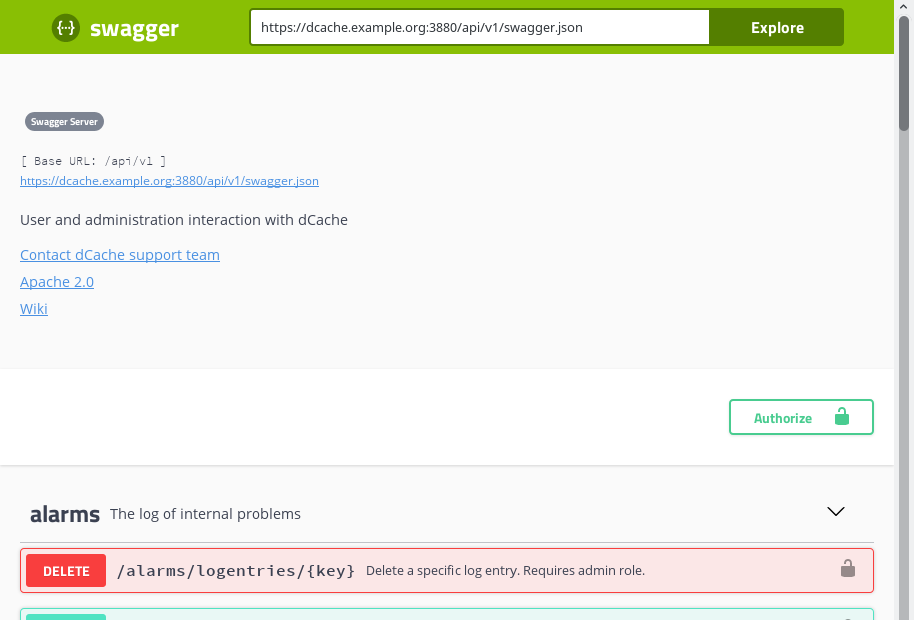
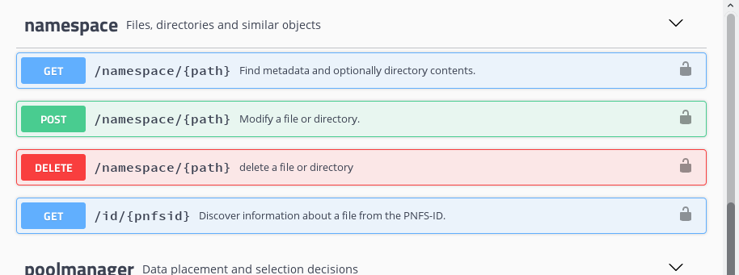
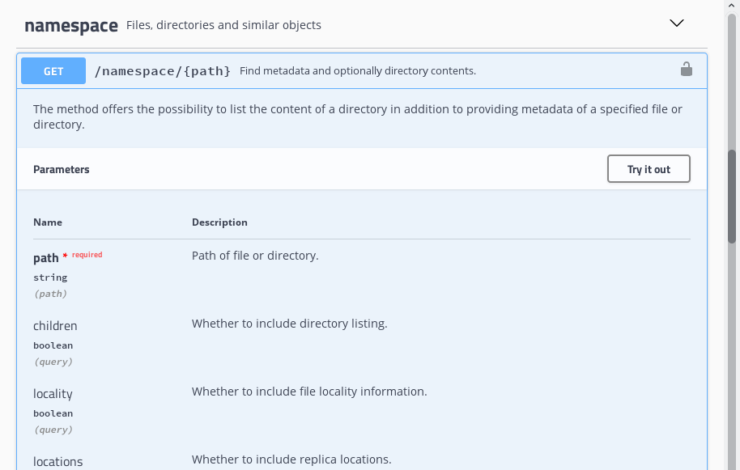
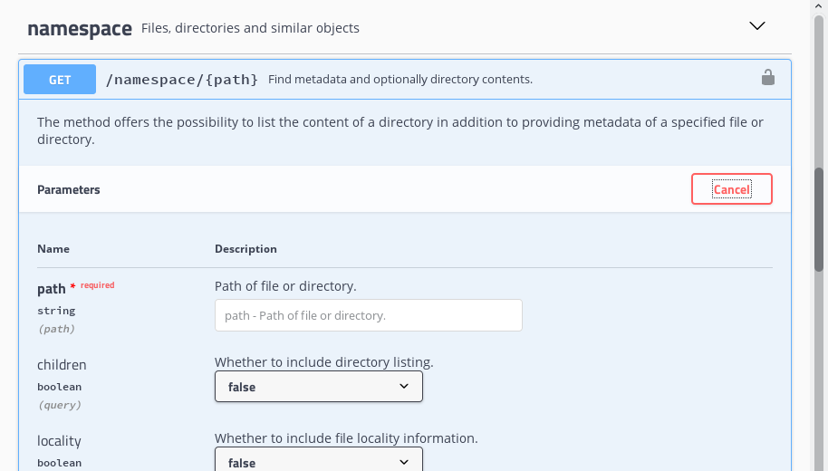
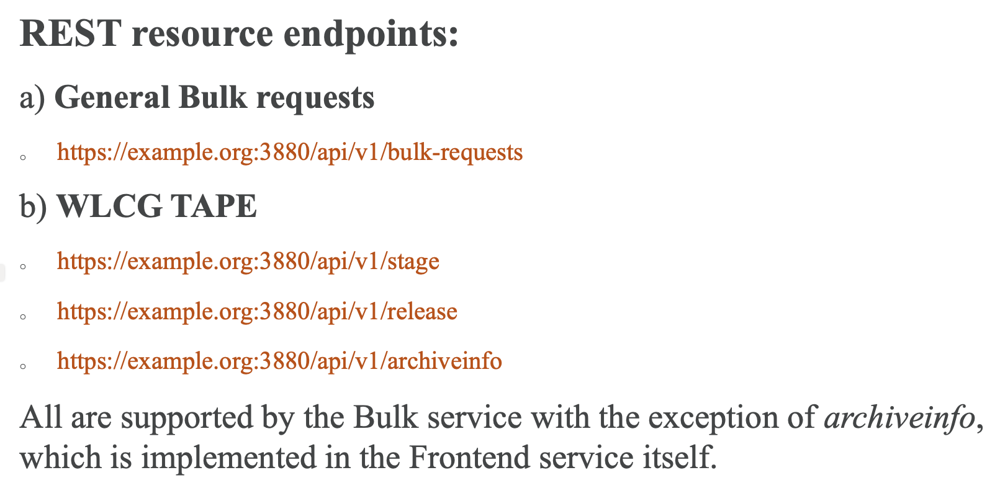
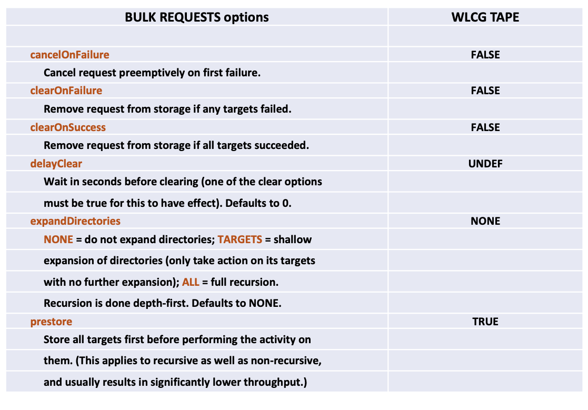
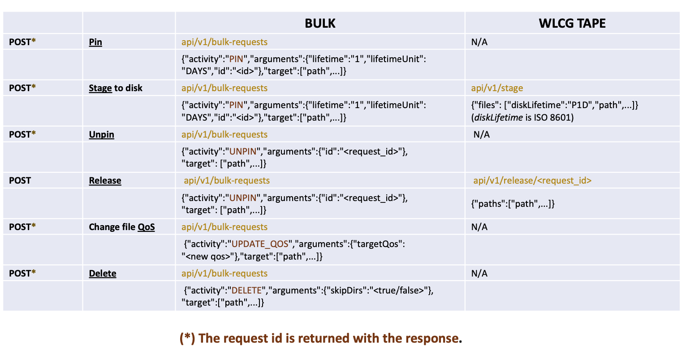
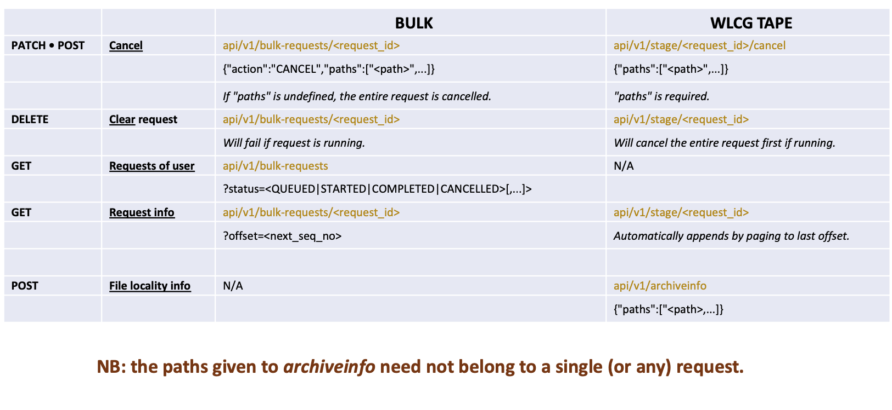
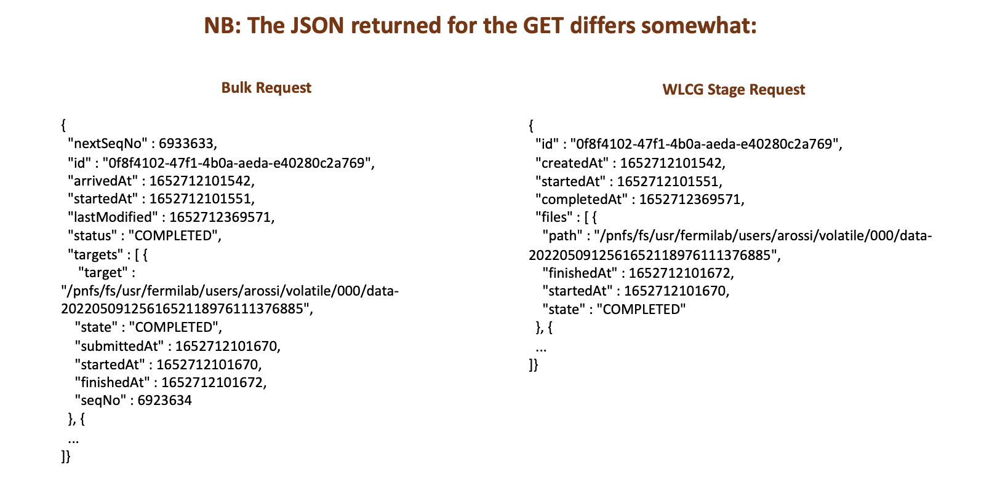

Chapter 4. Frontend
===================

**Table of Contents**

+ [REST overview](#rest-overview)
+ [Swagger](#swagger)
+ [Authentication](#authentication)
+ [REST with curl](#rest-with-curl)
+ [Active transfers](#active-transfers)
    * [Filtering](#filtering)
    * [Pagination](#pagination)
    * [Sorting](#sorting)
+ [Doors](#doors)
+ [Identity](#identity)
+ [Namespace](#namespace)
    * [Discovering metadata](#discovering-metadata)
    * [Listing directories](#listing-directories)
    * [Deleting files and directories](#deleting-files-and-directories)
    * [Creating directories](#creating-directories)
    * [Moving and renaming](#moving-and-renaming)
    * [Changing group-ownership](#changing-group-ownership)
    * [Modifying QoS](#modifying-qos)
    * [Managing extended attributes](#managing-extended-attributes)
+ [QoS Management](#qos-management)
+ [Space reservations](#space-reservations)
+ [Storage Events](#storage-events)
    * [Top-level information](#top-level-information)
    * [Understanding event types](#understanding-event-types)
    * [Channel lifecycle](#channel-lifecycle)
    * [Subscriptions](#subscriptions)
    * [Receiving events: SSE](#receiving-events-sse)
+ [Bulk Requests](#bulk-requests)

The frontend is an HTTP endpoint that provides a REST API.  In this
chapter, we discuss how you can interact with dCache using this
interface.

In this chapter, we will assume that dCache is running a frontend
service on `dcache.example.org` on port `3880` with TLS encryption
enabled.  Therefore, all the example URLs will start
`https://dcache.example.org:3880/`

## REST overview

REST is a design principal, rather than a specific protocol.  One of
the key ideas of REST is that clients use only a very few operations
when interacting with dCache.  In fact, only four standard HTTP
operations are needed: GET, POST, DELETE and PATCH.

Despite the small number of operations, clients can still discover and
control a wide range of aspects of dCache by targeting different URLs.
These URLs are referred to as resources, with the different requests
having similar semantics: a GET request discovers the current status
of a resource, a POST request creates a new resource, a DELETE request
removes or destroys a resource and a PATCH request modifies an
existing resource.

The REST API that frontend provides is non-standard.  This allows us
to expose some of dCache's advance features that are not available
through other protocols.

All REST API resources start `/api/v1/`.  The next path element in the
resource groups together related concepts; for example resources that
start `namespace` (`/api/v1/namespace`) represent dCache's namespace:
files and directories.  Resources that start `events`
(`/api/v1/events`) represent the Server-Sent Events (SSE) support and
its management interface.  Resources that start `/user`
(`/api/v1/user`) describe the identity of dCache users.

A number of resources are intended for administrative operations and
require special privileges.  These resources are not documented here,
but in a separate admin-focused book.

## Swagger

[Swagger](https://swagger.io/ "Swagger homepage") is a standard way of
describing a REST API as a JSON object.  All the REST API calls are
described, along with the arguments and the possible return values.

A Swagger description of a REST API may be used to build documentation
for that API.  It may also be used to generate REST clients in almost
any language.

Each dCache frontend provides a swagger description of its API.  The
swagger JSON description is available with the path
`/api/v1/swagger.json`; for example, from the URL
`https://dcache.example.org:3880/api/v1/swagger.json`.  A GET request
to this location returns a JSON object describing all dCache REST
operations.

```console-user
curl -s https://prometheus.desy.de:3880/api/v1/swagger.json | jq .
|{
|  "swagger": "2.0",
|  "info": {
|    "description": "User and administration interaction with dCache",
|    "version": "Swagger Server",
|    "title": "",
|    "contact": {
|      "name": "dCache support team",
|      "email": "support@dCache.org"
|    },
|    "license": {
|      "name": "Apache 2.0",
|      "url": "http://www.apache.org/licenses/LICENSE-2.0"
|    }
|  },
|  "basePath": "/api/v1",
|[...]
|  "externalDocs": {
|    "description": "Wiki",
|    "url": "https://github.com/dCache/dcache/wiki/Restful-API"
|  }
```

### Swagger UI

The Swagger UI is a JavaScript application that reads the Swagger JSON
description of a REST API and builds an interactive web-page.  This
page allows you to explore the API, read the documentation and even
try out the operations.

dCache frontend comes bundled with the Swagger UI application.  You
can try the Swagger UI by pointing your browser at `/api/v1/`
(e.g,. `https://dcache.example.org:3880/api/v1/`).



*Note* the Swagger JSON description of dCache REST API and
corresponding Swagger UI include all resources, whether they are
user-focused or admin-focused.  You will see a number of resources
that are not described here and that regular dCache users are not
authorised to use.

As an example, by scrolling down the page, you will find a section on
dCache's namespace operations.



Clicking on the GET `/namespace/` box expands this operation to reveal
detailed information about this operation.  This includes which
parameters this operation accepts and what values might be returned.



Clicking on the "Try it out" button modifies the display so that the
page now accepts values.  A large Execute button also appears.
Entering the desired values and clicking on the Execute button will
make a REST request.  The result of the REST operation is also shown.



You can also enter username and password information by clicking on
the Authorize button near the top of the page.  Swagger UI will use
this credential when making subsequent requests.

You can find out more about Swagger UI at [Swagger UI home
page](https://swagger.io/tools/swagger-ui/).

## Authentication

The frontend service supports several different forms of
authentication.  Each REST request may be authenticated using username
and password (HTTP BASIC), Kerberos, OpenID-Connect, Macaroons,
SciToken.  In addition, the TLS connection supports authentication
with X.509 client certificates.  However, it is possible that your
dCache instance is configured to support only a subset of these
options.

Bearer tokens (such as macaroons, SciToken and OpenID-Connect) may be
specified by including them in the `Authorization` HTTP request
header; e.g., `Authorization: Bearer <token>`.  They may also be
specified in the URL, with the `authz` query parameters;
e.g. `https://dcache.example.org:3880/api/v1/user?authz=M[...]z`

If the client supplies an X.509 client certificate when establishing
the secure TLS connection then that identity is used only if no other
authentication information is available.  If the HTTP request contains
the `Authorization` request header or the `authz` query parameter then
that information is used to authenticate and authorise the request.

## REST with curl

In most of this document, we will give the resource path (from which
the request URL is derived), indicate a request type (e.g., GET or
POST), necessary input (if any) and output (if any).

Whether it is to gain experience or to build a simple script, the
`curl` command is a simple way to interact with the dCache REST API.  In
the following section, we describe how to use curl with frontend.

### Formatting the response JSON

Although a simple `curl` invocation will make a GET request and show
the response, the format may not be laid out for easy reading.
Therefore, it is often useful to reformat the JSON output.  The
following example shows the JSON response reformatted using the `jq`
command:

```console-user
curl -s https://dcache.example.org:3880/api/v1/user | jq .
|{
|  "status" : "ANONYMOUS"
|}
```

The `| jq .` uses the `jq` command to format the JSON response.  Since
curl is no longer providing data on standard output (stdout), it
provides progress information instead.  This would upset the output,
so the `-s` option is used to tell curl not to emit such progress
information.

### Including JSON in POST request

When making a POST request with curl that sends JSON as input, it is
important to specify the `Content-Type` request header.  This is
because curl will, by default, use the wrong type, which will prevent
dCache from accepting the request.

For example, to send a POST request with the following JSON input:

```json
{
  "action": "mkdir",
  "name": "new-dir"
}
```

The curl command might look like:

```console-user
curl -u paul -X POST -H 'Content-Type: application/json' \
|        -d '{"action":"mkdir", "name":"new-dir"}' \
|        https://dcache.example.org:3880/api/v1/namespace/Users/paul
|Enter host password for user 'paul':
|{"status":"success"}
```

### Discovering Location response header

In several cases, a POST request will create a new resource with a
name chosen by dCache.  A common pattern is for dCache to return the
URL of this new resource in the `Location` HTTP response header.

The `-D-` curl option returns all response headers, allowing you to
see the `Location` response header:

```console-user
curl -D- -u paul -X POST \
|        https://dcache.example.org:3880/api/v1/events/channels
|Enter host password for user 'paul':
|HTTP/1.1 201 Created
|Date: Tue, 09 Apr 2019 20:50:07 GMT
|Server: dCache/5.1.0-SNAPSHOT
|Location: https://dcache.example.org:3880/api/v1/events/channels/pf_B1dEed98IVKqc9BNa-w
|Access-Control-Allow-Origin: *
|Access-Control-Allow-Methods: GET, POST, DELETE, PUT
|Access-Control-Allow-Headers: Content-Type, Authorization, Suppress-WWW-Authenticate
|Content-Length: 0
|
```

In this example, the new resource has the URL
`https://dcache.example.org:3880/api/v1/events/channels/pf_B1dEed98IVKqc9BNa-w`.


## Active transfers

The `transfers` resource (`/api/v1/transfers`) represents all ongoing
transfers.  This information is collected periodically and made
available as snapshot views of all concurrent transfers.

By default, a GET request returns information about transfers from the
most recent snapshot.

The following example shows a typical response when there are no
active transfers:

```json
{
  "items": [],
  "currentOffset": 0,
  "nextOffset": -1,
  "currentToken": "e4c5759b-f9b3-4165-9bd5-074b8e022596",
  "timeOfCreation": 1554815277797
}
```

In this example, there are no active transfers so the `items` property
is empty.  The `currentOffset` and `nextOffset` properties indicate that all
available data is shown.

The `currentToken` is a unique reference for this snapshot.  It may be
supplied as a query parameter when making subsequent GET requests to
refer to this snapshot (and not any other snapshot).

Finally, the `timeOfCreation` gives the Unix time (in milliseconds)
when this snapshot was created.

The following example shows the response to a GET request when there
are on-going transfers:


```json
{
  "items": [
    {
      "cellName": "webdav-secure-grid",
      "domainName": "dCacheDomain",
      "serialId": 1554815749796000,
      "protocol": "HTTP-1.1",
      "process": "",
      "pnfsId": "0000AC8078894C74493B8F1BE11DC2672D9C",
      "path": "/Users/paul/test-1",
      "pool": "pool2",
      "replyHost": "2001:638:700:20d6:0:0:1:3a",
      "sessionStatus": "Mover PoolName=pool2 PoolAddress=pool2@pools/641: Waiting for completion",
      "waitingSince": 1554815749796,
      "moverStatus": "RUNNING",
      "transferTime": 8021,
      "bytesTransferred": 16384,
      "moverId": 641,
      "moverSubmit": 1554815749839,
      "moverStart": 1554815749839,
      "subject": {
        "principals": [
          {
            "primaryGroup": false,
            "gid": 0,
            "name": "0"
          },
          {
            "clientChain": [
              "2001:638:700:20d6:0:0:1:3a"
            ],
            "address": "2001:638:700:20d6:0:0:1:3a",
            "name": "2001:638:700:20d6::1:3a"
          },
          {
            "name": "paul.millar@desy.de"
          },
          {
            "primaryGroup": true,
            "gid": 1001,
            "name": "1001"
          },
          {
            "name": "/C=DE/O=GermanGrid/OU=DESY/CN=Alexander Paul Millar"
          },
          {
            "uid": 2002,
            "name": "2002"
          },
          {
            "primaryGroup": false,
            "gid": 2002,
            "name": "2002"
          },
          {
            "primaryGroup": false,
            "name": "dteam"
          },
          {
            "fqan": {
              "group": "/dteam",
              "capability": "",
              "role": ""
            },
            "primaryGroup": true,
            "name": "/dteam"
          },
          {
            "name": "paul"
          },
          {
            "loA": "IGTF_AP_CLASSIC",
            "name": "IGTF-AP:Classic"
          }
        ],
        "readOnly": false,
        "publicCredentials": [],
        "privateCredentials": []
      },
      "userInfo": {
        "username": "paul",
        "uid": "2002",
        "gid": "1001",
        "primaryFqan": {
          "group": "/dteam",
          "capability": "",
          "role": ""
        },
        "primaryVOMSGroup": "/dteam"
      },
      "valid": true,
      "uid": "2002",
      "gid": "1001",
      "transferRate": 2,
      "vomsGroup": "/dteam",
      "timeWaiting": "0+00:00:09"
    }
  ],
  "currentOffset": 0,
  "nextOffset": -1,
  "currentToken": "fbfd7d39-9959-4135-bf9a-5f65355346f5",
  "timeOfCreation": 1554815757860
}
```

The format describing a transfer is not yet fixed and may be subject
to change.

### Filtering

The list of active transfers may be limited by specifying different
query parameters.

The following filters are supported:

| Name | Select only transfers... |
| ---- | --- |
| state | in state |
| door | initiated with this door |
| domain | inititated in this specific domain |
| prot | using the named protocol |
| uid | initiated by this user |
| gid | initiated by members of this group |
| vomsgroup | initiated by a member of this voms group |
| path | transfers involving this path |
| pnfsid | transfers involving this PNFS-ID |
| client | transfers involving this client |

An an example, the query `/api/v1/transfers?uid=1000&prot=HTTP-1.1`
would list all current HTTP transfers involving the user with uid
1000.

### Pagination

On an active dCache, there may be many too many concurrent transfers
to return them all in a single JSON response.  To support this, a
query can target a specific snapshot (rather than the latest snapshot)
and limiting the number of responses.

The `token` query parameter may be used to select a specific snapshot.
The value is the `currentToken` value.  In the above example, the
currentToken value is `fbfd7d39-9959-4135-bf9a-5f65355346f5`, so
repeated queries that target this snapshot have
`token=fbfd7d39-9959-4135-bf9a-5f65355346f5` as a query parameter.

The `offset` and `limit` query parameters select a subset of values.
If not specified then they default to 0 and 2147483647 respectively.

Therefore, a GET request targeting the path
`/api/v1/transfers?token=fbfd7d39-9959-4135-bf9a-5f65355346f5&offset=0&limit=10`
returns the first ten transfer from a specific snapshot.

A subsequent GET request targeting the path
`/api/v1/transfers?token=fbfd7d39-9959-4135-bf9a-5f65355346f5&offset=10&limit=10`
returns the next ten transfers, and so on.

### Sorting

The output is sorted.  The priority of different fields is controlled
by the `sort` query parameter, which takes a comma-separate list of
field names.  The default value is `door,waiting`.


## Doors

Doors are protocol-specific network services that allow clients to
interact with files stored in dCache; for example, a WebDAV door
allows clients to read and write files using the WebDAV protocol, in
addition to creating directories and renaming files.

Uploading and downloading files is not supported in the REST API;
therefore, a client must find a door that supports an appropriate
protocol if the client needs to transfer files.

The `doors` resource (`/api/v1/doors`) represents all doors within
dCache.  This allows a client to discover which protocols are
supported and what are their endpoints.

A GET request on this resource yields a complete set of all doors.
The response is a JSON array of JSON objects, with each JSON object
describing a door.

Here is an example response:

```json
[
  {
    "protocol": "ftps",
    "version": "1.0.0",
    "root": "/",
    "addresses": [
      "dcache.example.org"
    ],
    "port": 21,
    "load": 0,
    "tags": [
      "glue",
      "srm",
      "storage-descriptor"
    ],
    "readPaths": [
      "/"
    ],
    "writePaths": [
      "/"
    ]
  },
  {
    "protocol": "https",
    "version": "1.1",
    "root": "/",
    "addresses": [
      "dcache.example.org"
    ],
    "port": 2443,
    "load": 0,
    "tags": [
      "glue",
      "srm",
      "storage-descriptor"
    ],
    "readPaths": [
      "/"
    ],
    "writePaths": [
      "/"
    ]
  },
  {
    "protocol": "gsiftp",
    "version": "1.0.0",
    "root": "/",
    "addresses": [
      "dcache.example.org"
    ],
    "port": 2811,
    "load": 0,
    "tags": [
      "glue",
      "srm",
      "storage-descriptor"
    ],
    "readPaths": [
      "/"
    ],
    "writePaths": [
      "/"
    ]
  },
  {
    "protocol": "https",
    "version": "1.1",
    "root": "/",
    "addresses": [
      "dcache.example.org"
    ],
    "port": 443,
    "load": 0,
    "tags": [
      "cdmi",
      "dcache-view"
    ],
    "readPaths": [
      "/"
    ],
    "writePaths": [
      "/"
    ]
  }
]
```

In this example, three doors are listed: an FTPS door listening on
port 21, an gsiftp (GridFTP) door listening on port 2811, and a WebDAV
door listening on port 443.

The `root` property gives the door's root path.  The value is the absolute
path in dCache equivalent to the door's root path.  For example, if
the `root` property value is `/data/atlas` and a client downloads the
file `/2019/data-1.root` through this door then the client will
receive the file `/data/atlas/2019/data-1.root`.

The `addresses` indicates on which address(es) the door is listening.

The `port` indicates the TCP port number on which the door is
listening.

The `tags` are arbitrary metadata describing aspects of the door; for
example, describing for which kind of use the door is intended.  This
information is advisory, but allows dCache to advertise doors that are
for specialist users.

The `load` is a number between 0 and 1, indicating how busy the door
is currently.

The `readPaths` and `writePaths` describe generic limitations the door
will impose; for example, only allowing write activity on a subset of
the namespace.


## Identity

The identity resources are about someone's identity within dCache.
There is currently one resource that represents the user making the
request: `/user` (`/api/v1/user`).  A GET request to this resource
returns information about the user making the request.

If no credentials are presented then the user is the ANONYMOUS user:

```json
{
  "status" : "ANONYMOUS"
}
```

If the user authenticates, then information about that user is
returned:

```json
{
  "status": "AUTHENTICATED",
  "uid": 2002,
  "gids": [
    2002,
    0
  ],
  "username": "paul",
  "homeDirectory": "/Users/paul",
  "rootDirectory": "/"
}
```

## Namespace

With the namespace part of the API, you can discover information about
a specific file or directory, list the contents of a directory, delete
and rename files, and modify a file's or directory's QoS.

### Discovering metadata

Resources that describe files and directories in dCache are found beneath
the `namespace` resource (`/api/v1/namespace`) by simply appending the
dCache path to this path.  For example, the resource `namespace`
(`/api/v1/namespace`) represents the root directory and
`namespace/upload` (`/api/v1/namespace/upload`) represents the
`upload` directory.

To discover information about a path in dCache, make a GET request to
the file's or directory's resource.

The following example shows the root directory's resource:

```json
{
  "fileMimeType" : "application/vnd.dcache.folder",
  "fileType" : "DIR",
  "pnfsId" : "000000000000000000000000000000000000",
  "nlink" : 11,
  "mtime" : 1554697387559,
  "creationTime" : 1554696069369,
  "size" : 512
}
```

Additional information may be requested by specifying different query
parameters in the GET request.  These additional fields are not
included by default as fetching them would slow down the query.

There are three additional fields: `locality`, `locations`, `qos` and
`xattr`; for example, to enable fetching `locality` and `qos`
information, the GET request would include `?locality=true&qos=true`
in the URL.

The `locality` flag adds information about whether data is currently
available.  With this flag, the output includes the extra field
`fileLocality` in the output for files.  This flag does not provide
any extra information for directories.  The possible values for
`fileLocality` are summarised in the following table:

| Name | Semantics |
| ---- | ------ |
| ONLINE | data is available now. |
| NEARLINE | data is not available now; an automated process can make the data available on demand. |
| ONLINE_AND_NEARLINE | data is available now, but might require an automated activity to make it available in the future. |
| UNAVAILABLE | data is not available now; sysadmin intervention may be needed to make it available. |
| LOST | data is not available and there is no process to obtain it. |

The `locations` flag adds information about where data is currently
located.  With this flag, the output includes the `locations` field.
This field's value is a JSON array of pool names.

The `qos` flag adds information about the current QoS of a file or
directory.  With this flag, the output includes the `currentQoS` field
and optionally the `targetQoS` field.  The former describes the
current QoS for this file or directory.  If dCache is currently
transitioning a file to a different QoS then the `targetQoS` field is
present, describing which QoS the file should have.  See [QoS
Management](#qos-management) to understand more about these QoS
values.  How to trigger QoS changes is described in [Modifying
QoS](#modifying-qos).

The `xattr` flag adds a list of all currently assigned extended
attributes.  With this flag, the output includes the
`extendedAttributes` field.  The value is a JSON object where the JSON
object key is the extended attribute name and the corresponding JSON
object value is a JSON string containing the attribute value.  For
more details on extended attributes see the [chapter on extended
attributes](xattr.md).

The following example shows a typical response when querying a file
contains no extended attributes

```json
{
  "fileMimeType": "application/octet-stream",
  "size": 1099016,
  "creationTime": 1593622353030,
  "pnfsId": "00008E3F09F356D747668CC518EFC61D6A5E",
  "fileType": "REGULAR",
  "nlink": 1,
  "mtime": 1593622354113,
  "extendedAttributes": {}
}
```

The following example shows a typical response when querying a file
with two extended attributes `attribute-1` and `attribute-2`, with
values `Test value 1` and `Another test value` respectively:

```json
{
  "fileMimeType": "application/octet-stream",
  "size": 1099016,
  "creationTime": 1593622453204,
  "pnfsId": "00009599943268104B39B4624F5CC1F7E131",
  "fileType": "REGULAR",
  "nlink": 1,
  "mtime": 1593622453352,
  "extendedAttributes": {
    "attribute-2": "Another test value",
    "attribute-1": "Test value 1"
  }
}
```

If the path does not exist, then the HTTP response has a status code
404, with the following JSON response:

```json
{
  "errors": [
    {
      "message": "Not Found",
      "status": "404"
    }
  ]
}
```

### Listing directories

A GET request that targets a directory resource URL may include the
query argument `children=true`.  For example, a request to list the
root directory would target the resource `/namespace`
(`/api/v1/namespace`) and the complete path would be
`/api/v1/namespace/?children=true`.

The response is as before, but now also includes the `children`
property.  The value is a JSON array of JSON objects, where each JSON
object describes a child of this directory.  The same information is
provided for each child as is provided for the parent directory.


The following example shows a typical root directory listing.

```json
{
  "fileMimeType": "application/vnd.dcache.folder",
  "children": [
    {
      "fileName": "lost+found",
      "fileMimeType": "application/vnd.dcache.folder",
      "fileType": "DIR",
      "pnfsId": "000000000000000000000000000000000001",
      "nlink": 2,
      "mtime": 1554696070327,
      "creationTime": 1554696070327,
      "size": 512
    },
    {
      "fileName": "Users",
      "fileMimeType": "application/vnd.dcache.folder",
      "fileType": "DIR",
      "pnfsId": "00007EF0F064738E420099E7BDA672500DC2",
      "nlink": 30,
      "mtime": 1554696093632,
      "creationTime": 1554696089487,
      "size": 512
    },
    {
      "fileName": "VOs",
      "fileMimeType": "application/vnd.dcache.folder",
      "fileType": "DIR",
      "pnfsId": "0000F0C3D9A2EA9F4681970BF3D414A311ED",
      "nlink": 15,
      "mtime": 1554696092837,
      "creationTime": 1554696089424,
      "size": 512
    },
    {
      "fileName": "upload",
      "fileMimeType": "application/vnd.dcache.folder",
      "fileType": "DIR",
      "pnfsId": "00003405A2416C8D4317AA3833352F967A9A",
      "nlink": 14,
      "mtime": 1554726185595,
      "creationTime": 1554697387559,
      "size": 512
    }
  ],
  "fileType": "DIR",
  "pnfsId": "000000000000000000000000000000000000",
  "nlink": 11,
  "mtime": 1554697387559,
  "creationTime": 1554696069369,
  "size": 512
}
```

If the target is not a directory then adding `children=true` has no
effect on the output.

### Deleting files and directories

A file or directory may be deleted by making a DELETE request on the
target's corresponding resource.  For example, a DELETE request
targeting `/api/v1/namespace/Users/paul/old-data` would attempt to
delete the file `/Users/paul/old-data`.

If the target is a directory then it must be empty before the
operation will be successful.

The following example shows the response when successfully deleting a
file:

```json
{
  "status": "success"
}
```

### Creating directories

A new directory may be created using a POST request targeting the
resource corresponding to the parent directory.  This request must
supply a JSON object as the HTTP entity, with the `action` property of
`mkdir` and the `name property containing the new directory's name.

The following example creates a new directory called `my new dir`.

```json
{
  "action": "mkdir",
  "name": "my new dir"
}
```

The response, if successful shows the status `success`:

```json
{
  "status": "success"
}
```

### Moving and renaming

To rename or move a file or directory, make a POST request to the
resource representing the source file or directory; for example, to
rename the file `/Users/paul/my-data`, the POST request would target a
URL with the path `/api/v1/namespace/Users/paul/my-data`.

The POST request must contain a JSON object with the `action` property
value `mv`, and the `destination` property set to the new name or
path.  If the destination path is relative (i.e., does not start with
`/`) then it is resolved against the request's path parameter.

The following example renames the source to `new-name`.

```json
{
  "action": "mv",
  "destination": "new-name"
}
```

If the operation is successful then HTTP response has a 200 status
code, and the response entity is the JSON object:

```json
{
  "status": "success"
}
```

### Changing group-ownership

The POSIX permission model describes how a file or directory has two
ownerships: a personal (or user) owner and a group owner.  These two
identities are used to determine which operations any individual is
allowed to make.

A common goal is to grant specific access to a file or directory to a
group of people the people outside this group are denied; for example,
making a file readable only to members of a group.  This is possible
by establishing a group (within dCache) that represents the target
group of people, and assign the corresponding gid as group-owner of
the file or directory.  The desired access may then be specified for
the group-owner.

Sometimes a file or directory has the wrong group-owner: either
because of changing permissions policy or the file was uploaded using
a client that does not allow specifying the desired group-owner.  In
these circumstances, the group-owner must be changed.

You are only allowed to change the group-ownership of files or
directories you own (as the personal- or user owner).  You are also
only allowed to change group-ownership to a group of which you are
already a member.

Changing group-ownership is done by making a POST request to the
resource representing the file or directory; for example, to change
the group-ownership of the file `/Users/paul/my-data`, the POST
request would target `/api/v1/namespace/Users/paul/my-data`.

The POST request must contain a JSON object with the `action` property
set to `chgrp`, and the `gid` property containing an integer value,
which is the desired group owner.

The following example requests the target have gid 1000 as the new
group-owner:

```json
{
    "action": "chgrp",
    "gid": 1000
}
```

### Modifying QoS

Each file or directory has a corresponding QoS value.  To modify this
assigned QoS, make a POST request to the resource representing the
file or directory; for example, to modify the QoS of the file
`/Users/paul/my-data`, the POST request would target
`/api/v1/namespace/Users/paul/my-data`.

The POST request must contain a JSON object with the `action` property
set to `qos`, and the `target` property set to the desired QoS.  The
following example requests the target have QoS `tape`:

```json
{
  "action": "qos",
  "target": "tape"
}
```

QoS transitions that target a file may take some time to complete.
While the transition is taking place, a GET request on the resource
representing this file will continue to show the file's QoS unchanged
but will include an additional field `targetQoS` that indicates to
which QoS dCache is transitioning this file.  See [Discovering
metadata](#discovering-metadata) for more details.

See [QoS Management](#qos-management) to understand more about the
different QoS target values, including performance characteristics.

### Managing extended attributes

Each file and directory has zero or more multiple extended attributes.
Extended attributes allow users and clients to assign arbitrary
metadata and are described in the [extended attributes
chapter](xattr.md).

Extended attributes are mangaed by making a POST request to the
resource representing the source file or directory; for example, to
add new extended attributes to the file `/Users/paul/my-data`, the
POST request would target a URL with the path
`/api/v1/namespace/Users/paul/my-data`.


#### Adding or modifying extended attributes

To add or modify extended attributes, the POST request must contain a
JSON object with the `action` property value `set-xattr`, and the
`attributes` property set to a JSON object containing the new extended
attributes.  The `mode` property may be specified with a value of
`CREATE`, `MODIFY` or `EITHER`.  If the `mode` property is not
specified then `EITHER` is used as a default value.

If the `mode` value is `CREATE` then the new attributes are accepted
only if they do not already exist: attempts to modify an existing
extended attribute will fail.  If the `mode` is `MODIFY` then an
existing extended attribute value is updated: attempts to create a new
extended attribute will fail.  If the `mode` is `EITHER` then the
extended attribute is assigned: creating a new extended attribute or
updating an existing attribute as appropriate.

The following example shows a POST request entity that creates two new
extended attributes (with names `attr-1` and `attr-2`) but only if
these extended attributes do not already exist:

```json
{
    "action" : "set-xattr",
    "mode" : "CREATE",
    "attributes" : {
        "attr-1": "First attribute",
        "attr-2": "Second attribute"
    }
}
```

The following example shows a POST request entity that either creates
a new extended attribute or modifies an existing extended attribute so
that the file now has an extended attribute with name `catalogue-id`:

```json
{
    "action" : "set-xattr",
    "attributes" : {
        "catalogue-id": "e163fb54-6d2e-4282-9f68-b6f97a707d0d"
    }
}
```

#### Removing extended attributes

To remove extended attributes, the POST request must contain a JSON
object with the `action` property value `rm-xattr`, and the `names`
property set to either a JSON string or a JSON array of JSON strings.
The JSON array values are the names of extended attributes to remove.
As a special case, if only a single extended attribute is to be
removed then the JSON array may be replaced with a JSON string.

The following example shows a POST request entiy that removes the two
extended attributes with names `attr-1` and `attr-2`:

```json
{
    "action" : "rm-xattr",
    "names" : [
        "attr-1",
        "attr-2"
    ]
}
```

The following example shows a POST request entity that removes a
single extended attribute with name `catalogue-id`:

```json
{
    "action" : "rm-xattr",
    "names" : "catalogue-id"
}
```


## QoS Management

The `qos-management` resources are a set of resources for working with
different QoS classes.  These resources all start
(`/api/v1/qos-management`).

The current QoS class of a file or directory is represented by that
file or directory's resource.  See [Discovering
metadata](#discovering-metadata) for more details on how to query the
current QoS and modify QoS values.

The resources that start `qos-management/qos`
(`/api/v1/qos-management/qos`) represent the different QoS classes.

Files and directories in dCache have an associated QoS class.  The QoS
class for a file describes how that file is handled by dCache; for
example, what performance a user may reasonably expect when reading
from that file.  The QoS class for a directory describes what QoS
class a file will receive when it is written into that directory.
Currently, all directory QoS classes have an equivalent file QoS class
with the same name.

A GET request on `qos-management/qos/file`
(`/api/v1/qos-management/qos/file`) provides a list of file QoS class
names.  Similarly, a GET request on `qos-management/qos/directory`
(`/api/v1/qos-management/qos/directory`) provides a list of directory
QoS class names.

The following example shows the response to a GET request targeting
`/api/v1/qos-management/qos/file`:

```json
{
  "name": [
    "disk",
    "tape",
    "disk+tape",
    "volatile"
  ],
  "message": "successful",
  "status": "200"
}
```

The same response is returned when querying the
`qos-management/qos/directory` resource.

In both cases, the `name` property is a JSON array of QoS class names.

Each individual QoS class is represented by the resource
`qos-management/qos/<type>/<name>`
(`/api/v1/qos-management/qos/<type>/<name>`).  For example, the
resource `qos-management/qos/file/tape` represents the QoS `tape` for
files.

A GET request on a QoS class resource returns information about that
resource.  The following example shows the response to a GET request
targeting the resource `qos-management/qos/file/disk`
(`/api/v1/qos-management/qos/file/disk`):

```json
{
  "status": "200",
  "message": "successful",
  "backendCapability": {
    "name": "disk",
    "transition": [
      "tape",
      "disk+tape"
    ],
    "metadata": {
      "cdmi_data_redundancy_provided": "1",
      "cdmi_geographic_placement_provided": [
        "DE"
      ],
      "cdmi_latency_provided": "100"
    }
  }
}
```

The returned JSON provides two groups of information.

The `transition` list shows all allowed transitions if a file
currently has the QoS class `disk`.  In this example, the transition
from QoS class `disk` to QoS class `volatile` is not allowed.  See
[Modifying QoS](#modifying-qos) for more information about changing a
file's or directory's QoS.

The `metadata` object contains information about the `disk` QoS class.
The three values in this example (`cdmi_data_redundancy_provided`,
`cdmi_geographic_placement_provided` and `cdmi_latency_provided`) come
from the [CDMI specification](https://www.snia.org/cdmi "Cloud Data
Management Interface (CDMI)"), see section 16.5.

## Space reservations

Space reservations are a promise to store a given amount of data.
They may be used when uploading a reasonable sized dataset, to avoid
running out of storage space midway through the upload.

Resources beneath `space` (`/api/v1/space`) represent space
reservations.

A GET request on the `space/tokens` (`/api/v1/space/tokens`) resource
provides information about space reservations.  The response is a JSON
array containing a JSON object.  Each of these JSON objects provides
information about a space reservation.

The following example shows the returned JSON for two space
reservations:

```json
[
  {
    "id": 2,
    "voGroup": "/atlas",
    "retentionPolicy": "REPLICA",
    "accessLatency": "ONLINE",
    "linkGroupId": 2,
    "sizeInBytes": 268435456000,
    "creationTime": 1554782633504,
    "description": "ATLASSCRATCHDISK",
    "state": "RESERVED"
  },
  {
    "id": 3,
    "voGroup": "/atlas",
    "retentionPolicy": "REPLICA",
    "accessLatency": "ONLINE",
    "linkGroupId": 2,
    "sizeInBytes": 107374182400,
    "creationTime": 1554782633548,
    "description": "ATLASDATADISK",
    "state": "RESERVED"
  }
]
```

Query parameters in the URL may be used to limit the reservations
listed; for example, `accessLatency=ONLINE` limits the response to
those reservations with online access-latency and `voGroup=/atlas`
limits the response to those reservations with `/atlas` ownership.

The following filters are supported:

| Name | Select only reservations... |
| ---- | ------ |
|  id  | with this id. |
| voGroup | with this VO group. |
| voRole | with this VO role. |
| accessLatency | with this Access Latency. |
| retentionPolicy | with this Retention Policy. |
| groupId | created from a linkgroup with this id. |
| state | with this current state. |
| minSize | with a capacity (in bytes) larger than this capacity  |
| minFreeSpace | with a free capacity (in bytes) larger than this capacuty |

Multiple filters may be combined in a single query, with the effects
being accumulative: each filter (potentially) reducing the number of
reservations listed.

For example, the query parameter `voGroup=/atlas&minSize=200000000000`
(`/api/v1/space/tokens?voGroup=/atlas&minSize=200000000000`) restricts
the returned list of space reservations to those that are both owned
by VO group `/atlas` and have a reserved capacity is at least 200 GB.

## Storage Events

Storage events is a mechanism where dCache can let you know when
something of interest has happened.  To do this, dCache uses a W3C
standard protocol: Server-Sent Events (SSE).

SSE is a protocol that allows an HTTP client to receive events with a
minimal delay.  It is widely supported, with libraries existing in all
major languages in addition to built-in support in all major web
browsers.

All REST activity to do with storage events targets the `events` resource
(`/api/v1/events`) with different resources below this having more
specific roles.

### Management overview

Although the SSE protocol is a standard, there is no standard
management interface to allow you to control which events you are
interested in receiving.  Therefore, dCache has a proprietary
interface that allows you to discover what possibilities exist,
discover the current configuration and modify that configuration.

The SSE protocol targets a specific endpoint.  In dCache, this
endpoint for receiving events is called a channel.  It is expected
that each client will have its own channel: channels are not shared
between clients.  A client will create its own channel and then
configures this channel to receive all events the client is interested
in.

Although it is not forbidden, a client could create multiple channels.
However, this is unnecessary, as a channel can receive any number of
events of any type.  Clients creating multiple channels is also
discouraged, as each user is allowed only a limited number of
channels.

Storage events are grouped together into broadly similar types, called
event types; for example, all events that simulate the Linux
filesystem notification system "inotify" have the `inotify` event
type.  Events that are to do with SSE support itself (or other
low-level aspects) have the `SYSTEM` event type.

When a client creates a channel, it initially receives only `SYSTEM`
events.  To start receiving interesting events, the client must create
subscriptions.  A subscription is a description of which events (of a
specific event type) are of interest.  There is a JSON object, called
a selector, that describes which events (of all possible events
emitted by an event type) are of interest.  The exact format of the
selector depends on the event type.

A channel can have multiple subscriptions.  Each subscription is
independent: they could come from the same event type, or from
different event types.  A client can add and remove subscriptions as
its interest in events changes.  For example, a client that is showing
the contents of a specific directory might subscribe to learn of
changes to that directory; when the user changes directory, so the
subscriptions would change accordingly.

### Top-level information

A GET request on the `events` (`/api/v1/events`) resource returns a
JSON object providing information that is independent of any channel
and any event type.

The `channels` property value describes information about channels in
general, rather than about a specific channel.  Channels are
automatically deleted if they are not used for long enough.  The time
before this happens may be adjusted by the client.  The
`lifetimeWhenDisconnected` property describes this policy, with the
values in seconds.

Additionally, each user is allowed to have only a limited number of
channels.  Once this limit is reached, attempts to create more
channels will fail.  This limit is recorded in the `maximumPerUser`
property.

The following shows a typical response to a GET request on the
`events` resource:

```json
{
  "channels": {
    "lifetimeWhenDisconnected": {
      "maximum": 86400,
      "minimum": 1,
      "default": 300
    },
    "maximumPerUser": 128
  }
}
```

In the above example, new channels are garbage collected automatically
after five minutes.  An individual channel may be configured to be
garbage collected on a different schedule: as quickly as after one
second, or as long as after a day.  Users are limited to having at
most 128 channels concurrently.

### Understanding event types

The `events/eventTypes` resource (`/api/v1/events/eventTypes`)
describes information about different events types, independent of any
subscriptions.

A GET request against this resource provides a list of available event
types:

```json
[
  "inotify",
  "metronome"
]
```

In the above example, two event types are shown: `inotify` and
`metronome`.  The `SYSTEM` event type is not shown since a channel is
always subscribed to this event type and cannot control the delivery
of those events.

Individual event types are represented by the resource
`events/eventTypes/<name>`.  For example, the `inotify` event type is
represented by the resource `events/eventTypes/inotify`
(`/api/v1/events/eventTypes/inotify`).

A GET request targeting the event type resource returns a JSON object
providing basic information about this event type.

For example, the following JSON is the response to a GET request
targeting the `events/eventTypes/metronome`
(`/api/v1/events/eventTypes/metronome`) resource

```json
{
  "description": "a configurable stream of messages"
}
```

Similar information is available from the
`events/eventTypes/inotify` resource:

```json
{
  "description" : "notification of namespace activity, modelled after inotify(7)"
}
```

There are two further resources per resource type: one that represents
the selector and one that represents the data supplied with events of
this type.

#### Event Type: Selectors

The `events/eventTypes/<name>/selector` resource
(`/api/v1/events/eventTypes/<name>/selector`) represents the selector
for this event type.  A selector is supplied when subscribing to
events of a specific type, to describe which events are of interest.

A GET request on this resource returns the JSON Schema of the
selector.  When subscribing to this event type, the selector must
satisfy this JSON Schema.  In addition to describing the structure,
the schema also describes the semantics of each of the arguments,
including any default values that are used if not specified.

##### metronome

The following is the response to a GET request targeting the
`events/eventTypes/metronome/selector` resource:

```json
{
  "$id": "http://dcache.org/frontend/events/metronomeSelectors#",
  "$schema": "http://json-schema.org/draft-06/schema#",
  "type": "object",
  "properties": {
    "frequency": {
      "title": "The trigger frequency",
      "description": "How often events are fired, in Hz.",
      "type": "number",
      "minimum": 0.0033333333333333335,
      "maximum": 1000000
    },
    "delay": {
      "title": "The delay between successive triggers",
      "description": "The time between two triggers, in seconds.",
      "type": "number",
      "minimum": 1e-06,
      "maximum": 300
    },
    "message": {
      "title": "The event payload",
      "description": "The data sent with each event.  A ${username} is replaced by the user's username and ${count} is replaced by the message number.",
      "minLength": 1,
      "type": "string",
      "default": "tick"
    },
    "count": {
      "title": "The number of events",
      "description": "The number of events to generate before cancelling the subscription.  If not specified then the events are supplied until the subscription is explicitly cancelled by the client.",
      "type": "number"
    }
  },
  "oneOf": [
    {
      "required": [
        "frequency"
      ]
    },
    {
      "required": [
        "delay"
      ]
    }
  ],
  "additionalProperties": false
}
```

This describes how, when subscribing for `metronome` events, either
the `frequency` or `delay` argument must be provided.  The `count` and
`message` argument may be provided, but are not required.

The following is a valid selector that requests events be sent every
two seconds with the data `"Message 1"`, `"Message 2"`, `"Message 3"`
and so on.

```json
{
  "message": "Message ${count}",
  "delay": 2
}
```

The following JSON object is a valid selector that requests events at
1 kHZ for two seconds.  Each event will have the same data `"tick"`.

```json
{
  "freqency": 1000,
  "count": 2000
}
```

##### inotify

Selectors for `inotify` are more complicated, but a JSON Schema that
describes them is represented by the
`events/eventTypes/inotify/selector` resource.

The following JSON Schema is returned by a GET request targeting this
resource.

```json
{
  "$id": "http://dcache.org/frontend/events/namespaceSelectors#",
  "$schema": "http://json-schema.org/draft-06/schema#",
  "description": "path of a directory to watch",
  "type": "object",
  "required": [
    "path"
  ],
  "properties": {
    "path": {
      "title": "The path of the file or directory to watch",
      "description": "The target must exist when the request is made.  The watch will follow the target, if it is moved.",
      "pattern": "^/(.*[^/])?$",
      "type": "string"
    },
    "flags": {
      "title": "Control which events are selected",
      "description": "See inotify(7) for the meaning of these flags.",
      "type": "array",
      "items": {
        "type": "string",
        "enum": [
          "IN_ACCESS",
          "IN_ATTRIB",
          "IN_CLOSE_WRITE",
          "IN_CLOSE_NOWRITE",
          "IN_CREATE",
          "IN_DELETE",
          "IN_DELETE_SELF",
          "IN_MODIFY",
          "IN_MOVE_SELF",
          "IN_MOVED_FROM",
          "IN_MOVED_TO",
          "IN_OPEN",
          "IN_ALL_EVENTS",
          "IN_CLOSE",
          "IN_MOVE",
          "IN_DONT_FOLLOW",
          "IN_EXCL_UNLINK",
          "IN_MASK_ADD",
          "IN_ONESHOT",
          "IN_ONLYDIR"
        ]
      }
    }
  },
  "additionalProperties": false
}
```

The `path` property is required, while the `flags` property is
optional.

The following selector selects all inotify events for the directory
`/data/uploads`.

```json
{
  "path": "/data/uploads"
}
```

The following selector watches the `/Users/paul/docs` directory for
any files or directories being created, renamed or deleted.  For
files, an `IN_CREATE` event is sent at the start of an upload and an
`IN_CLOSE_WRITE` event is sent when the upload is complete.

```json
{
  "path": "/Users/paul/docs",
  "flags": [
    "IN_CREATE",
    "IN_DELETE",
    "IN_MOVE_FROM",
    "IN_MOVE_TO",
    "IN_CLOSE_WRITE"
  ]
}
```


#### Event Type: Events

The `events/eventTypes/<eventType>/event` resource
(`/api/v1/events/eventTypes/<eventType>/event`) represents the events
generated by this event type.

A GET request returns a JSON Schema that describes the information
included with events of this type.

##### metronome

The `events/eventTypes/metronome/event` resource
(`/api/v1/events/eventTypes/metronome/event`) represents the events from the metronome event type.

A GET request will provide JSON object like:

```json
{
  "$id": "http://dcache.org/frontend/events/metronomeEvents#",
  "$schema": "http://json-schema.org/draft-06/schema#",
  "type": "string"
}
```

This JSON Schema describes a simple JSON String which (for metronome)
corresponds to the `message` field in the metronome selector.
Therefore, the default event data is simply `"tick"`.

##### inotify

The events generated by the inotify event type are described in the
`events/eventTypes/inotify/event`
(`/api/v1/events/eventTypes/inotify/event`) resource.

A GET request targeting this resource returns the following JSON
Schema:

```json
{
  "$id": "http://dcache.org/frontend/events/namespaceEvents#",
  "$schema": "http://json-schema.org/draft-06/schema#",
  "description": "the description of a change in the namespace",
  "type": "object",
  "oneOf": [
    {
      "$ref": "#/definitions/nonMoveChildEvent"
    },
    {
      "$ref": "#/definitions/moveChildEvent"
    },
    {
      "$ref": "#/definitions/selfEvent"
    },
    {
      "$ref": "#/definitions/managementEvent"
    }
  ],
  "definitions": {
    "childEvent": {
      "required": [
        "name"
      ],
      "properties": {
        "name": {
          "title": "The name of the target",
          "description": "The filename of the filesystem object that triggered this event.",
          "type": "string",
          "minLength": 1
        }
      }
    },
    "nonMoveChildEvent": {
      "allOf": [
        {
          "$ref": "#/definitions/childEvent"
        },
        {
          "properties": {
            "mask": {
              "title": "One or more flags that describe this event",
              "description": "The semantics are based on inotify(7)",
              "type": "array",
              "minitems": 1,
              "maxitems": 2,
              "items": {
                "type": "string",
                "enum": [
                  "IN_ACCESS",
                  "IN_ATTRIB",
                  "IN_CLOSE_WRITE",
                  "IN_CLOSE_NOWRITE",
                  "IN_CREATE",
                  "IN_DELETE",
                  "IN_MODIFY",
                  "IN_OPEN",
                  "IN_ISDIR"
                ]
              }
            }
          }
        }
      ]
    },
    "moveChildEvent": {
      "allOf": [
        {
          "$ref": "#/definitions/childEvent"
        },
        {
          "required": [
            "mask",
            "cookie"
          ],
          "properties": {
            "mask": {
              "title": "One or more flags that describe this event",
              "description": "The semantics are based on inotify(7)",
              "type": "array",
              "minitems": 1,
              "maxitems": 2,
              "items": {
                "type": "string",
                "enum": [
                  "IN_MOVED_FROM",
                  "IN_MOVED_TO",
                  "IN_ISDIR"
                ]
              }
            },
            "cookie": {
              "title": "move association",
              "description": "An id that is the same for the MOVED_FROM and MOVED_TO events from a single namespace operation.",
              "type": "string",
              "minLength": 1
            }
          }
        }
      ]
    },
    "selfEvent": {
      "required": [
        "mask"
      ],
      "properties": {
        "mask": {
          "title": "One or more flags that describe this event",
          "description": "The semantics are based on inotify(7)",
          "type": "array",
          "minitems": 1,
          "maxitems": 2,
          "items": {
            "type": "string",
            "enum": [
              "IN_DELETE_SELF",
              "IN_MOVE_SELF",
              "IN_ISDIR"
            ]
          }
        }
      }
    },
    "managementEvent": {
      "required": [
        "mask"
      ],
      "properties": {
        "mask": {
          "title": "One or more flags that describe this event",
          "description": "The semantics are based on inotify(7)",
          "type": "array",
          "minitems": 1,
          "maxitems": 3,
          "items": {
            "type": "string",
            "enum": [
              "IN_IGNORED",
              "IN_Q_OVERFLOW",
              "IN_UNMOUNT"
            ]
          }
        }
      }
    }
  }
}
```

This JSON Schema describes how inotify events are one of four types: a
move-child event, a non-move-child event, a self event and a
management event.

###### Move-child events

A move child event is where the subscription's path is a directory and
either a directory item (a file or directory) is moved into the
subscription's path, or a directory item is moved out of that path.
Renaming a file within a directory is treated as a move operation and
generates two move-child events.

Here are some examples to clarify this.

A move-child event is generated if the watched directory is
`/Users/paul/data` and a file is moved from
`/Users/paul/old-data/example.dat` to `/Users/paul/data/example.dat`.
The event might look like:

```json
{
  "name": "example.dat",
  "mask": [
    "IN_MOVED_TO"
  ],
  "cookie": "123456789abcdef"
}
```

Similarly, a move-child event is generated if the watched directory is
`/Users/paul/data` and a directory is moved from
`/Users/paul/data/2018` to `/Users/paul/old-data/2018`.  Here's how
that event would look:

```json
{
  "name": "2018",
  "mask": [
    "IN_MOVED_TO",
    "IN_ISDIR"
  ],
  "cookie": "1133557799bbddf"
}
```

Finally, two move-child events are generated if the file
`old-name.txt` in `/Users/paul/data` is renamed to `new-name.txt` and
kept in the same directory.

Here are those two events:

```json
{
  "name": "old-name.txt",
  "mask": [
    "IN_MOVED_FROM"
  ],
  "cookie": "1111555511115555"
}
```

and

```json
{
  "name": "new-name.txt",
  "mask": [
    "IN_MOVED_TO"
  ],
  "cookie": "1111555511115555"
}
```

The order of these two events is not guaranteed; however the two
events will have the same `cookie` property value.

If a client is watching multiple directories then the event's
subscription property describes which event corresponds to which
watched directory (or file).  The subscription property is part of
every event's envelope, so isn't shown here.

If a file is moved from one watch directory to another then the client
will receive two move-child events with the same cookie property
value, much like a rename within the same directory.

###### Non-move child events

Non-move events are generated when a subscription's path is a
directory and something happens with a directory item (a file or
directory) within that watched directory.

The following event indicates that a new file within the watched
directory has been created.  This new file has the name
`my-new-file.dat`.

```json
{
  "name": "my-new-file.dat",
  "mask": [
    "IN_CREATE"
  ]
}
```

The following event indicates that a new directory within the watched
directory has been created.  This new directory has the name
`my-new-dir`.

```json
{
  "name": "my-new-dir",
  "mask": [
    "IN_CREATE",
    "IN_ISDIR"
  ]
}
```

This event indicates that some metadata associated with the file or
directory called `important.dat` has changed.  A client must fetch
fresh metadata to learn what has changed.

```json
{
  "name": "important.dat",
  "mask": [
    "IN_ATTRIB"
  ]
}
```

###### Self events

Self events are events that describe changes to the watched path
itself, rather than the watched directory's child.  If the
subscription is targeting a file (rather than a directory) then the
client will receive only self events and management events.

The following event indicates that the subscription's path, which is a
directory, has moved.

```json
{
  "mask": [
    "IN_MOVE_SELF",
    "IN_ISDIR"
  ]
}
```

The following event indicates that the subscription's path, which is a
file, has been deleted.

```json
{
  "mask": [
    "IN_DELETE_SELF"
  ]
}
```

Any `IN_DELETE_SELF` event will trigger the automatic removal of the
subscription.

###### Management events

Management events are those that are to do with the delivery of
inotify events, rather than the direct result of activity in the
watched portion of the namespace.

The `IN_IGNORED` event indicates that no further events will be sent
on this subscription.  Here is an example:

```json
{
  "mask": [
    "IN_IGNORED"
  ]
}
```

The `IN_Q_OVERFLOW` event indicates that dCache-internal resources
were exhausted when attempting to deliver events.  It is possible that
events were lost as a result of this.  Therefore, the client should
take steps to resynchronise its state with dCache's namespace.

Here is an example of such an event.

```json
{
  "mask": [
    "IN_Q_OVERFLOW"
  ]
}
```

### Channel lifecycle

A channel provides the endpoint that an SSE client will use to receive
events.  A channel is also the entity that receives subscription
requests.

The `events/channels` (`/api/v1/events/channels`) resource represents
all channels for the current user.

A GET request against this resource returns a JSON List of JSON
Strings, one for each of the currently available channels.  This list
is initially empty:

```json
[]
```

In order to receive any events, a client must connect to the channel's
SSE endpoint.  This requires that a client first create a
channel.

A POST request to the `events/channels` (`/api/v1/events/channels`)
resource creates a new channel.  The new channel is represented by the
`events/channels/<id>` (`/api/v1/events/channels/<id>`) resource.

The complete URL of this resource is provided in the `Location` HTTP
response header:

```console-user
curl -D- -u paul -X POST \
|        https://dcache.example.org:3880/api/v1/events/channels
|Enter host password for user 'paul':
|HTTP/1.1 201 Created
|Date: Tue, 09 Apr 2019 20:50:07 GMT
|Server: dCache/5.1.0-SNAPSHOT
|Location: https://dcache.example.org:3880/api/v1/events/channels/pf_B1dEed98IVKqc9BNa-w
|Access-Control-Allow-Origin: *
|Access-Control-Allow-Methods: GET, POST, DELETE, PUT
|Access-Control-Allow-Headers: Content-Type, Authorization, Suppress-WWW-Authenticate
|Content-Length: 0
|
```

In the above example, the new channel is represented by the resource
`events/channels/pf_B1dEed98IVKqc9BNa-w`.

A subsequent GET request targeting the `events/channels` resource will
show this channel:

```json
[
  "https://dcache.example.org:3880/api/v1/events/channels/pf_B1dEed98IVKqc9BNa-w"
]
```

A channel may be given an identifier by the client.  Having a client
identifier is optional and has no impact on how the channel operates;
instead, it allows a client to discover a channel it created
previously.

A channel is assigned an identifier by the client when creating a
channel by including a JSON object in the POST request with the
`client-id` property:

```json
{
  "client-id": "test-1"
}
```

In this example, the newly created channel will be given the client
identifier `test-1`.

The client identifier may then be used to select specific channels
when querying the existing channels.  This is done by specifying the
identifier as a query parameter in a GET request targeting the
`events/channels` resource.

As above, a GET request without any query parameter will show all the
channels that are currently available to this user:

```json
[
  "https://dcache.example.org:3880/api/v1/events/channels/pf_B1dEed98IVKqc9BNa-w",
  "https://dcache.example.org:3880/api/v1/events/channels/IQ7U7sA0gpnpu9QGz-Hbxg"
]
```

In this example, the user currently has two channels: the channel
created earlier without a Client ID and the channel created with
Client ID `test-1`.

By including the client identifier in the `client-id` query parameter,
the response from the GET request selects only those channels created
with that client identifier.

The following is the response to a GET request targeting the
`events/channels` resource while selecting `test-1` client ID
(`/api/v1/events/channels?client-id=test-1`)

```json
[
  "https://dcache.example.org:3880/api/v1/events/channels/IQ7U7sA0gpnpu9QGz-Hbxg"
]
```

In this example, only the channel created with the `test-1` client
identifier is returned.

If the query parameter is included in the GET request without any
value (`/api/v1/events/channels?client-id=`) then the response
includes only channels created without a client identifier:

```json
[
  "https://dcache.example.org:3880/api/v1/events/channels/pf_B1dEed98IVKqc9BNa-w"
]
```

Information about a specific channel may be obtained by a GET request
against that channel's resource: `events/channels/<id>`
(`/api/v1/events/channels/<id>`).

*Note*: clients also receive events from a channel by making a GET
request to a channel's resource.  A request to receive SSE events must
include the HTTP request header `Accept: text/event-stream`.
Therefore, to avoid ambiguity, a query to discover a channel's
metadata should include the `Accept: application/json` HTTP request
header.

The response to a GET request targeting a channel endpoint is a JSON
object that describes this channel.  The `timeout` property describes
the amount of time, in seconds, a client may be disconnected from the
channel before the channel is automatically deleted.


The following shows the response to a GET request targeting a specific
channel:

```json
{
  "timeout": 300
}
```

In this example, the channel will be automatically deleted if the
client remains disconnected for more than five minutes.

The timeout value may be modified by making a PATCH request that
targets the channel's resource.  This PATCH request must contain a
JSON object with the `timeout` property providing the updated duration,
in seconds, after which the channel is automatically removed.

The following JSON Object is an example of the HTTP entity sent with a
PATCH request.

```json
{
  "timeout": 3600
}
```

In the above example, the PATCH request attempts to modify this
channel's timeout to one hour.

After this request is successfully processed, a GET request that
targets this channel's resource will show the updated timeout value:

```json
{
  "timeout": 3600
}
```

Further down, there are several complete examples showing how to
receive events.

Once a client is finished receiving events, it can remove a channel
by issuing a DELETE request that targets the channel's resource.

```console-user
curl -u paul -X DELETE \
|        https://dcache.example.org:3880/api/v1/events/channels/pf_B1dEed98IVKqc9BNa-w
|Enter host password for user 'paul':
```

Subsequent attempts to use this channel will return a 404 status code,
as will attempts to query the channel's status or modify the channel.

```console-user
curl -D- -u paul -H 'Accept: application/json' \
|        https://dcache.example.org:3880/api/v1/events/channels/pf_B1dEed98IVKqc9BNa-w
|Enter host password for user 'paul':
|HTTP/1.1 404 Not Found
|Date: Tue, 09 Apr 2019 21:11:57 GMT
|Server: dCache/5.1.0-SNAPSHOT
|Content-Type: application/json
|Access-Control-Allow-Origin: *
|Access-Control-Allow-Methods: GET, POST, DELETE, PUT
|Access-Control-Allow-Headers: Content-Type, Authorization, Suppress-WWW-Authenticate
|Content-Length: 51
|
|{"errors":[{"message":"Not Found","status":"404"}]}
```

The channel will also no longer appear in the response to GET requests
targeting the `events/channels` resource.

A client is not required to remove the channel it created: dCache will
automatically delete any leftover channel once the client remains
disconnected for long enough.  However, it is recommended clients
explicitly delete a channel if the channel is no longer needed.  This
is because each dCache user is only allowed a limit number of
concurrent channels and it may take some time before an abandoned
channel is automatically deleted.

### Subscriptions

A channel must subscribe to receive events.  A channel's subscriptions
are represented by the `events/channels/<id>/subscriptions`
(`/api/v1/events/channels/<id>/subscriptions`) resource.

A GET request targeting the `events/channels/<id>/subscriptions`
resource will return the current list of subscriptions.

As a channel initially has no subscriptions, this list is initially
empty:

```json
[]
```

The resource `events/channels/<id>/subscriptions/<eventType>`
(`/api/v1/events/channels/<id>/subscriptions/<eventType>`) represents
the subscriptions of this channel of event type `<eventType>`.

For example, the
`events/channels/pf_B1dEed98IVKqc9BNa-w/subscriptions/inotify`
resource represents the `inotify` subscriptions of the channel
`events/channels/pf_B1dEed98IVKqc9BNa-w`.

To subscribe to events from `<eventType>`, a client issues a POST
request targeting this resource.  The POST request entity is the
selector for this subscription, and must be valid according to this
eventType selector JSON Schema.

For example, to subscribe to `metronome` events with the default message
every two seconds to the `events/channels/pf_B1dEed98IVKqc9BNa-w`
channel, the client issues a POST request to
`events/channels/pf_B1dEed98IVKqc9BNa-w/subscriptions/metronome` with
the HTTP entity:

```json
{
  "delay": 2
}
```

This selector is valid for the `metronome` selector schema (see the
`events/eventTypes/metronome/selector` resource).

If the subscription is accepted then the HTTP response contains the
subscription resource as the `Location` response header.

The following example shows a subscription to the `metronome` event
source.

```console-user
curl -D- -u paul -X POST -H 'Content-Type: application/json' \
|        -d '{"delay":2}' \
|        https://dcache.example.org:3880/api/v1/events/channels/pf_B1dEed98IVKqc9BNa-w/subscriptions/metronome
|Enter host password for user 'paul':
|HTTP/1.1 201 Created
|Date: Tue, 09 Apr 2019 21:29:30 GMT
|Server: dCache/5.1.0-SNAPSHOT
|Location: https://dcache.example.org:3880/api/v1/events/channels/pf_B1dEed98IVKqc9BNa-w/subscriptions/metronome/53db4a4a-d04b-47ec-acee-b475772586ed
|Access-Control-Allow-Origin: *
|Access-Control-Allow-Methods: GET, POST, DELETE, PUT
|Access-Control-Allow-Headers: Content-Type, Authorization, Suppress-WWW-Authenticate
|Content-Length: 0
|
```

The `Location` response header contains a resource that represents
this subscription.

This new subscription is now included in the response to a GET request
targeting this channel's subscription resource `events/channels/pf_B1dEed98IVKqc9BNa-w/subscriptions` (`/api/v1/events/channels/pf_B1dEed98IVKqc9BNa-w/subscriptions`):

```json
[
  "https://dcache.example.org:3880/api/v1/events/channels/pf_B1dEed98IVKqc9BNa-w/subscriptions/metronome/53db4a4a-d04b-47ec-acee-b475772586ed"
]
```

A GET request on the resource representing the subscription returns
the selector used to generate the subscription.

For example, the resource representing the above subscription is
`events/channels/pf_B1dEed98IVKqc9BNa-w/subscriptions/metronome/53db4a4a-d04b-47ec-acee-b475772586ed`
(`/api/v1/events/channels/pf_B1dEed98IVKqc9BNa-w/subscriptions/metronome/53db4a4a-d04b-47ec-acee-b475772586ed`). A
GET request on this resource returns the selector:

```json
{
  "delay": 2
}
```

Once events from this subscription are no longer needed, the
subscription may be removed by issuing a DELETE request against the
subscription resource.

The following example shows the above subscription being removed.

```console-user
curl -u paul -X DELETE \
|        https://dcache.example.org:3880/api/v1/events/channels/pf_B1dEed98IVKqc9BNa-w/subscriptions/metronome/53db4a4a-d04b-47ec-acee-b475772586ed
|Enter host password for user 'paul':
```

Once the subscription is removed, the channel will stop receiving
events from this subscription.

In addition, this subscription will no longer be included in the
response from a GET request that targets the channel's subscription
resource `events/channels/pf_B1dEed98IVKqc9BNa-w/subscriptions`
(`/api/v1/events/channels/pf_B1dEed98IVKqc9BNa-w/subscriptions`):

```json
[]
```

### Receiving events: SSE

The SSE protocol is sufficiently simple that it is possible to see
events using curl.  In this section, we explore enough to demonstrate
receiving events.

*Note* Using curl as an SSE client is meant only to provide an easy
way to see the effect of subscribing to events.  This is not a
recommended procedure.

First, to receive SSE events, the client makes a GET request to the
resource representing the channel, specifying it will accept the MIME
type `text/event-stream`

```console-user
curl -u paul -H 'Accept: text/event-stream' \
|        https://dcache.example.org:3880/api/v1/events/channels/pf_B1dEed98IVKqc9BNa-w
|Enter host password for user 'paul':
|^C
```

The curl command does not return straight away, but blocks.  Any event
will be delivered as a series of lines describing the event type, the
subscription and the event itself.  Therefore, you must interrupt curl
(typically, by typing Control+C) in order to stop it from waiting for
further events.

The following examples show the effect of subscribing to events, along
with their delivery.

Let's show a complete example, where a channel is created and curl is
set to receive any events. While that is happening, a metronome
subscription is used to deliver a single event.

First, we create a channel.

```console-user
curl -u paul -X POST -D- \
|        https://dcache.example.org:3880/api/v1/events/channels
|Enter host password for user 'paul':
|HTTP/1.1 201 Created
|Date: Wed, 10 Apr 2019 10:18:30 GMT
|Server: dCache/5.2.0-SNAPSHOT
|Location: https://dcache.example.org:3880/api/v1/events/channels/MwcXzif2nF3NkHWcjk8sGw
|Access-Control-Allow-Origin: *
|Access-Control-Allow-Methods: GET, POST, DELETE, PUT
|Access-Control-Allow-Headers: Content-Type, Authorization, Suppress-WWW-Authenticate
|Content-Length: 0
|
```

The channel resource is `events/channels/MwcXzif2nF3NkHWcjk8sGw`
(`/api/v1/events/channels/MwcXzif2nF3NkHWcjk8sGw`).

We now start receiving events by making a GET request to this channel
resource, accepting a `text/event-stream` response:

```console-user
curl -u paul -H 'Accept: text/event-stream' \
|        https://dcache.example.org:3880/api/v1/events/channels/MwcXzif2nF3NkHWcjk8sGw
|Enter host password for user 'paul':
```

This event-watching curl command will wait indefinitely to receive
events.

While this is happening, we create a new metronome subscription in a
separate terminal.  The metronome selector indicates that metronome
should deliver a single event and then unsubscribe itself.

```console-user
curl -u paul -X POST -H 'Content-Type: application/json' \
|        -d '{"delay":1,"count":1}' \
|       https://dcache.example.org:3880/api/v1/events/channels/MwcXzif2nF3NkHWcjk8sGw/subscriptions/metronome
|Enter host password for user 'paul':
```

When this has been accepted, the output from the (already running)
event-watching curl command changes:

```console-user
curl -u paul -H 'Accept: text/event-stream' \
|        https://dcache.example.org:3880/api/v1/events/channels/MwcXzif2nF3NkHWcjk8sGw
|Enter host password for user 'paul':
|event: SYSTEM
|data: {"type":"NEW_SUBSCRIPTION","subscription":"https://dcache.example.org:3880/api/v1/events/channels/MwcXzif2nF3NkHWcjk8sGw/subscriptions/metronome/2748b2a8-10f4-4c4b-ac73-8351f5107822"}
|
|event: metronome
|id: 0
|data: {"event":"tick","subscription":"https://dcache.example.org:3880/api/v1/events/channels/MwcXzif2nF3NkHWcjk8sGw/subscriptions/metronome/2748b2a8-10f4-4c4b-ac73-8351f5107822"}
|
|event: SYSTEM
|data: {"type":"SUBSCRIPTION_CLOSED","subscription":"https://dcache.example.org:3880/api/v1/events/channels/MwcXzif2nF3NkHWcjk8sGw/subscriptions/metronome/2748b2a8-10f4-4c4b-ac73-8351f5107822"}
```

This output shows three events.  The full description of this output
is provided by the SSE specification.  In summary, an empty line
separates events and each event has one or more `:`-separated
key-value pairs, with certain keywords (`event`, `data`, `id`) having
a specific meaning.

<dl>
<dt><tt>event</tt></dt>
<dd>The event type that generated this event.  In this example, two
events are <tt>SYSTEM</tt> events and one <tt>metronome</tt> event.</dd>
<dt><tt>id</tt></dt>
<dd>An optional, unique identifier for this
event.  This is used by the client when reconnecting to indicate the
last event it processed.  dCache will deliver any events that occurred
while the client was disconnected.</dd>
<dt><tt>data</tt></dt>
<dd>Information about an event.  For dCache events, this field is
always a JSON object.</dd>
</dl>

The two `SYSTEM` events describe the creation of a new subscription
and the (automatic) removal of that subscription by metronome after
the final event was sent.

The `metronome` event is the single event generated by the
subscription.

Here is the metronome event's data, reformatted to make it a little
easier to read:

```json
{
  "subscription": "https://dcache.example.org:3880/api/v1/events/channels/MwcXzif2nF3NkHWcjk8sGw/subscriptions/metronome/2748b2a8-10f4-4c4b-ac73-8351f5107822",
  "event": "tick"
}
```

This overall JSON format is the same for all events: there is always a
`subscription` property and an `event` property.

The `subscription` property identifies the subscription that selected
this event.  This property's value is the resource that represents
this subscription.  This allows a client to have multiple
subscriptions and identify which events are from which subscriptions.

The `event` property is the specific information about the specific
event.  The general format for this information is described by the
event JSON Schema for this event type, as represented by the
`events/eventTypes/<eventType>/event` resource.  For example,
`metronome` event JSON is described by the
`events/eventTypes/metronome/event` resource.

We can also add an inotify subscription and trigger some events.
While keeping the event-watching curl process running, we add an
inotify subscription by issuing a POST request to
`events/channels/MwcXzif2nF3NkHWcjk8sGw/subscriptions/inotify`:

```console-user
curl -u paul -X POST -H 'Content-Type: application/json' \
|        -d '{"path": "/Users/paul"}' \
|       https://dcache.example.org:3880/api/v1/events/channels/MwcXzif2nF3NkHWcjk8sGw/subscriptions/inotify
|Enter host password for user 'paul':
```

The inotify selector is

```json
{
  "path": "/Users/paul"
}
```

This selector subscribes the channel to all inotify events for the
directory `/Users/paul`.

The event-watching curl process will see this new subscription as a
`SYSTEM` event:

```console-user
|event: SYSTEM
|data: {"type":"NEW_SUBSCRIPTION","subscription":"https://dcache.example.org:3880/api/v1/events/channels/MwcXzif2nF3NkHWcjk8sGw/subscriptions/inotify/AACFqb-WHkhFAYm6_xQY1Jf3"}
```

Now, when we create a new directory in the `/Users/paul` directory, we
will see a corresponding event.

In a separate terminal, we create this new directory using a REST API
call.

```console-user
curl -u paul -X POST -H 'Content-Type: application/json' \
|        -d '{"action": "mkdir", "name": "new-directory"}' \
|       https://dcache.example.org:3880/api/v1/namespace/Users/paul
|Enter host password for user 'paul':
|{"status":"success"}
```

In the event-watching curl process, we are notified of this new directory

```console-user
|event: inotify
|id: 1
|data: {"event":{"name":"new-directory","mask":["IN_CREATE","IN_ISDIR"]},"subscription":"https://dcache.example.org:3880/api/v1/events/channels/MwcXzif2nF3NkHWcjk8sGw/subscriptions/inotify/AACFqb-WHkhFAYm6_xQY1Jf3"}
```

Reformatting this event's data, the information is:

```json
{
  "event": {
    "name": "new-directory",
    "mask": [
      "IN_CREATE",
      "IN_ISDIR"
    ]
  },
  "subscription": "https://dcache.example.org:3880/api/v1/events/channels/MwcXzif2nF3NkHWcjk8sGw/subscriptions/inotify/AACFqb-WHkhFAYm6_xQY1Jf3"
}
```

The inotify event data for this event:

```json
{
  "name": "new-directory",
  "mask": [
    "IN_CREATE",
    "IN_ISDIR"
  ]
}
```

We can then rename this new directory from `new-directory` to
`my-data`.

```console-user
curl -u paul -X POST -H 'Content-Type: application/json' \
|        -d '{"action": "mv", "destination": "/Users/paul/my-data"}' \
|       https://dcache.example.org:3880/api/v1/namespace/Users/paul/new-directory
|Enter host password for user 'paul':
|{"status":"success"}
```

The following two events are delivered to the event-watching curl
process:

```console-user
|event: inotify
|id: 2
|data: {"event":{"name":"new-directory","cookie":"0r6/JbKH+oZ0D2ETnzGMQA","mask":["IN_MOVED_FROM","IN_ISDIR"]},"subscription":"https://dcache.example.org:3880/api/v1/events/channels/MwcXzif2nF3NkHWcjk8sGw/subscriptions/inotify/AACFqb-WHkhFAYm6_xQY1Jf3"}
|
|event: inotify
|id: 3
|data: {"event":{"name":"my-data","cookie":"0r6/JbKH+oZ0D2ETnzGMQA","mask":["IN_MOVED_TO","IN_ISDIR"]},"subscription":"https://dcache.example.org:3880/api/v1/events/channels/MwcXzif2nF3NkHWcjk8sGw/subscriptions/inotify/AACFqb-WHkhFAYm6_xQY1Jf3"}
```

The inotify event data for these two events is:

```json
{
  "name": "new-directory",
  "cookie": "0r6/JbKH+oZ0D2ETnzGMQA",
  "mask": [
    "IN_MOVED_FROM",
    "IN_ISDIR"
  ]
}
```

and

```json
{
  "name": "my-data",
  "cookie": "0r6/JbKH+oZ0D2ETnzGMQA",
  "mask": [
    "IN_MOVED_TO",
    "IN_ISDIR"
  ]
}
```

Notice that the cookie value is the same for the `IN_MOVE_FROM` and
`IN_MOVE_TO` events: `0r6/JbKH+oZ0D2ETnzGMQA`.  This allows the client
to realise that these two events are from the same rename operation.

As a final example, we will upload the file `interesting-results.dat`
using the WebDAV door:

```console-user
curl -u paul -LT interesting-results.dat \
|       https://dcache.example.org/Users/paul/
|Enter host password for user 'paul':
```

This generates the following update in the event-watching curl process
output:

```console-user
|event: inotify
|id: 4
|data: {"event":{"name":"interesting-results.dat","mask":["IN_CREATE"]},"subscription":"https://dcache.example.org:3880/api/v1/events/channels/MwcXzif2nF3NkHWcjk8sGw/subscriptions/inotify/AACFqb-WHkhFAYm6_xQY1Jf3"}
|
|event: inotify
|id: 5
|data: {"event":{"name":"interesting-results.dat","mask":["IN_OPEN"]},"subscription":"https://dcache.example.org:3880/api/v1/events/channels/MwcXzif2nF3NkHWcjk8sGw/subscriptions/inotify/AACFqb-WHkhFAYm6_xQY1Jf3"}
|
|event: inotify
|id: 6
|data: {"event":{"name":"interesting-results.dat","mask":["IN_MODIFY"]},"subscription":"https://dcache.example.org:3880/api/v1/events/channels/MwcXzif2nF3NkHWcjk8sGw/subscriptions/inotify/AACFqb-WHkhFAYm6_xQY1Jf3"}
|
|event: inotify
|id: 7
|data: {"event":{"name":"interesting-results.dat","mask":["IN_CLOSE_WRITE"]},"subscription":"https://dcache.example.org:3880/api/v1/events/channels/MwcXzif2nF3NkHWcjk8sGw/subscriptions/inotify/AACFqb-WHkhFAYm6_xQY1Jf3"}
|
|event: inotify
|id: 8
|data: {"event":{"name":"interesting-results.dat","mask":["IN_ATTRIB"]},"subscription":"https://dcache.example.org:3880/api/v1/events/channels/MwcXzif2nF3NkHWcjk8sGw/subscriptions/inotify/AACFqb-WHkhFAYm6_xQY1Jf3"}
```

This is five events describing changes within dCache from this upload
of data.

The initial `IN_CREATE` event describes the creation of this new
file's namespace entry.  At this point, the file has no size and
cannot be read.

The `IN_OPEN` indicates that dCache has started the process of
accepting data for this file.

The `IN_MODIFY` event indicates that the client is sending data for
this file.  In Linux, the `IN_MODIFY` event is sent whenever data has
been written.  In dCache, this event is rate limited, so there is a
minimum time between successive `IN_MODIFY` events.  This is to avoid
overloading when the system is busy.  Nevertheless there can be many
`IN_MODIFY` events delivered if the upload takes some time.

The `IN_CLOSE_WRITE` event indicates that the client has finished
sending the file's data and the file is ready to be read.

The final `IN_ATTRIB` event describes how the namespace entry is
updated with new information about the file.  For example, by setting
the file's size.

The order of the `IN_CLOSE_WRITE` and `IN_ATTRIB` events is not
guaranteed.

## Bulk Requests

A bulk request targets a list of files and/or directories.  The latter can
be targeted without expansion (``expandDirectories=NONE``, default), with shallow expansion
(``expandDirectories=TARGETS``, immediate children), or recursively expanded
(``expandDirectories=ALL``).

The currently available general request types include ``pin``, ``unpin``,
``qos`` (disk-tape transitioning), and ``delete``.  In addition, there are specialized
versions of pin and unpin for the WLCG Tape API: ``stage`` and ``release``.

A request is for only one type of action (they cannot be combined).



The following summarizes the options which are available for bulk requests and
what values they automatically are given for the WLCG Tape API requests:



The following two tables compare the usage for the ``bulk-request`` and WLCG resources, respectively:

~~~~~~~~~~~~~~~~~~~~~~~~~~~~~~~~~~~~~~~~~~~~~~~~~~~~~~~~~~~~~~~~~~~~~~~~~~~~~~~~
 NOTE:  In the following charts, the resource URL is out of date.  The current
        WLCG resources are all prefixed by '/tape'; i.e., '/tape/stage',
        '/tape/release', and '/tape/archiveinfo'.
~~~~~~~~~~~~~~~~~~~~~~~~~~~~~~~~~~~~~~~~~~~~~~~~~~~~~~~~~~~~~~~~~~~~~~~~~~~~~~~~





Please note that the JSON returned for GET on bulk-requests differs from that returned for WLCG stage:



Full specification of these commands can be obtained by inspecting the
SWAGGER page which is available from the frontend
at ``https://<host>:3880/api/v1``.

~~~~~~~~~~~~~~~~~~~~~~~~~~~~~~~~~~~~~~~~~~~~~~~~~~~~~~~~~~~~~~~~~~~~~~~~~~~~~~~
 NOTE: The user-driven attribute 'delay' for indicating how long to wait
       before clearing a request on success or failure has been deprecated
       and is no longer supported.
~~~~~~~~~~~~~~~~~~~~~~~~~~~~~~~~~~~~~~~~~~~~~~~~~~~~~~~~~~~~~~~~~~~~~~~~~~~~~~~~

## Support for .well-known

From version 8.2 on, the frontend service exposes the `.well-known` resource on
port 3880.  Currently, two endpoints are supported.

For the WLCG TAPE API, a .json file should be configured to provide the actual host
and port at which the RESTful service may be contacted.  An example is provided:

```
/var/lib/dcache/httpd/wlcg-tape-rest-api.json
```

See https://docs.google.com/document/d/1Zx_H5dRkQRfju3xIYZ2WgjKoOvmLtsafP2pKGpHqcfY/edit#heading=h.ozszs1lr7q93
for fuller information (version 1).

The `security.txt` well-known endpoint is also supported on both the frontend
at port 3880 and on webdav at port 2880.  The property:

```
dcache.wellknown!security-txt.uri=${dcache.paths.httpd}/security.txt
```

should be configured to point to either a URL with host and port that provides
this information, or a local path with the appropriate `security.txt` file.
See https://securitytxt.org/ for further information.