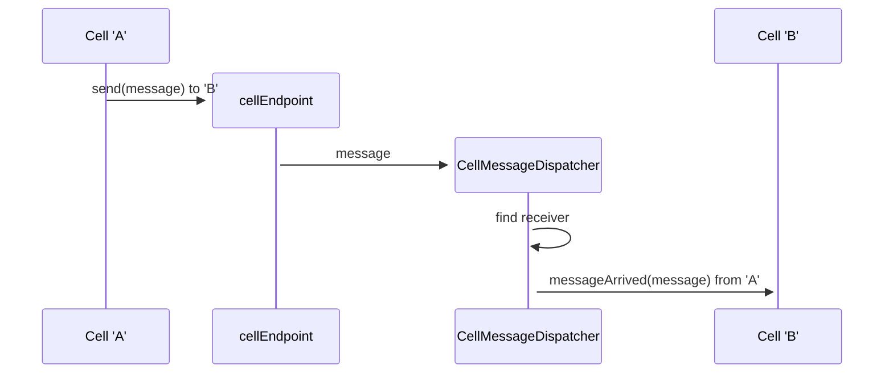

# Cell

This module is responsible for inner-cell communication.

## Celle messages

```mermaid
sequenceDiagram
    
    participant  Cell 'A'
    create participant cellEndpoint
    Cell 'A' ->>+cellEndpoint: send(message) to 'B'
    
    create participant CellMessageDispatcher
    cellEndpoint ->>+CellMessageDispatcher:message
    CellMessageDispatcher ->>+CellMessageDispatcher:find receiver
    
    participant  Cell 'B'
    CellMessageDispatcher ->>+Cell 'B': messageArrived(message) from 'A'

```
