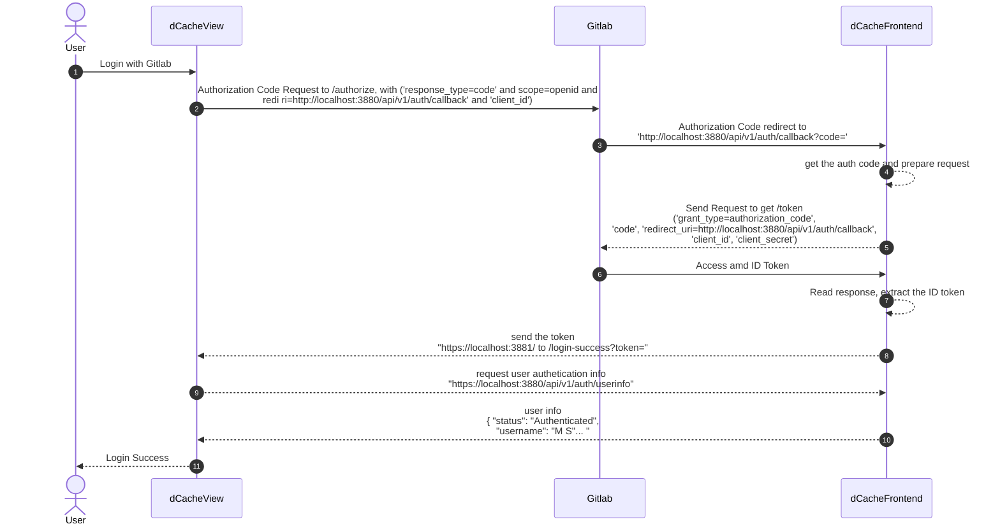

# Code flow Authorization

## Set of sequence diagrams of coe flow Authorization with dcache-view

### Positive path

```mermaid
sequenceDiagram
    autonumber
    actor User
    participant dCacheView
    participant Gitlab
    participant dCacheFrontend
    User->>dCacheView: Login with Gitlab
    dCacheView->>Gitlab: Authorization Code Request to /authorize, with  ('response_type=code' and scope=openid and <br> redi ri=http://localhost:3880/api/v1/auth/callback' and 'client_id')
    Gitlab->>dCacheFrontend: Authorization Code redirect to <br/> 'http://localhost:3880/api/v1/auth/callback?code='
    dCacheFrontend-->>dCacheFrontend: get the auth code and prepare request
    dCacheFrontend-->>Gitlab: Send  Request to get /token <br/>  ('grant_type=authorization_code', <br/>  'code', 'redirect_uri=http://localhost:3880/api/v1/auth/callback', <br/>  'client_id', 'client_secret')
    Gitlab->>dCacheFrontend: Access amd ID Token
    dCacheFrontend-->>dCacheFrontend: Read response, extract the ID token
    dCacheFrontend-->>dCacheView: send the token  <br/> "https://localhost:3881/ to /login-success?token="
    dCacheView-->>dCacheFrontend: request user authetication info <br/> "https://localhost:3880/api/v1/auth/userinfo"
    dCacheFrontend-->>dCacheView: user info <br/> { "status": "Authenticated", <br/> "username": "M S"... "
    dCacheView-->>User: Login Success
```