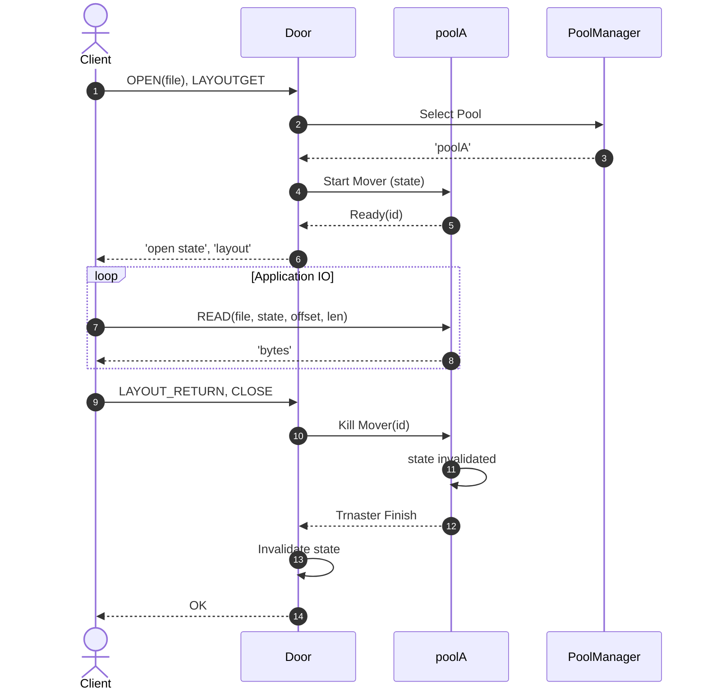

# NFSv4.1/pNFS Door

```mermaid
sequenceDiagram
    autonumber
    actor Client
    participant Door
    participant poolA
    participant PoolManager
    Client->>Door: OPEN(file), LAYOUTGET 
    Door->>PoolManager: Select Pool
    PoolManager-->>Door: 'poolA'
    Door->>poolA: Start Mover (state)
    poolA-->>Door: Ready(id)
    Door-->>Client: 'open state', 'layout'
    loop Application IO
        Client->>poolA: READ(file, state, offset, len)
        poolA-->>Client: 'bytes'
    end
    Client->>Door: LAYOUT_RETURN, CLOSE
    Door->>poolA: Kill Mover(id)
    poolA->>poolA: state invalidated
    poolA-->>Door: Trnaster Finish
    Door->>Door: Invalidate state
    Door-->>Client: OK
```