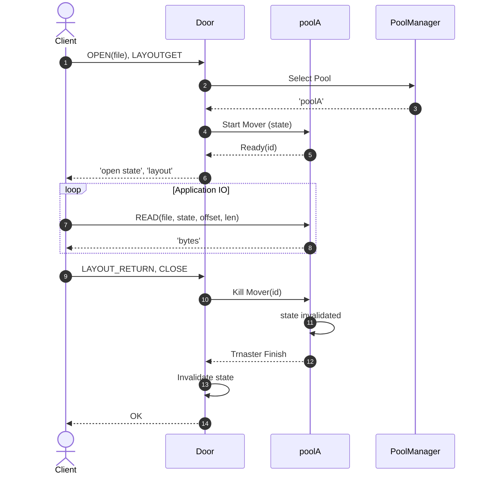
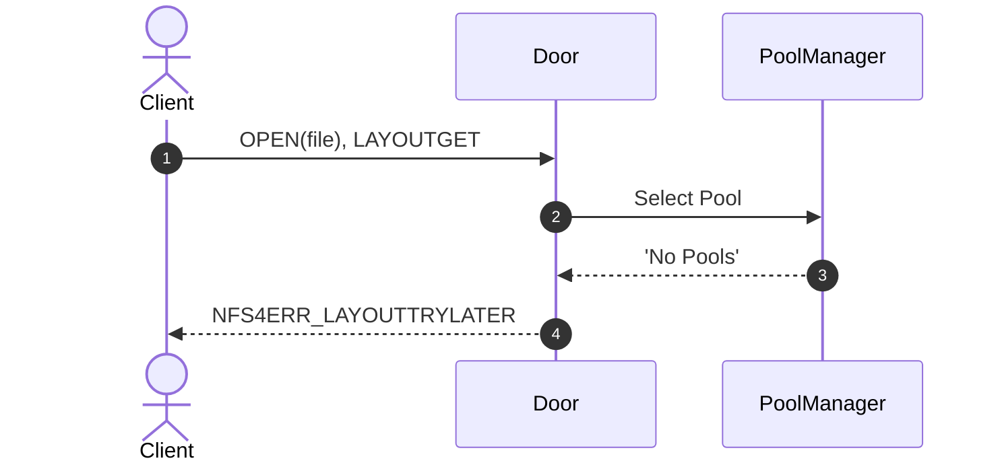
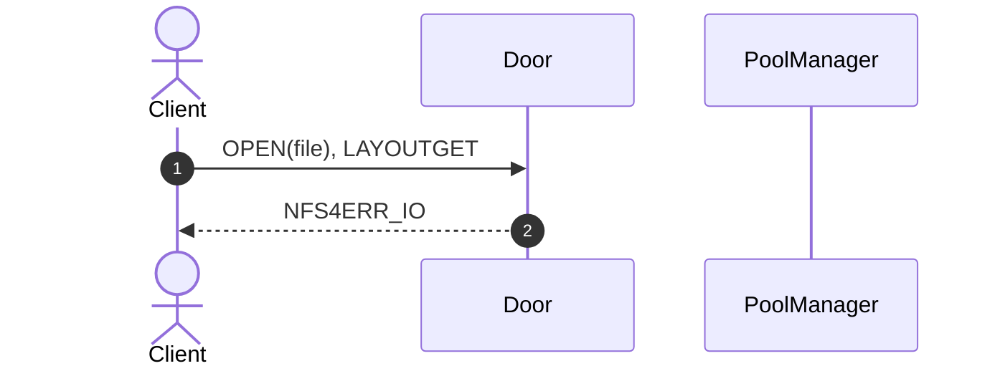
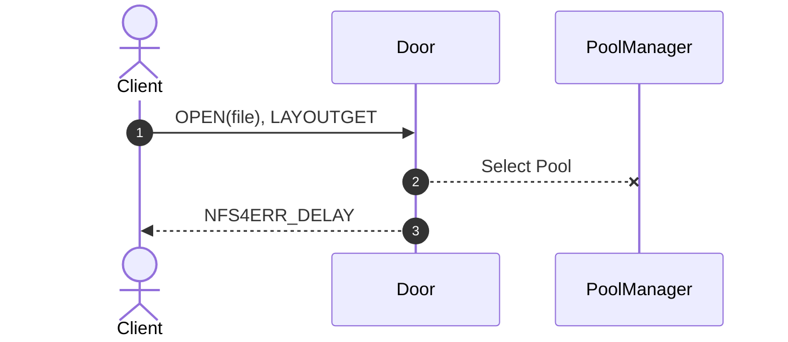
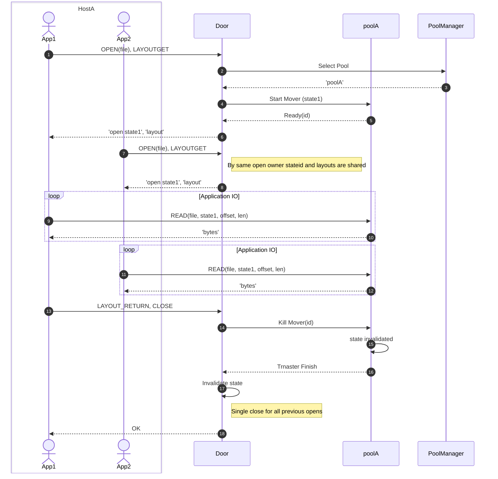
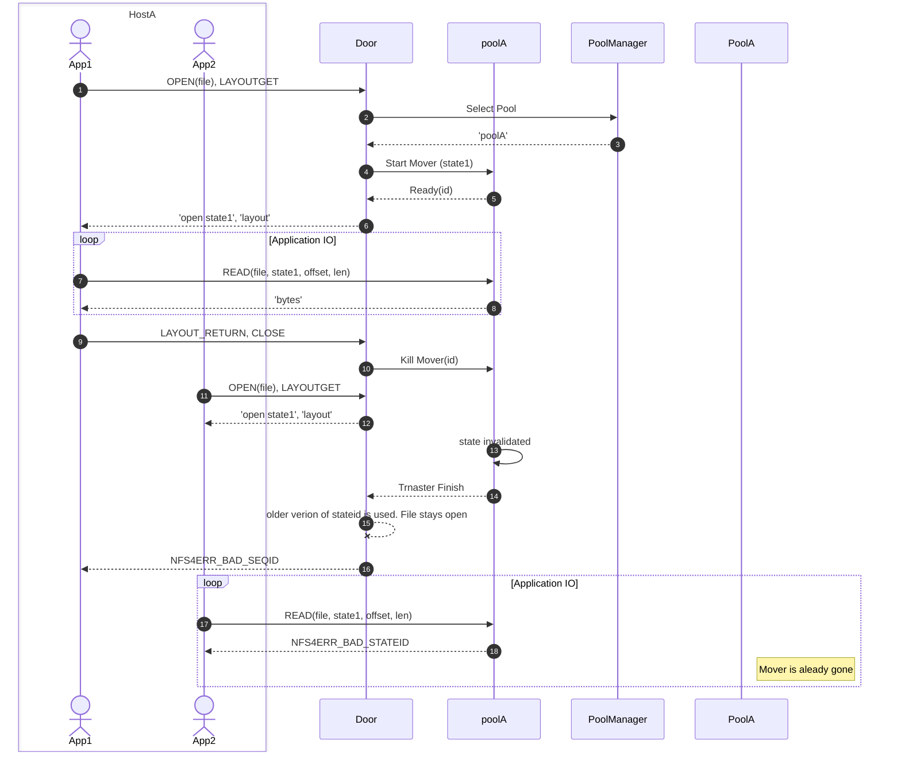
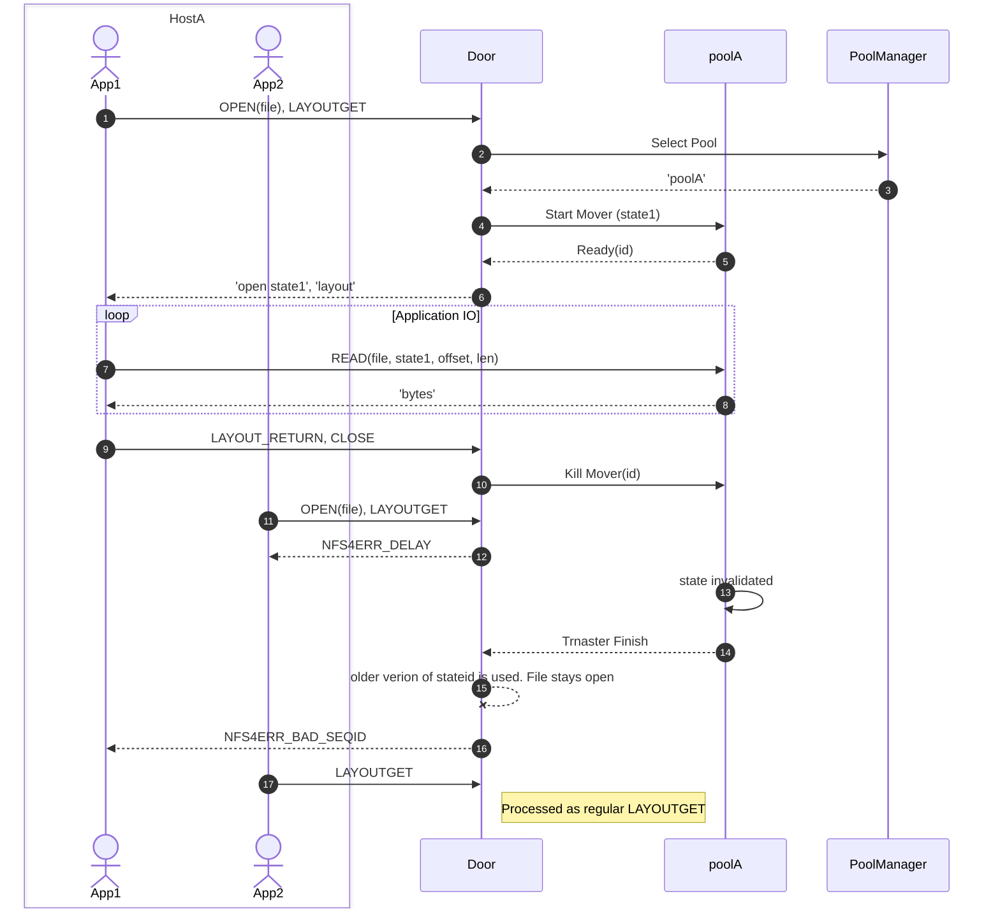

# NFSv4.1/pNFS Door

## Set of sequence diagrams of pNFS flow

### Positive path

### File is offline

### No disk and tape locations

### PoolManager is offline

### Two opens

### Competing opens (race condition)

(fixed by commit 421e1dc932c73186d52901431ec8b822fdadb508)

### Competing opens

(fixed by commit 421e1dc932c73186d52901431ec8b822fdadb508)
