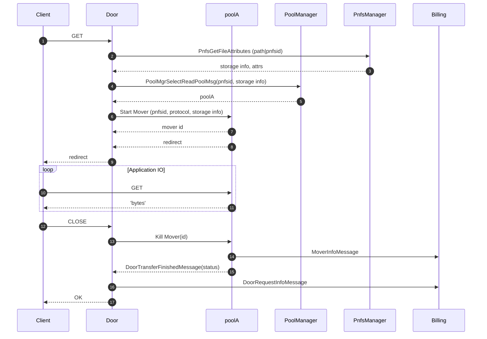
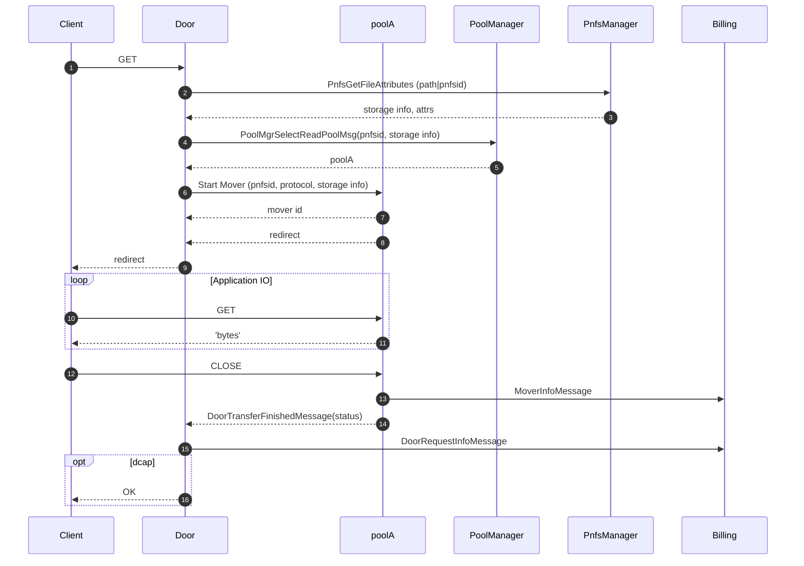

# dCache request diagrams

## Door workflow on successful read, close through door (NFS)

```mermaid
sequenceDiagram
    autonumber
    participant Client
    participant Door
    participant poolA
    participant PoolManager
    participant PnfsManager
    participant Billing
    Client ->> Door: GET
    Door->>PnfsManager: PnfsGetFileAttributes (path|pnfsid)
    PnfsManager -->> Door: storage info, attrs
    
    Door ->> PoolManager: PoolMgrSelectReadPoolMsg(pnfsid, storage info)
    PoolManager-->>Door: poolA
    Door->>poolA: Start Mover (pnfsid, protocol, storage info)
    poolA -->>Door: mover id
    poolA-->>Door: redirect
    Door -->> Client: redirect
    loop Application IO
        Client->>poolA: GET
        poolA-->>Client: 'bytes'
    end
    Client->>Door: CLOSE
    Door->>poolA: Kill Mover(id)
    poolA ->> Billing: MoverInfoMessage
    poolA-->>Door: DoorTransferFinishedMessage(status)
    Door->>Billing: DoorRequestInfoMessage
    Door-->>Client: OK
```

## Door workflow on successful read, close through pool (dcap, xroot, http)

```mermaid
sequenceDiagram
    autonumber
    participant Client
    participant Door
    participant poolA
    participant PoolManager
    participant PnfsManager
    participant Billing
    Client ->> Door: GET
    Door->>PnfsManager: PnfsGetFileAttributes (path|pnfsid)
    PnfsManager -->> Door: storage info, attrs
    
    Door ->> PoolManager: PoolMgrSelectReadPoolMsg(pnfsid, storage info)
    PoolManager-->>Door: poolA
    Door->>poolA: Start Mover (pnfsid, protocol, storage info)
    poolA -->>Door: mover id
    poolA-->>Door: redirect
    Door -->> Client: redirect
    loop Application IO
        Client->>poolA: GET
        poolA-->>Client: 'bytes'
    end
    Client->>poolA: CLOSE
    poolA ->> Billing: MoverInfoMessage
    poolA-->>Door: DoorTransferFinishedMessage(status)
    Door->>Billing: DoorRequestInfoMessage
    opt dcap
        Door-->>Client: OK
    end
```
